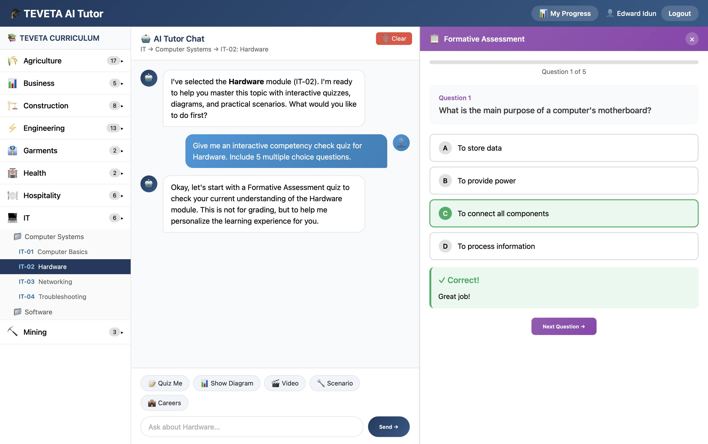

# 🎓 AI Tutor - Open Source TVET Skills Development Platform

[](https://github.com/YOUR_ORG/ai-tutor/actions/workflows/build-desktop.yml)
[](https://opensource.org/licenses/MIT)
[](https://www.python.org/downloads/)

An AI-powered tutor for Technical and Vocational Education and Training (TVET) that delivers **personalized learning** using formative and summative assessments. Originally developed for TEVETA Zambia, this platform is designed to be easily customized for any country's vocational training curriculum.



## 🌟 Features

- **🎯 Personalized Learning Path** - Formative assessment identifies knowledge gaps, then teaching is tailored to each student
- **📊 Formative & Summative Assessment** - Research-based approach: 5-question diagnostic → personalized teaching → 10-question certification
- **🏆 Competency Certification** - Award certificates showing learning journey and demonstrated skills
- **📱 Cross-Platform** - Runs on Windows, macOS, Linux as a desktop app, or as a web application
- **🌍 Easily Localizable** - Simple configuration to adapt for any country's TVET system
- **🔌 Offline-Capable** - Desktop app works without internet (requires API key for AI features)
- **📚 Curriculum-Aligned** - Map to your national qualifications framework

## 🚀 Quick Start

### Option 1: Download Desktop App

Download the latest release for your platform from the [Releases page](https://github.com/YOUR_ORG/ai-tutor/releases):

| Platform | Download |
|----------|----------|
| Windows | `AI-Tutor-Windows-x64.exe` |
| macOS (Intel) | `AI-Tutor-macOS.dmg` |
| macOS (Apple Silicon) | `AI-Tutor-macOS-ARM64.app` |
| Linux | `AI-Tutor-x86_64.AppImage` |

### Option 2: Run from Source

```bash
# Clone the repository
git clone https://github.com/YOUR_ORG/ai-tutor.git
cd ai-tutor

# Create virtual environment
python -m venv venv
source venv/bin/activate  # On Windows: venv\Scripts\activate

# Install dependencies
pip install -r requirements.txt

# Set your Claude API key
cp .env.example .env
# Edit .env and add your ANTHROPIC_API_KEY

# Run the web application
python app.py
```

Open http://localhost:5000 in your browser.

### Option 3: Run as Desktop App

```bash
# Install additional desktop dependencies
pip install -r requirements-desktop.txt

# Run desktop app
python desktop.py
```

## 🔑 Configuration

### Step 1: Get a Claude API Key

1. Sign up at [console.anthropic.com](https://console.anthropic.com)
2. Create an API key
3. Add it to your `.env` file:

```env
ANTHROPIC_API_KEY=sk-ant-xxxxxxxxxxxxx
```

### Step 2: Customize for Your Country

Copy and edit the configuration file:

```bash
cp config/settings.example.json config/settings.json
```

Edit `config/settings.json` to customize:

```json
{
  "country": {
    "name": "Your Country",
    "code": "XX",
    "language": "en"
  },
  "institution": {
    "name": "Your TVET Authority",
    "full_name": "Full Name of Your Institution",
    "mission": "Your institution's mission statement"
  },
  "localization": {
    "electricity_provider": "Your Power Company",
    "safety_standards": "Your Standards Body",
    "example_companies": ["Company1", "Company2"],
    "example_cities": ["City1", "City2"]
  }
}
```

### Step 3: Add Your Curriculum

Create a curriculum file in `curricula/your_country.json`:

```json
{
  "programs": [
    {
      "code": "EI",
      "name": "Electrical Installation",
      "level": "Certificate",
      "modules": [
        {
          "code": "EI-101",
          "name": "Electrical Safety Practices",
          "learning_objectives": [
            "Identify electrical hazards in the workplace",
            "Apply safety procedures when working with electricity",
            "Select and use appropriate PPE"
          ],
          "topics": [
            {
              "name": "Electrical Hazards",
              "subtopics": ["Shock hazards", "Arc flash", "Fire risks"]
            }
          ]
        }
      ]
    }
  ]
}
```

## 📐 Architecture

```
┌─────────────────────────────────────────────────────────────────┐
│                        AI Tutor Platform                        │
├─────────────────────────────────────────────────────────────────┤
│                                                                 │
│  ┌──────────────┐    ┌──────────────┐    ┌──────────────┐      │
│  │   Desktop    │    │     Web      │    │   Mobile     │      │
│  │  (pywebview) │    │   (Flask)    │    │  (Flutter)   │      │
│  └──────┬───────┘    └──────┬───────┘    └──────┬───────┘      │
│         │                   │                   │               │
│         └───────────────────┴───────────────────┘               │
│                             │                                   │
│  ┌──────────────────────────┴───────────────────────────┐      │
│  │                    Flask Backend                      │      │
│  │  • Learning Session Management                        │      │
│  │  • Assessment Engine (Formative/Summative)           │      │
│  │  • Certificate Generation                             │      │
│  │  • Skills Tracking                                    │      │
│  └──────────────────────────┬───────────────────────────┘      │
│                             │                                   │
│  ┌──────────────────────────┴───────────────────────────┐      │
│  │                   Claude AI (Anthropic)               │      │
│  │  • Personalized Teaching                              │      │
│  │  • Quiz Generation                                    │      │
│  │  • Adaptive Feedback                                  │      │
│  └──────────────────────────────────────────────────────┘      │
│                                                                 │
│  ┌──────────────────────────────────────────────────────┐      │
│  │                      SQLite DB                        │      │
│  │  • Students • Sessions • Certificates • Skills        │      │
│  └──────────────────────────────────────────────────────┘      │
│                                                                 │
└─────────────────────────────────────────────────────────────────┘
```

## 📚 Learning Science Approach

This platform implements a **personalized learning approach** based on educational research:

### Formative Assessment (5 Questions)
- **Purpose**: Assessment FOR Learning
- **Goal**: Diagnose what the student already knows
- **Output**: Identifies knowledge gaps to personalize instruction

### Personalized Teaching
Based on formative results:
- **0-40%**: Start with foundations, more scaffolding, visual aids
- **60%**: Focus on specific gaps, connect to existing knowledge
- **80%+**: Quick review, move to summative assessment

### Summative Assessment (10 Questions)
- **Purpose**: Assessment OF Learning
- **Goal**: Evaluate mastery of ALL learning objectives
- **Threshold**: 80% required for competency certification

### Certificate
Shows the complete learning journey:
- Formative score → Summative score
- Percentage improvement
- Skills demonstrated

## 🌍 Country Customization Examples

We provide example configurations for:

| Country | Config File | Notes |
|---------|-------------|-------|
| 🇿🇲 Zambia | `config/settings.example.json` | Default - TEVETA |
| 🇲🇿 Mozambique | `config/examples/mozambique.json` | Portuguese, ANEP |

### What to Customize

| Component | What to Change | File |
|-----------|----------------|------|
| **API Key** | Your Claude API key | `.env` |
| **Institution** | Name, logo, mission | `config/settings.json` |
| **Branding** | Colors, app name | `config/settings.json` |
| **Localization** | Companies, cities, standards | `config/settings.json` |
| **Curriculum** | Programs, modules, topics | `curricula/*.json` |
| **Language** | UI text, AI language | `config/settings.json` |

## 🛠️ Development

### Project Structure

```
ai-tutor/
├── app.py                  # Main Flask application
├── desktop.py              # Desktop app entry point
├── database.py             # Database layer with DAOs
├── curriculum_content.py   # Curriculum loader
├── multimedia_resources.py # Media resource management
├── templates/
│   ├── index.html          # Main learning interface
│   ├── login.html          # Authentication
│   └── student_dashboard.html  # Progress dashboard
├── config/
│   ├── settings.json       # Your configuration
│   └── examples/           # Country examples
├── curricula/
│   └── *.json              # Curriculum definitions
├── assets/
│   ├── icon.ico            # Windows icon
│   ├── icon.icns           # macOS icon
│   └── icon.png            # Linux icon
├── .github/
│   └── workflows/
│       └── build-desktop.yml  # CI/CD for releases
├── requirements.txt        # Python dependencies
└── requirements-desktop.txt # Desktop-specific deps
```

### Running Tests

```bash
pip install pytest
pytest tests/
```

### Building Desktop Apps Locally

```bash
# Install PyInstaller
pip install pyinstaller

# Build for your current platform
pyinstaller --name="AI-Tutor" \
  --onefile \
  --windowed \
  --add-data="templates:templates" \
  --add-data="config:config" \
  desktop.py
```

### Creating a Release

1. **Set up GitHub Secret for API key** (required for CI/CD):
   - Go to your repository → Settings → Secrets and variables → Actions
   - Click "New repository secret"
   - Name: `ANTHROPIC_API_KEY`
   - Value: Your Claude API key from https://console.anthropic.com
   - Click "Add secret"

2. Tag your commit:
   ```bash
   git tag v1.0.0
   git push origin v1.0.0
   ```

3. GitHub Actions will automatically build for all platforms

4. Download artifacts from the Actions tab or Releases page

**Note:** The API key secret is used for CI testing only. Desktop builds include a placeholder `.env` file that users must configure with their own API key after installation.

## 🤝 Contributing

We welcome contributions! Here's how you can help:

1. **Add Country Configurations** - Submit config files for your country
2. **Translate UI** - Help translate the interface
3. **Improve Curriculum** - Add or improve vocational content
4. **Report Issues** - File bugs or suggest features
5. **Submit PRs** - Code contributions welcome

See [CONTRIBUTING.md](CONTRIBUTING.md) for guidelines.

## ☁️ Azure Deployment

For production deployments, we support Microsoft Azure with the following services:

| Service | Purpose |
|---------|---------|
| Azure App Service | Host Flask application |
| Azure SQL Database | Store student data, certificates |
| Azure Blob Storage | Media files, curricula |
| Azure Key Vault | Secure secrets (API keys) |
| Application Insights | Monitoring & logging |

### Quick Azure Deploy

```bash
# 1. Login to Azure
az login

# 2. Create resource group
az group create --name aitutor-rg --location eastus

# 3. Deploy infrastructure
az deployment group create \
  --resource-group aitutor-rg \
  --template-file azure/main.bicep \
  --parameters environment=dev anthropicApiKey="your-key"

# 4. Deploy application
az webapp up --resource-group aitutor-rg --runtime "PYTHON:3.11"
```

See [azure/README.md](azure/README.md) for complete deployment guide including:
- CI/CD setup with GitHub Actions
- Database configuration
- Monitoring and logging
- Cost estimation (~$21/month for dev)

## 📄 License

This project is licensed under the MIT License - see [LICENSE](LICENSE) for details.

## 🙏 Acknowledgments

- [TEVETA Zambia](https://www.teveta.org.zm) - Original partner institution
- [Anthropic](https://www.anthropic.com) - Claude AI
- [World Bank](https://www.worldbank.org) - STRIVE Program support
- All contributors and educators who make TVET accessible

## 📞 Support

- **Documentation**: [docs/](docs/)
- **Issues**: [GitHub Issues](https://github.com/YOUR_ORG/ai-tutor/issues)
- **Discussions**: [GitHub Discussions](https://github.com/YOUR_ORG/ai-tutor/discussions)

---

<p align="center">
  Made with ❤️ for vocational education worldwide
</p>
