# Deep Dive: Prompt Assembly, Curriculum Data Model & Content Pipeline

> A detailed analysis of how prompts are constructed, how curriculum is modeled and seeded, and three design proposals for evolving the system toward editorial workflows, dynamic pedagogy, and localized content generation.

---

## Part 1: Current Implementation — How It Works Today

### 1.1 Prompt Assembly Pipeline

The system constructs LLM prompts through a two-layer architecture defined in `apps/llm/prompts.py`. The layers separate *who the tutor is* (stable across a session) from *what the tutor is doing right now* (changes every turn).

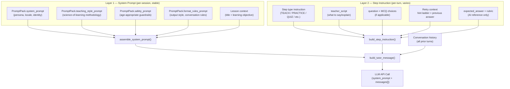

**Key observations:**

- `assemble_system_prompt()` concatenates four `PromptPack` fields plus a lesson-context block with `"\n\n".join()`. No templating engine is used — it is straight Python string composition (`prompts.py:26-63`).

- `build_step_instruction()` is the per-turn context injector. It switches on `StepType` to select an instruction prefix, then conditionally appends question, choices, retry/hint context, expected answer, and rubric (`prompts.py:66-126`).

- `build_tutor_message()` wraps the step instruction in `[STEP CONTEXT]...[/STEP CONTEXT]` delimiters and injects it into the conversation messages array as a user-role message (`prompts.py:129-174`).

- In **conversational mode** (detected by the engine when there is exactly 1 TEACH step with `answer_type=NONE`), the engine appends a `completion_instruction` string directly to the system prompt at runtime, telling the LLM to emit `[SESSION_COMPLETE]` when the exit ticket is passed (`engine.py:333-345`).

#### Prompt flow for the two operating modes

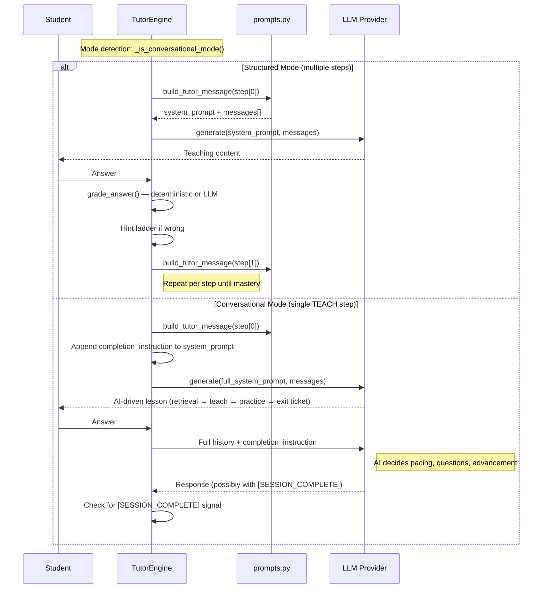

### 1.2 Curriculum Data Model

The curriculum follows a rigid four-level hierarchy. Every model is institution-scoped.

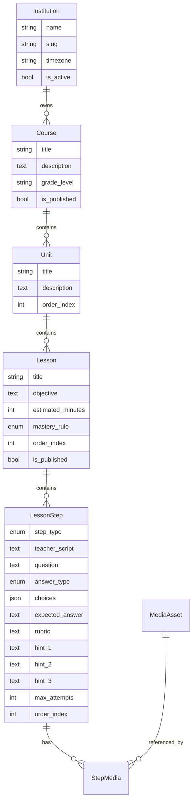

**The `LessonStep` is the atomic content unit.** It carries everything the prompt assembler needs: what to teach (`teacher_script`), what to ask (`question`, `choices`), how to grade (`expected_answer`, `rubric`), and how to scaffold mistakes (`hint_1/2/3`, `max_attempts`).

The model *can* support richly-authored structured lessons (see `seed_sample_data` which creates 6 steps per lesson with handcrafted questions, answers, and hints). But for the Seychelles deployment, this capability is deliberately unused.

### 1.3 The `seed_seychelles` Command — What It Actually Does

The management command at `apps/curriculum/management/commands/seed_seychelles.py` is the sole mechanism for loading the Seychelles curriculum. It creates the entire content graph programmatically.

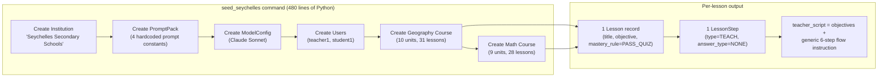

**What is hardcoded in the Python file:**

| Data | Location | Form |
|---|---|---|
| Tutor persona & Seychelles context | `SYSTEM_PROMPT` constant (lines 18-32) | Prompt string literal |
| Science-of-learning pedagogy | `TEACHING_STYLE_PROMPT` constant (lines 34-79) | Prompt string literal |
| Safety guardrails | `SAFETY_PROMPT` constant (lines 81-87) | Prompt string literal |
| Output format rules | `FORMAT_RULES_PROMPT` constant (lines 89-103) | Prompt string literal |
| Geography syllabus (10 units, ~31 lessons) | Python list-of-dicts (lines 231-323) | Nested data structures |
| Math syllabus (9 units, ~28 lessons) | Python list-of-dicts (lines 344-427) | Nested data structures |
| Lesson terminal objectives | Embedded in each lesson dict | Lists of strings |

**What is NOT in the database after seeding:**

- No practice questions, worked examples, or quiz items
- No hint content
- No expected answers or rubrics
- No MCQ choices
- No media attachments (unless `generate_media` is run separately)

Every Seychelles lesson produces exactly **one `LessonStep`** with `step_type=TEACH` and `answer_type=NONE`. The `teacher_script` is a template that embeds the lesson title, objective, terminal objectives as bullet points, and a generic 6-step flow instruction. This puts the lesson into **conversational mode** where the AI generates all teaching content, practice problems, and the exit ticket dynamically.

#### The teacher_script template (assembled per lesson)

```
LESSON: {title}
LEARNING OBJECTIVE: {objective}
TERMINAL OBJECTIVES:
• {objective_1}
• {objective_2}
• {objective_3}
Begin this tutoring session following the structured flow:
1. Start with a retrieval question from a previous related topic
2. Introduce today's topic: {title}
3. Explain concepts clearly with examples using Seychelles context
4. Guide the student through practice problems (scaffolded hints, no direct answers)
5. End with a 5-question multiple choice exit ticket (4/5 required to pass)
6. Praise their effort and summarize key learnings
```

This template is the **only curriculum-specific content** that distinguishes one lesson from another in the LLM's context. The pedagogical behavior, localization, and session structure all come from the PromptPack fields (which are the same for all 59 lessons).

---

## Part 2: Three Issues & Design Proposals

### Issue 1: Curriculum Maintenance Is a Code Change, Not an Editorial Workflow

#### The Problem

Today, modifying any part of the Seychelles curriculum requires:

1. Editing Python source code in `seed_seychelles.py`
2. Running the management command (which uses `update_or_create` and therefore overwrites prior edits)
3. Deploying the updated code

This workflow has several consequences:

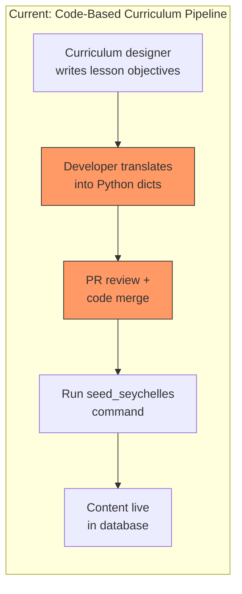

- **Bottleneck on developers** — every syllabus update, typo fix, or new lesson requires a code change, PR, and deployment.
- **No separation of concerns** — curriculum content (an editorial artifact) lives in application code (an engineering artifact). This makes it impossible to give curriculum editors autonomy.
- **Destructive reseeding** — running the command recreates everything. If someone hand-edits a lesson in Django Admin, those edits are overwritten on the next seed.
- **No versioning of content** — the `PromptPack` has a `version` field, but curriculum records (Course, Unit, Lesson, LessonStep) do not. There is no audit trail of what changed in the syllabus.
- **Scaling problem** — adding a new country, subject, or grade level means writing another 300+ line seed function.

#### Proposed Solution: Declarative Curriculum Import from Structured Files

Replace the hardcoded Python data with a **file-based curriculum format** (YAML or JSON) and a **generic import command** that reads these files.

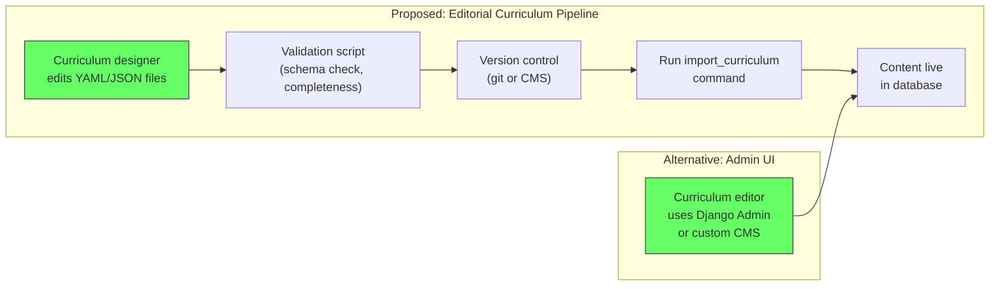

**The curriculum file format** would mirror the existing data hierarchy:

```yaml
# curriculum/seychelles/geography.yaml
course:
  title: Geography
  grade_level: S1-S3
  description: >
    Seychelles Secondary Geography Curriculum (Cycle 4: S1-S3).

units:
  - title: "S1: Introduction to Geography"
    lessons:
      - title: What is Geography?
        objective: Understand geography as study of earth, inhabitants, and their relationships
        terminal_objectives:
          - Define geography
          - Know fundamental concepts: location, pattern, process
          - Understand human-environment interaction
        localization_hints:
          examples: ["Use Seychelles as primary case study"]
          place_names: [Victoria, Mahé, Praslin]
```

**The generic import command** would:

1. Parse the file and validate against a JSON Schema
2. Use `update_or_create` keyed on `(institution, course_title, unit_title, lesson_title)` — preserving the idempotent behavior
3. Generate the `teacher_script` from a configurable template (not hardcoded in Python)
4. Support `--dry-run` to preview changes without writing to the database
5. Log a changelog of what was created, updated, or left unchanged

**Separation of PromptPack from curriculum data** — the prompt strings (`SYSTEM_PROMPT`, `TEACHING_STYLE_PROMPT`, etc.) should also move out of the seed command into their own file or admin-managed records, since they are independent of the syllabus content.

**Benefits:**
- Curriculum designers edit YAML files directly (or through a lightweight CMS that outputs YAML)
- No Python knowledge required to add a lesson or fix an objective
- Files can be validated, diffed, and reviewed in version control
- The same import command works for any country or subject — just point it at a different file
- Teacher_script template becomes a configurable string, not hardcoded code

---

### Issue 2: Science-of-Learning Principles Are Static in the System Prompt

#### The Problem

The pedagogical methodology is embedded as a single, monolithic text block in `TEACHING_STYLE_PROMPT` (seed_seychelles.py, lines 34-79). This block is stored in `PromptPack.teaching_style_prompt` and injected into every session identically, regardless of:

- **Subject** — math tutoring benefits from different strategies than geography (worked examples vs. case studies)
- **Student level** — an S1 student needs more scaffolding than an S5 student
- **Lesson phase** — retrieval practice and explicit instruction need different principles than guided practice
- **Student performance** — a struggling student needs different scaffolding than one who's breezing through

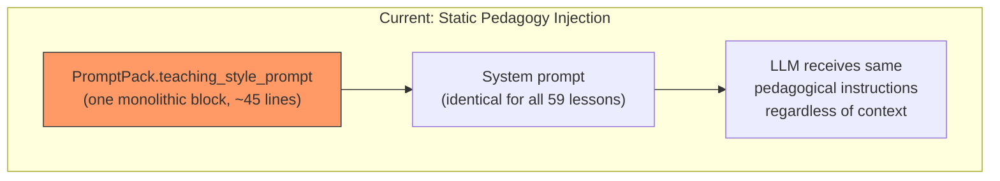

The teaching style prompt contains good principles (retrieval practice, scaffolding, mastery-based advancement, interleaving, immediate feedback) but applies them uniformly. The LLM gets the same instructions for "What is Geography?" (S1, introductory) and "The Blue Economy" (S3, analytical). It gets the same instructions for a student who has mastered 80% of prior lessons and one who is struggling with fundamentals.

#### Proposed Solution: Principle Registry with Context-Sensitive Selection

Introduce a **`PedagogicalPrinciple`** model that stores individual science-of-learning strategies as discrete, tagged records. At prompt assembly time, select and compose the relevant subset based on session context.

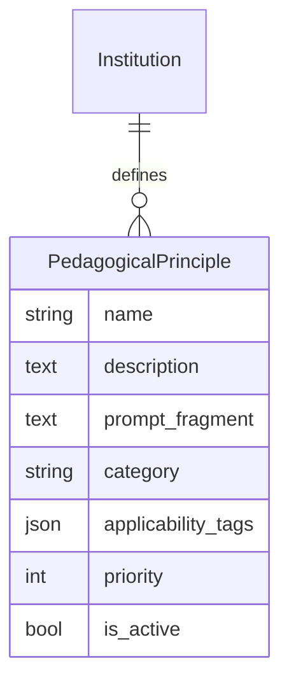

Where `applicability_tags` encode when a principle should be injected:

```json
{
  "subjects": ["mathematics"],
  "grade_levels": ["S1", "S2"],
  "lesson_phases": ["guided_practice"],
  "student_performance": ["struggling"],
  "step_types": ["practice", "quiz"]
}
```

The prompt assembly function gains a new stage:

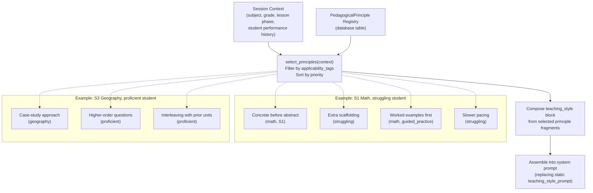

**How it changes prompt assembly:**

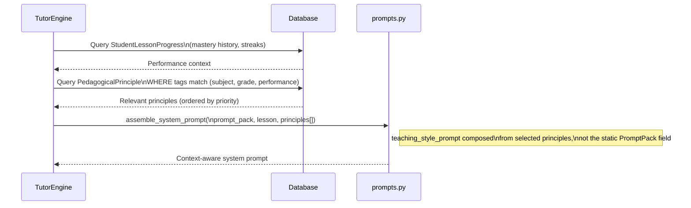

**Seeding pedagogical principles** — the existing `TEACHING_STYLE_PROMPT` content would be decomposed into ~15-20 individual principle records. For example:

| Principle | Category | Applies to |
|---|---|---|
| "Start with 1-2 retrieval questions about previously learned topics" | retrieval_practice | all subjects, all grades |
| "Break concepts into small, digestible pieces" | explicit_instruction | all subjects, S1-S2 |
| "Use Seychelles as primary case study when possible" | localization | geography |
| "Show step-by-step working for all calculations" | worked_examples | mathematics |
| "If student struggles on 2+ problems, slow down and re-explain" | adaptive_pacing | all subjects, struggling |
| "Mix in review of older topics" | interleaving | all subjects, proficient |
| "Use concrete examples before abstract concepts" | scaffolding | mathematics, S1-S3 |
| "Encourage analytical reasoning with open-ended questions" | higher_order_thinking | all subjects, S3+, proficient |

**Benefits:**
- Pedagogical strategies can be added, modified, or deactivated without code changes
- Different subject-pedagogy combinations emerge naturally (math gets worked-examples emphasis, geography gets case-study emphasis)
- Student performance data already in `StudentLessonProgress` can drive adaptive principle selection
- Researchers can A/B test pedagogical strategies by toggling principles on/off
- New principles from learning science research can be added as data, not code

---

### Issue 3: Learning Content Is Not Localized or Pre-Authored, Relying Entirely on LLM Generation

#### The Problem

In the Seychelles deployment, the LLM generates **all** learning content at runtime:

- Practice examples and worked problems
- Activities and exercises
- Exit ticket quiz questions and answer options
- Contextual examples and analogies

The only localization cue is a 6-line block in the system prompt telling the AI to use Seychelles place names, currency, and industries. Whether the AI actually produces well-localized, pedagogically appropriate content depends entirely on the LLM's interpretation of these general instructions on every single turn.

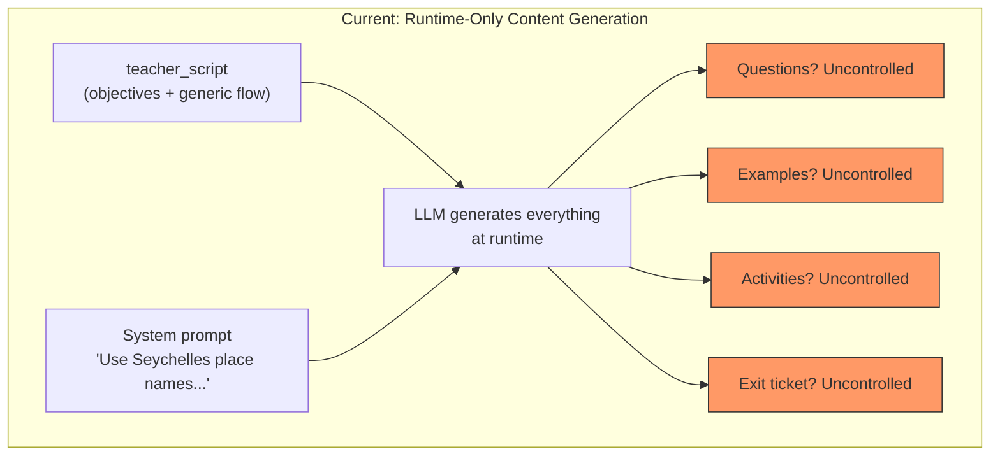

**Consequences:**

- **Quality variance** — the same lesson can produce excellent or mediocre content depending on the LLM's generation. There is no floor on quality.
- **Shallow localization** — "Use Seychelles place names" is a surface-level instruction. True localization means using correct local examples (e.g., the actual fish species caught in Seychelles for a biology lesson, or real SCR prices for a percentage problem).
- **No content review** — because content is generated on-the-fly, there is no opportunity for curriculum experts or teachers to review, approve, or improve it before students see it.
- **No reuse** — a great example the AI generates in one session is lost. It cannot be captured, curated, and reused.
- **Factual risk** — the LLM may generate incorrect local facts (wrong population figures, wrong distances between islands, wrong fish species).

#### Proposed Solution: Content Bank with Dynamic Prompt Injection

Introduce a **`ContentItem`** model that stores pre-authored, reviewed, and localized learning content fragments. These are injected into the prompt at assembly time, giving the LLM vetted raw material to work with rather than asking it to invent everything.

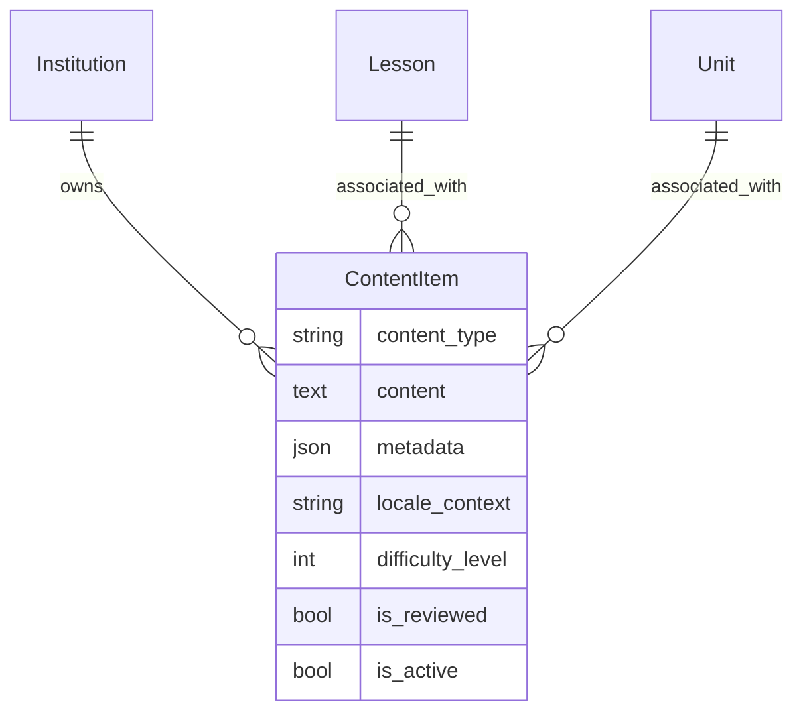

Where `content_type` is one of: `worked_example`, `practice_problem`, `mcq_question`, `real_world_example`, `local_fact`, `activity`, `analogy`.

**Example content items for "Simple Interest" lesson:**

| Type | Content | Locale context |
|---|---|---|
| `real_world_example` | "Marie saves 5,000 SCR at Seychelles Commercial Bank at 3.5% annual interest" | Seychelles, SCR, real bank name |
| `practice_problem` | "Pierre's family takes a loan of 15,000 SCR to repair their fishing boat. The bank charges 6% simple interest per year. How much interest do they pay after 2 years?" | Seychelles, fishing industry, SCR |
| `mcq_question` | "A tourism shop in Victoria borrows 20,000 SCR at 4% simple interest for 3 years. What is the total interest? A) 2,400 SCR B) 2,000 SCR C) 3,000 SCR D) 1,600 SCR" | Seychelles, tourism, Victoria |
| `local_fact` | "The Central Bank of Seychelles sets the base lending rate. In 2024 it was approximately 4.5%." | Verifiable local fact |
| `analogy` | "Think of interest like rent — when you borrow someone's money, you pay rent (interest) for using it, just like paying rent for a house in Beau Vallon." | Seychelles place name |

**How it changes prompt assembly:**

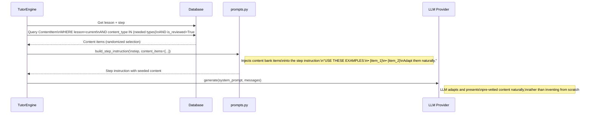

The `teacher_script` template would gain a new section:

```
LESSON: {title}
LEARNING OBJECTIVE: {objective}
TERMINAL OBJECTIVES:
• ...

CONTENT BANK (use these in your teaching — adapt naturally):

WORKED EXAMPLE:
  Marie saves 5,000 SCR at Seychelles Commercial Bank at 3.5% annual interest...

PRACTICE PROBLEMS (present one at a time):
  1. Pierre's family takes a loan of 15,000 SCR to repair their fishing boat...
  2. A hotel in Beau Vallon needs 50,000 SCR for renovations...

EXIT TICKET QUESTIONS (present as MCQ):
  1. A tourism shop in Victoria borrows 20,000 SCR at 4%...
     A) 2,400 SCR  B) 2,000 SCR  C) 3,000 SCR  D) 1,600 SCR
     Correct: A

Begin this tutoring session following the structured flow...
```

**The content pipeline:**

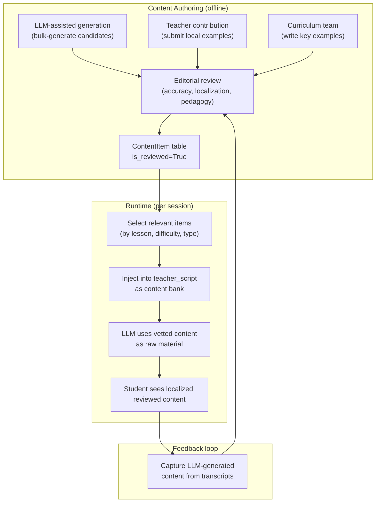

**Key design decisions:**

1. **Content items supplement, not replace, the LLM** — the AI still adapts, paraphrases, and sequences the content. The content bank gives it vetted ingredients; it's still the chef.

2. **Progressive enrichment** — lessons can start with zero content items (current behavior) and gain them over time. The system gracefully degrades: if no items exist, the LLM generates everything as it does today.

3. **Random selection from pools** — if a lesson has 10 practice problems but only 3 are needed per session, randomly select 3. This provides variety across sessions while keeping content quality controlled.

4. **Difficulty-tagged items** — content items carry a `difficulty_level` (1-5). Combined with student performance data, the assembler can select easier or harder items adaptively.

5. **Feedback loop** — session transcripts (`SessionTurn`) already capture everything the AI generates. A curation workflow can extract good AI-generated examples from transcripts, review them, and add them back to the content bank. Over time, the content bank grows organically.

---

## Part 3: How the Three Proposals Fit Together

The three proposals are complementary and can be implemented incrementally:

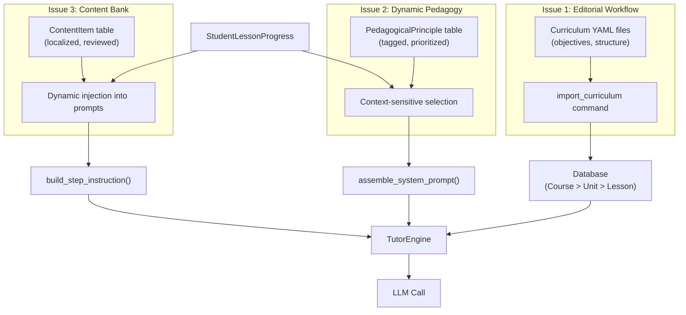

**Implementation order recommendation:**

1. **Issue 1 first** — extract curriculum to YAML files and build the generic importer. This unblocks non-developers from maintaining curriculum and establishes the declarative data pattern.

2. **Issue 3 second** — build the `ContentItem` model and injection pipeline. This can reuse the YAML file pattern (content items can live alongside curriculum files). The highest-value content items are localized practice problems and MCQ questions for exit tickets.

3. **Issue 2 third** — decompose the teaching style prompt into principle records. This is the most nuanced change and benefits from having the content bank in place (principles like "use worked examples before practice" are more effective when there are actually worked examples to inject).

---

*Generated February 2026. Based on analysis of the ai-tutor repository at commit `7768177`.*
