# Deep Dive: Prompt Assembly, Curriculum Data Model & Content Pipeline

> A detailed analysis of how prompts are constructed, how curriculum is modeled and seeded, and three design proposals for evolving the system toward editorial workflows, dynamic pedagogy, and localized content generation.
>
> **Revision 2** — Updated after the `104cebc` merge which introduced the curriculum generator, phase-based engine, exit ticket system, teacher dashboard, and safety module.

---

## Part 1: Current Implementation — How It Works Today

### 1.1 Prompt Assembly Pipeline

The system now has **two distinct prompt assembly paths** depending on the operating mode. Both start from the same `PromptPack` and `Lesson` data, but diverge significantly in how they construct the final LLM input.

#### Path A: Step-Based Mode (via `prompts.py`)

Used when a lesson has multiple `LessonStep` records (e.g., lessons created by `generator.py` with TEACH + WORKED_EXAMPLE + PRACTICE + QUIZ + SUMMARY steps).

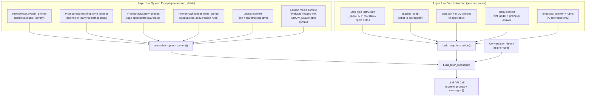

**Key functions** (all in `apps/llm/prompts.py`):

- `assemble_system_prompt()` — Concatenates 4 PromptPack fields + lesson context + (new) media availability block via `"\n\n".join()`. The media block tells the AI which images are available and how to reference them with `[SHOW_MEDIA:title]` markers.

- `build_step_instruction()` — Switches on `StepType` for an instruction prefix, appends `teacher_script`, question/choices, retry context with progressive hint reveal, and expected answer/rubric.

- `build_tutor_message()` — Wraps step instruction in `[STEP CONTEXT]...[/STEP CONTEXT]` delimiters and injects it into the conversation messages array as a user-role message.

#### Path B: Conversational Mode (via `engine.py`)

Used when a lesson has exactly 1 TEACH step with `answer_type=NONE` — all `seed_seychelles` lessons and dashboard-uploaded lessons with thin placeholders.

The engine bypasses `prompts.py` for system prompt construction and builds its own **massive structured system prompt** in `_build_structured_system_prompt()`. This prompt embeds the entire phase protocol, artifact format schemas, and media list directly.

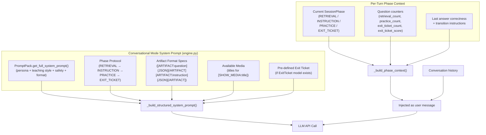

**Key architectural differences from the original analysis:**

1. **Phase state machine** — The engine now tracks a `SessionPhase` enum (`RETRIEVAL`, `INSTRUCTION`, `PRACTICE`, `EXIT_TICKET`, `COMPLETE`) persisted in `TutorSession.engine_state` (JSONField). Phase transitions are deterministic based on question counters, not on `[SESSION_COMPLETE]` string detection.

2. **Artifact protocol** — The AI communicates structured content (questions, instructions, media references) via `[ARTIFACT:type]{JSON}[/ARTIFACT]` markers. The engine parses these to extract question commands, instruction commands, and media references. For exit tickets, the engine **overrides** AI-generated questions with pre-defined ones from the `ExitTicket` model.

3. **Pre-defined exit tickets** — `_load_exit_ticket()` queries `ExitTicket` and `ExitTicketQuestion` records. If present, the actual question text is injected verbatim into the phase context during the EXIT_TICKET phase. This is a critical shift from fully AI-generated to **database-stored, reviewable** assessment items.

4. **Engine constants** — Phase behavior is governed by class constants: `RETRIEVAL_QUESTIONS = 2`, `PRACTICE_QUESTIONS = 3`, `EXIT_TICKET_QUESTIONS = 10`, `EXIT_TICKET_PASS_THRESHOLD = 8`.

#### Combined flow for both modes

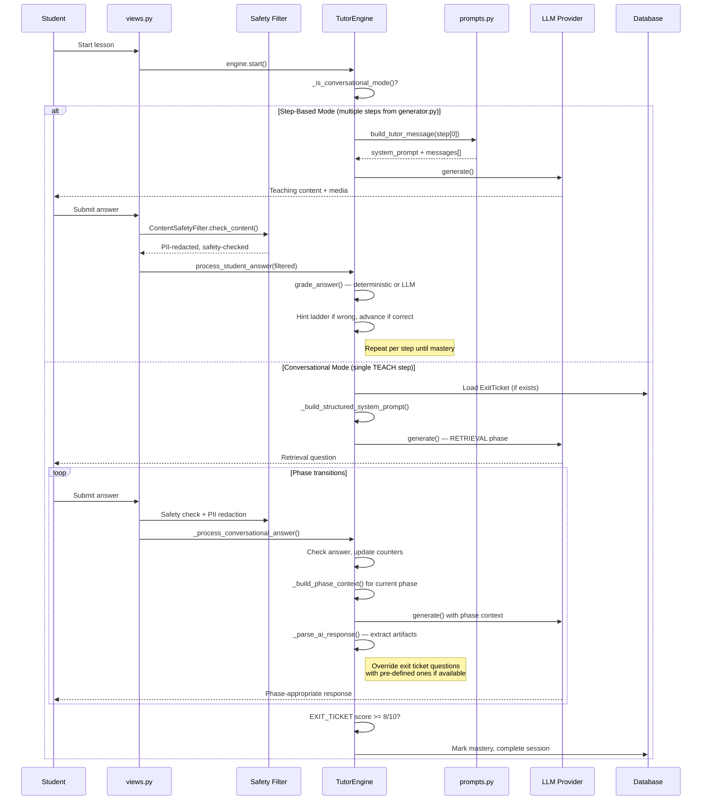

### 1.2 Curriculum Data Model

The model has expanded with exit ticket tables, engine state persistence, and a dashboard upload tracker.

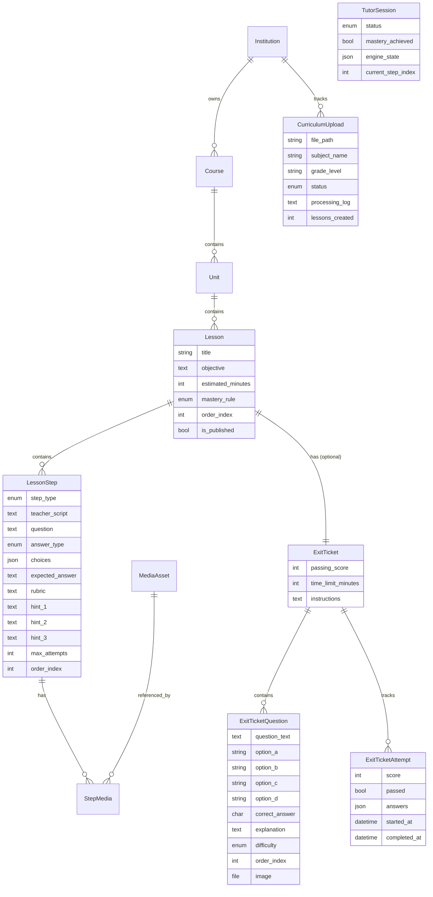

**New model highlights:**

- **`ExitTicket` / `ExitTicketQuestion`** — Stores standardized, pre-generated assessment items per lesson. Questions have Bloom's-aligned difficulty tiers (easy/recall, medium/apply, hard/analyze), individual option fields (not JSON), and an optional image. The engine loads these at session start and injects them verbatim during the EXIT_TICKET phase.

- **`TutorSession.engine_state`** (JSONField) — Persists phase counters, current phase, exit ticket score, and question tracking across turns. Enables the engine to be stateless between requests.

- **`CurriculumUpload`** — Tracks dashboard file uploads with processing status, log, and link to the created Course. Supports the editorial pipeline.

### 1.3 Curriculum Content Pipelines — Three Paths Now Exist

The system has evolved from a single seed command to three distinct curriculum creation paths:

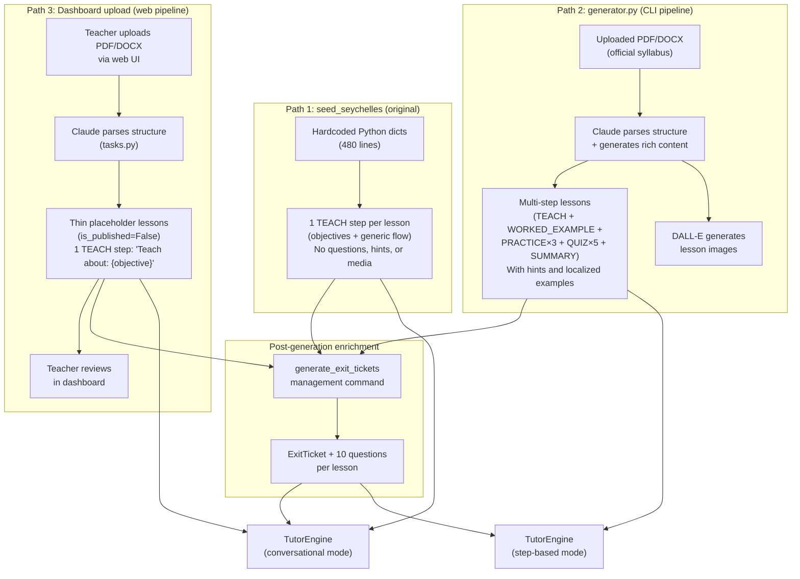

#### Path 1: `seed_seychelles` (original, unchanged)

Hardcoded Python data producing thin single-step lessons. As analyzed in the original document — 59 lessons, each with 1 TEACH step containing objectives and a generic 6-step flow instruction. All teaching content, practice, and assessment is AI-generated at runtime.

#### Path 2: `generator.py` (new — CLI/management command)

A full AI-powered curriculum generation pipeline (`apps/curriculum/generator.py`, 603 lines):

1. **Extract** text from PDF (pypdf + pdftotext fallback) or DOCX (python-docx)
2. **Analyze** structure with Claude — sends up to 15,000 chars, gets back JSON with units and topics including learning objectives, key concepts, and skills
3. **Create** DB records via `@transaction.atomic` with `update_or_create` patterns
4. **Generate** rich content per lesson with a second Claude call — produces teaching script, worked example, retrieval questions, practice problems (with hints), 5-question exit ticket, summary, and image prompts
5. **Create steps** — maps the JSON to a full set of `LessonStep` records: TEACH, WORKED_EXAMPLE, up to 3 PRACTICE (with `hint_1`/`hint_2`/`hint_3`), up to 5 QUIZ, and SUMMARY
6. **Generate media** — calls DALL-E 3 per image suggestion, saves as `MediaAsset` linked via `StepMedia`

This pipeline produces **richly-authored structured lessons** that run in step-based mode. Localization is injected via a hardcoded `LOCAL_CONTEXT` constant in the Python file.

#### Path 3: Dashboard upload (new — web UI)

A lighter web-facing pipeline (`apps/dashboard/tasks.py` + `apps/dashboard/views.py`):

1. Teacher uploads PDF/DOCX via the dashboard
2. `CurriculumUpload` record created with `status=pending`
3. `process_curriculum_upload()` extracts text, calls Claude for structure, creates Course/Unit/Lesson records
4. Lessons are created with `is_published=False` and a thin placeholder TEACH step (`"Teach about: {objective}"`)
5. Teacher reviews in the dashboard before publishing

This pipeline is intentionally thin — it defers rich content generation. A `generate_lesson_content()` function exists in `tasks.py` but is not yet wired into the upload flow.

#### Post-generation: `generate_exit_tickets` command

A management command (`apps/tutoring/management/commands/generate_exit_tickets.py`) that generates standardized 10-question exit tickets for any lesson:

- Supports `--lesson`, `--course`, or `--all` targeting
- Uses the active `ModelConfig` from the database (not a hardcoded model)
- Generates questions with Bloom's-aligned difficulty distribution (Q1-3 easy, Q4-7 medium, Q8-10 hard)
- Saves to `ExitTicket` + `ExitTicketQuestion` models
- Questions are **persistent and editable** in Django Admin
- Supports `--dry-run` for preview and `--overwrite` for regeneration

---

## Part 2: Three Issues — Updated Analysis

### Issue 1: Curriculum Maintenance Is a Code Change, Not an Editorial Workflow

#### What Has Changed

The new code introduces significant movement toward an editorial workflow, but the transformation is incomplete.

```mermaid
flowchart TD
    subgraph "Progress Made"
        direction TB
        P1["Dashboard upload UI\n(teachers can upload syllabi)"]
        P2["is_published=False default\n(editorial gate before students see content)"]
        P3["CurriculumUpload model\n(audit trail with processing log)"]
        P4["generate_exit_tickets --dry-run\n(CLI preview before committing)"]
        P5["Exit tickets editable in Admin\n(post-generation review)"]
    end

    subgraph "Still Hardcoded"
        direction TB
        H1["LOCAL_CONTEXT in generator.py\n(Seychelles names, currency, industries)"]
        H2["'Seychelles' in 7 Python files\n(not configurable per institution)"]
        H3["Phase constants in engine.py\n(RETRIEVAL_QUESTIONS=2, etc.)"]
        H4["seed_seychelles still the only\nway to load the initial curriculum"]
        H5["No web UI to edit\nlesson content after generation"]
    end

    style P1 fill:#6f6,stroke:#333
    style P2 fill:#6f6,stroke:#333
    style P3 fill:#6f6,stroke:#333
    style P4 fill:#6f6,stroke:#333
    style P5 fill:#6f6,stroke:#333
    style H1 fill:#f96,stroke:#333
    style H2 fill:#f96,stroke:#333
    style H3 fill:#f96,stroke:#333
    style H4 fill:#f96,stroke:#333
    style H5 fill:#f96,stroke:#333
```

**Two generation pipelines, neither fully editorial:**

| Concern | `generator.py` (CLI) | `tasks.py` (Dashboard) |
|---|---|---|
| Who triggers it | Developer (management command) | Teacher (web upload) |
| Content richness | Full (multi-step, hints, media) | Thin (placeholder TEACH step) |
| Published by default | Yes (`is_published=True`) | No (`is_published=False`) |
| Review gate | None — content goes live immediately | Exists but incomplete (no edit UI) |
| Localization | Hardcoded `LOCAL_CONTEXT` constant | Hardcoded `"Seychelles"` strings |
| Model selection | Hardcoded `claude-sonnet-4-20250514` | Uses active `ModelConfig` from DB |
| Idempotent | Yes (`update_or_create`) | Yes (`update_or_create`) |

#### Revised Proposal

The original proposal (YAML-based declarative import) remains valid as a third, complementary path — particularly valuable for curriculum experts who want to maintain content in version-controlled files. However, given the new dashboard infrastructure, the highest-impact next steps are:

1. **Unify the two AI generation pipelines** — `generator.py` and `tasks.py` duplicate effort. The CLI pipeline produces richer content but hardcodes the model; the dashboard pipeline is more flexible but produces thin placeholders. Merge into a single `CurriculumGenerationService` class that both paths call, with `is_published=False` as the universal default.

2. **Add a content review UI to the dashboard** — The `course_detail` view exists but is read-only. Add edit capabilities for lesson content, step scripts, and exit ticket questions. This completes the editorial loop: upload → generate → review → publish.

3. **Extract `LOCAL_CONTEXT` to the `Institution` model** — Add a `localization_context` TextField to `Institution` that carries the place names, currency, industries, and local names. Inject this into generation prompts dynamically instead of from a Python constant. This single change eliminates the hardcoded Seychelles references across all seven files.

4. **Wire `generate_lesson_content()` into the dashboard flow** — The function exists in `tasks.py` but is not called. Add a "Generate rich content" button to the dashboard that triggers it for selected lessons, with the result visible for review before publishing.

5. **Add `generate_exit_tickets` to the dashboard** — Currently CLI-only. Add a "Generate exit ticket" action to the lesson detail view so teachers can trigger and review assessment generation from the web UI.

---

### Issue 2: Science-of-Learning Principles Are Static in the System Prompt

#### What Has Changed

The engine now implements a **real phase state machine** that structures sessions around science-of-learning principles. This is a major advance — but the principles are now hardcoded in *two* places instead of one.

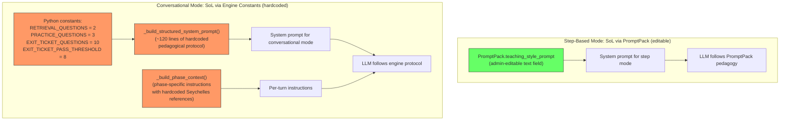

**The split creates two problems:**

1. **Inconsistent configurability** — In step-based mode, an admin can change the teaching methodology by editing `PromptPack.teaching_style_prompt`. In conversational mode, the methodology is baked into Python. A curriculum editor who wants to change "2 retrieval questions" to "3" or adjust the exit ticket threshold from 80% to 70% must submit a code change.

2. **The `PromptPack` is partially bypassed** — Conversational mode calls `self.prompt_pack.get_full_system_prompt()` as a *prefix* to the engine's own protocol. The PromptPack's persona and safety rules are preserved, but its `teaching_style_prompt` is effectively overridden by the engine's hardcoded phase protocol. The two pedagogical instruction sets may contradict each other.

**Additionally, `ChildProtection.get_age_appropriate_system_prompt()` exists but is not wired** — The safety module defines a method that returns a child-safety prompt addendum, but neither `prompts.py` nor `engine.py` calls it. This is a gap: the safety prompt in the `PromptPack` is a static text field, while the `ChildProtection` module has dynamic, age-aware logic that is never injected.

#### Revised Proposal

The original `PedagogicalPrinciple` registry proposal remains the right long-term architecture. The new engine's phase state machine is a strong foundation to build on — it just needs to be made configurable. The revised approach works in two stages:

**Stage 1: Extract engine constants to database configuration**

Introduce a `SessionConfig` model (or extend `PromptPack`) with fields that the engine currently hardcodes:

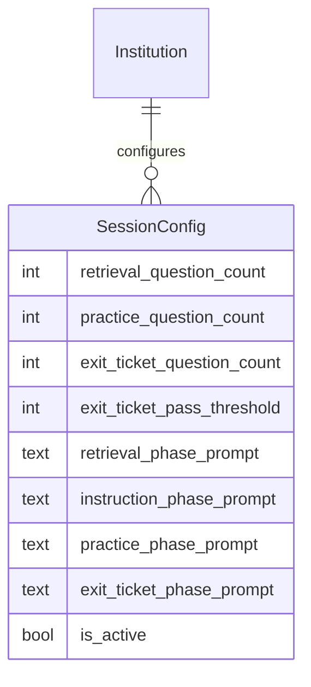

The engine reads these values at session start instead of using class constants. Phase-specific prompt fragments come from the database instead of `_build_phase_context()` string literals. This makes the conversational mode as editable as the step-based mode without changing the phase machine architecture.

**Stage 2: Implement the `PedagogicalPrinciple` registry (original proposal)**

Decompose the phase prompts further into individual, tagged principles that are selected based on subject, grade, phase, and student performance. This builds naturally on Stage 1 — the phase prompt fields become composition targets rather than monolithic strings.

**Wire `ChildProtection.get_age_appropriate_system_prompt()`** — Both `assemble_system_prompt()` in `prompts.py` and `_build_structured_system_prompt()` in `engine.py` should call this method and append the result. This requires passing the student user to the prompt assembly functions.

---

### Issue 3: Learning Content Is Not Localized or Pre-Authored, Relying Entirely on LLM Generation

#### What Has Changed

This issue has seen the most progress. The system now generates and stores content ahead of time, but localization remains static.

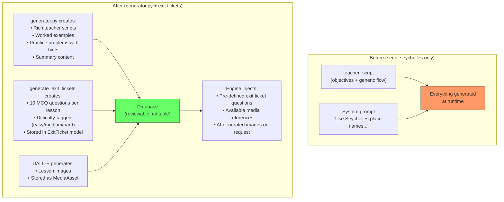

**What is now pre-authored and stored:**

| Content Type | Source | Stored In | Editable? | Used At Runtime? |
|---|---|---|---|---|
| Teacher scripts | `generator.py` | `LessonStep.teacher_script` | Django Admin | Yes — step-based mode |
| Worked examples | `generator.py` | `LessonStep` (WORKED_EXAMPLE type) | Django Admin | Yes — step-based mode |
| Practice problems + hints | `generator.py` | `LessonStep` (PRACTICE type) | Django Admin | Yes — step-based mode |
| Exit ticket questions | `generate_exit_tickets` | `ExitTicketQuestion` | Django Admin | Yes — both modes |
| Lesson images | `generator.py` / DALL-E | `MediaAsset` + `StepMedia` | Django Admin | Yes — both modes |

**What is still generated entirely at runtime:**

| Content Type | When | Localization Source |
|---|---|---|
| Retrieval practice questions | Conversational mode, RETRIEVAL phase | Hardcoded `"Seychelles examples"` in `_build_phase_context()` |
| Instruction explanations | Conversational mode, INSTRUCTION phase | Hardcoded `"[Clear explanation with Seychelles examples]"` in engine |
| Practice problems | Conversational mode, PRACTICE phase | PromptPack system_prompt locale block |
| Feedback on answers | Both modes | PromptPack system_prompt locale block |
| Dynamic images | Conversational mode, on-demand | Hardcoded `"secondary school students in Seychelles"` in `image_service.py` |

**Localization is hardcoded in 7 locations across the codebase:**

| File | What | Line(s) |
|---|---|---|
| `generator.py` | `LOCAL_CONTEXT` constant | 51-58 |
| `generator.py` | `"rooted in Seychelles context"` | 382 |
| `generate_exit_tickets.py` | `"relevant to Seychelles secondary school students"` | 32 |
| `tasks.py` | `"students in Seychelles"` | 237 |
| `tasks.py` | `"Seychelles secondary students"` | 271 |
| `engine.py` | `"[Clear explanation with Seychelles examples]"` | 813 |
| `image_service.py` | `"secondary school students in Seychelles."` | 243 |

Additionally, `engine.py`'s `_find_relevant_media()` has hardcoded Geography-specific keyword boosts (`layer`, `rain`, `earth`, `diagram`) that will not match media for other subjects.

#### Revised Proposal

The exit ticket system is a **partial implementation of the content bank concept** from the original proposal. It proves the pattern works: AI-generates content once → stores in DB → reviewed/editable → injected at runtime. The revised proposal extends this pattern to cover the remaining runtime-generated content types.

**The content bank model and injection pipeline remain as proposed**, with these adjustments:

1. **`ExitTicketQuestion` is already a content bank for assessment** — the model exists, works, and is wired into the engine. Extend the pattern to practice problems and worked examples by creating a parallel `LessonContent` model (or reuse `ContentItem` as proposed) for non-assessment content.

2. **Centralize localization context** — Extract all 7 hardcoded Seychelles references into a single `Institution.localization_context` field:

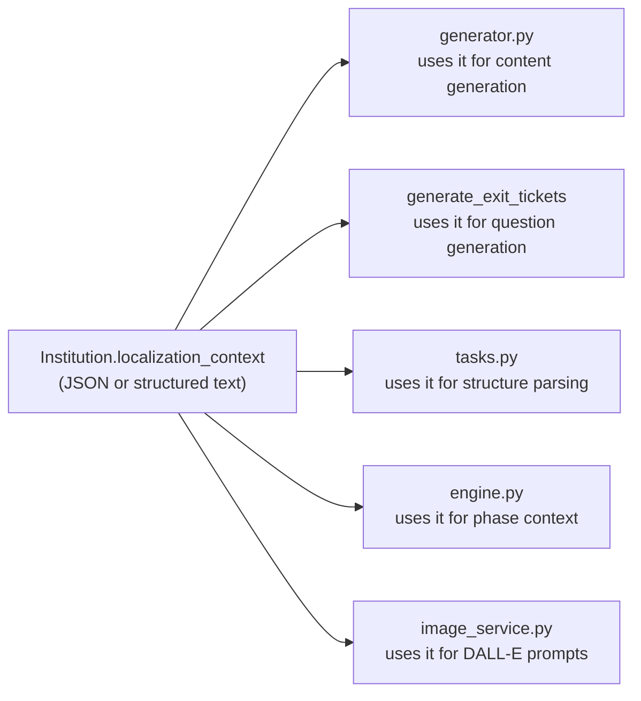

A single database field replaces 7 hardcoded strings. Changing deployment from Seychelles to Kenya becomes a data change, not a code change.

3. **Make media keyword matching configurable** — The `_find_relevant_media()` function in `engine.py` has hardcoded Geography keyword boosts. Move these to the `Course` or `Unit` model as a `media_keywords` JSONField, or derive them from the lesson's subject at runtime.

4. **The feedback loop is now feasible** — Session transcripts (`SessionTurn`) capture all AI-generated content. With the `ExitTicket` pattern as a model, a curation workflow can: (a) scan transcripts for well-received practice problems (high student engagement, correct answers), (b) surface them for editorial review, (c) save approved ones back to the content bank. The infrastructure for steps (a) and (c) exists; step (b) needs a dashboard view.

---

## Part 3: How the Three Proposals Fit Together (Revised)

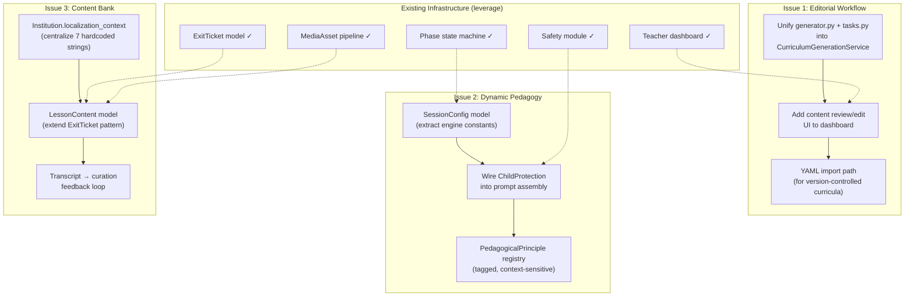

#### Revised Implementation Order

The new code changes the priority sequence. The exit ticket system and dashboard are already in place — build on them rather than starting from scratch.

**Phase 1: Consolidate and centralize (low effort, high impact)**

1. Add `localization_context` to `Institution` — eliminates 7 hardcoded strings
2. Unify the two generation pipelines into a shared service
3. Wire `generate_exit_tickets` and `generate_lesson_content` into the dashboard UI
4. Wire `ChildProtection.get_age_appropriate_system_prompt()` into both prompt paths

**Phase 2: Make the engine configurable (medium effort)**

5. Extract engine constants to `SessionConfig` model
6. Move phase-specific prompt fragments to database
7. Add content editing to the dashboard (lesson steps, exit ticket questions)

**Phase 3: Build the full content bank (higher effort, builds on Phase 1-2)**

8. `LessonContent` model extending the `ExitTicket` pattern to practice problems, worked examples, and localized facts
9. Dynamic injection into both step-based and conversational prompt paths
10. Transcript curation workflow (feedback loop)

**Phase 4: Pedagogical principle registry (builds on Phase 2-3)**

11. Decompose `SessionConfig` phase prompts into tagged `PedagogicalPrinciple` records
12. Context-sensitive selection based on subject, grade, phase, and student performance
13. A/B testing infrastructure for pedagogical strategies

---

## Appendix: New Code Inventory

Files added or significantly modified in the `104cebc` merge:

| File | Lines | Status | Primary Concern |
|---|---|---|---|
| `apps/curriculum/generator.py` | 603 | New | Issue 1 (generation pipeline) + Issue 3 (localized content) |
| `apps/tutoring/engine.py` | 1,560 | Expanded | Issue 2 (phase-based SoL) + Issue 3 (exit ticket injection) |
| `apps/tutoring/models.py` | 352 | Modified | Issue 3 (ExitTicket models) |
| `apps/tutoring/management/commands/generate_exit_tickets.py` | 199 | New | Issue 3 (assessment generation) |
| `apps/tutoring/image_service.py` | 304 | New | Issue 3 (localized media) |
| `apps/tutoring/views.py` | 794 | Expanded | Safety integration, SSE streaming |
| `apps/llm/prompts.py` | 216 | Modified | Media-aware prompts |
| `apps/dashboard/views.py` | 611 | New | Issue 1 (editorial UI) |
| `apps/dashboard/models.py` | 110 | New | Issue 1 (upload tracking) |
| `apps/dashboard/tasks.py` | 347 | New | Issue 1 (web generation pipeline) |
| `apps/safety/__init__.py` | 543 | New | Safety, privacy, COPPA/GDPR |
| `apps/safety/models.py` | 99 | New | Audit logging, consent |
| `apps/safety/views.py` | 197 | New | Privacy dashboard |
| **Total** | **~5,935** | | |

---

*Generated February 2026. Revision 2 based on analysis of the ai-tutor repository at commit `104cebc`.*
