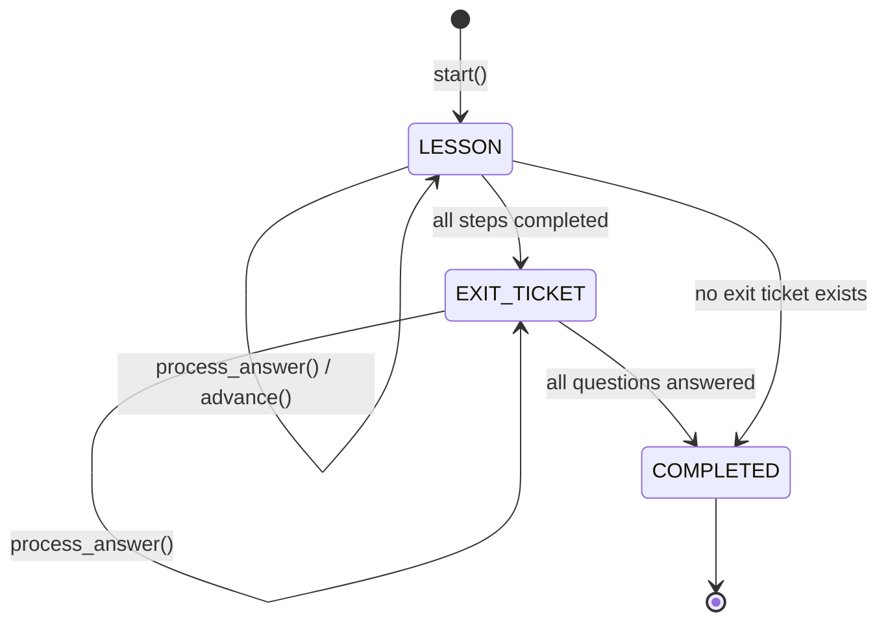
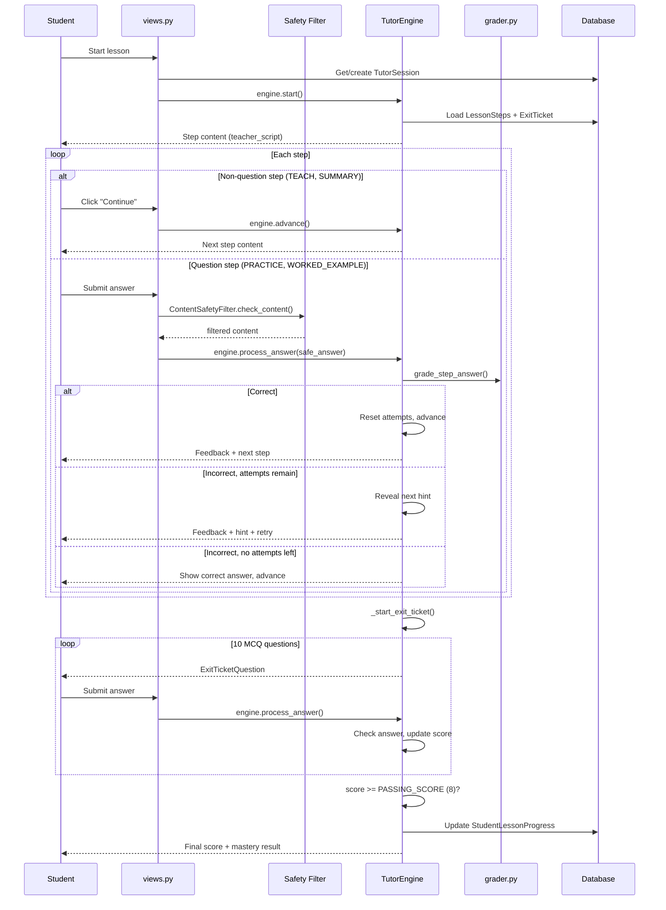
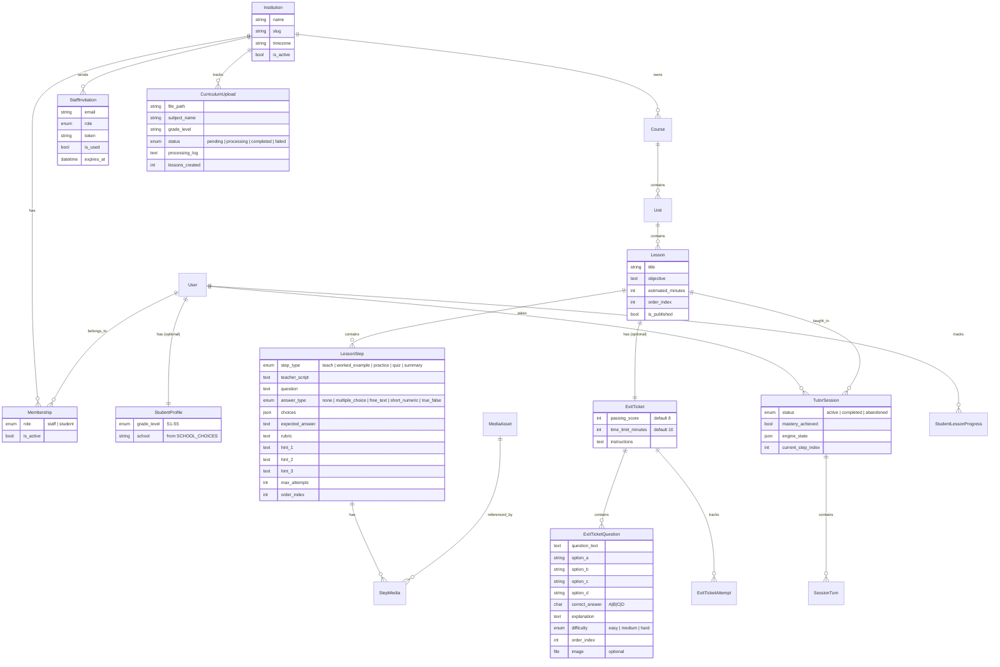
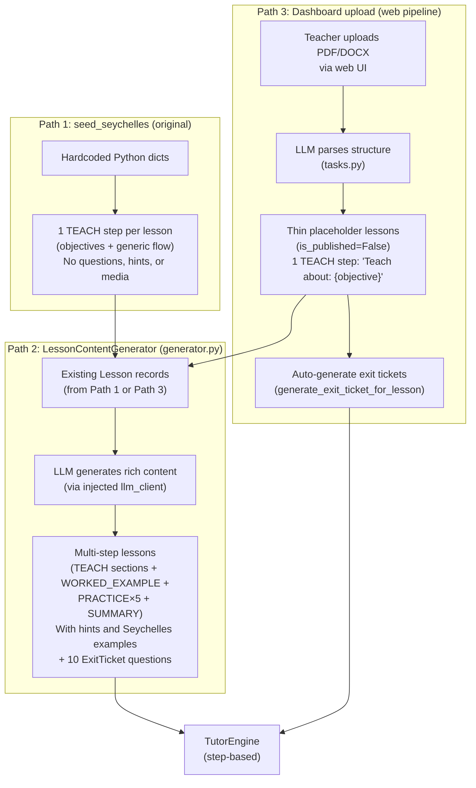
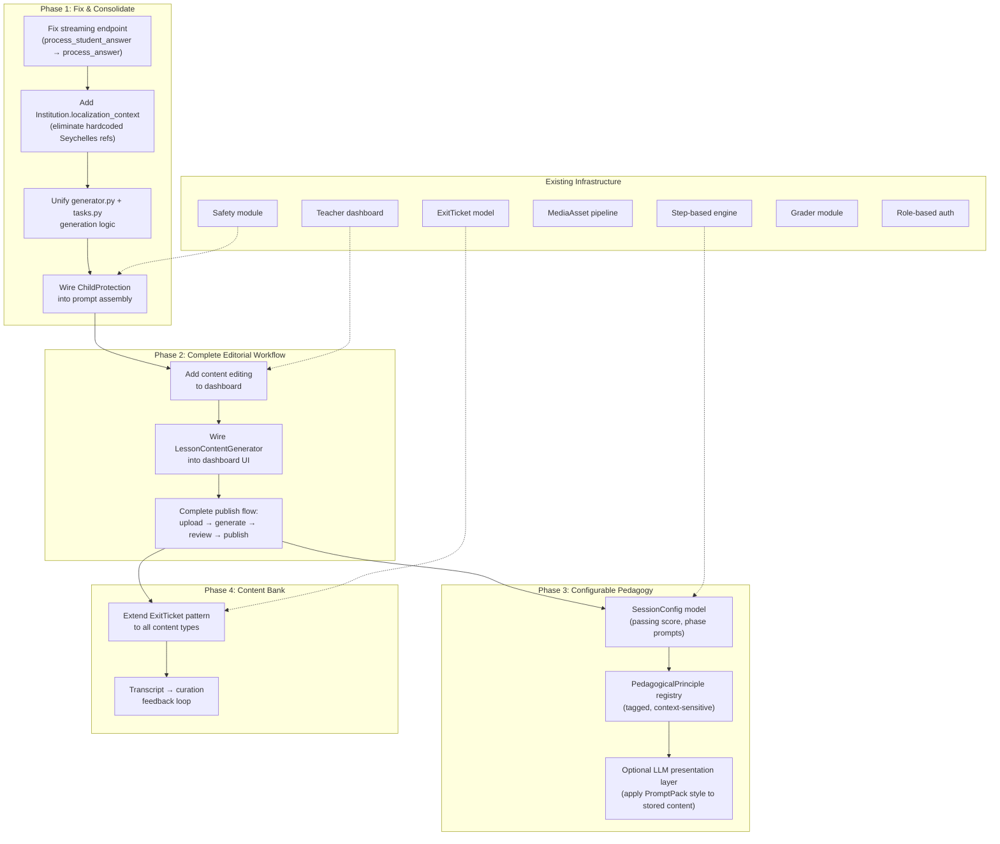

# System Architecture: Tutoring Engine, Content Pipeline & Data Model

> A detailed analysis of how the step-based tutoring engine works, how curriculum content is generated and stored, how prompts are assembled, and design proposals for evolving the system.
>
> **Based on codebase at commit `b93e17b`** (February 2026)

---

## Part 1: Current Implementation

### 1.1 Tutoring Engine — Step-Based, No Runtime AI

The system uses a single, deterministic tutoring engine (`apps/tutoring/engine.py`, 615 lines). There is **no AI generation during tutoring sessions** — all content is pre-generated and stored in the database. The engine walks through `LessonStep` records in order, grades answers deterministically (or via an optional LLM client for free-text), and serves pre-loaded exit ticket questions.

> The old conversational engine with its 5-phase state machine (RETRIEVAL → INSTRUCTION → PRACTICE → EXIT_TICKET → COMPLETE) and artifact protocol is preserved in `engine_backup.py` (1,711 lines) but is not used by any live code path.

#### Session Phases



The `SessionPhase` enum has three values:
- **`LESSON`** — Walking through `LessonStep` records (TEACH → WORKED_EXAMPLE → PRACTICE → SUMMARY)
- **`EXIT_TICKET`** — Serving pre-stored `ExitTicketQuestion` MCQs
- **`COMPLETED`** — Session finished, mastery evaluated

#### Engine Public API

| Method | Purpose |
|---|---|
| `start()` | Begin session, present first step |
| `resume()` | Resume from persisted state |
| `process_answer(answer)` | Grade answer, provide feedback, advance or give hint |
| `advance()` | Move to next step (for non-question steps like TEACH, SUMMARY) |

#### Session Flow



#### Grading (`apps/tutoring/grader.py`, 277 lines)

A dedicated grading module routes to the appropriate strategy based on `LessonStep.answer_type`:

| Answer Type | Strategy | Details |
|---|---|---|
| `multiple_choice` | Exact match | Normalizes case, accepts letter or choice text |
| `true_false` | Variant matching | Accepts "true", "t", "yes", "y", "1", etc. |
| `short_numeric` | Numeric tolerance | Strips `$`, `%`, `,`; uses relative tolerance |
| `free_text` | LLM rubric grading | Calls LLM with question + rubric + answer; returns CORRECT/PARTIAL/INCORRECT |

The engine itself also has a simpler inline grading path for MCQ (`_grade_step_answer()`), used as the primary path. The `grader.py` module is called for free-text when an `llm_client` is provided.

#### Engine State Persistence

All state is stored in `TutorSession.engine_state` (JSONField):

```json
{
    "phase": "lesson",
    "step_index": 3,
    "current_attempt": 1,
    "hints_given": 1,
    "exit_question_index": 0,
    "exit_correct_count": 0,
    "exit_answers": []
}
```

The engine is stateless between requests — it loads from `engine_state` on init and saves after every action.

#### Engine Constants

| Constant | Value | Location |
|---|---|---|
| `PASSING_SCORE` | 8 (out of 10) | `engine.py:75` |

This is the only hardcoded constant. All other behavior (number of steps, number of exit questions, max attempts per step) comes from the database records themselves.

### 1.2 Prompt Assembly (`apps/llm/prompts.py`, 217 lines)

The prompt assembler exists for potential LLM-based tutoring (currently used only by the streaming endpoint and grader). It builds a two-layer prompt:

**Layer 1 — System Prompt** (per-session, stable):
- `PromptPack.system_prompt` (persona, locale, identity)
- `PromptPack.teaching_style_prompt` (science-of-learning methodology)
- `PromptPack.safety_prompt` (age-appropriate guardrails)
- `PromptPack.format_rules_prompt` (output style, conversation rules)
- Lesson context (title + learning objective)
- Available media list (`[SHOW_MEDIA:title]` syntax)

**Layer 2 — Step Instruction** (per-turn, varies):
- Step type instruction (TEACH / PRACTICE / QUIZ / etc.)
- `teacher_script` (what to say/explain)
- Question + MCQ choices (if applicable)
- Retry context with progressive hint reveal
- Expected answer + rubric (AI reference only)

The `build_tutor_message()` function wraps the step instruction in `[STEP CONTEXT]...[/STEP CONTEXT]` delimiters and injects it into the conversation messages array.

> **Note:** The current step-based engine does NOT use `prompts.py` for session delivery. Content is served directly from `LessonStep.teacher_script`. The prompt assembler is used only by the `submit_answer_stream` endpoint and LLM-based grading.

### 1.3 Data Model



**Key model relationships:**

- **`StaffInvitation`** — Invitation-gated staff onboarding. Staff cannot self-register; they must receive a token-based invitation from an admin. Students self-register with school and grade selection.
- **`StudentProfile.SCHOOL_CHOICES`** — Hardcoded list of 11 Seychelles secondary schools.
- **`ExitTicket` / `ExitTicketQuestion`** — Standardized 10-question MCQ assessments per lesson. Questions have Bloom's-aligned difficulty tiers (easy/recall, medium/apply, hard/analyze), individual option fields (not JSON), and an optional image. The engine loads these at session start.
- **`TutorSession.engine_state`** (JSONField) — Persists phase, step index, attempt counters, exit ticket score across turns.
- **`CurriculumUpload`** — Tracks dashboard file uploads with processing status, log, and link to the created Course.

### 1.4 Content Pipelines — Three Paths



#### Path 1: `seed_seychelles` (management command)

Hardcoded Python data producing thin single-step lessons. 59 lessons across Geography and Mathematics, each with 1 TEACH step containing objectives and a generic 6-step flow instruction. All content is AI-generated at runtime (or requires Path 2 enrichment for the step-based engine).

#### Path 2: `LessonContentGenerator` (`apps/curriculum/generator.py`, 453 lines)

A content enrichment class that takes **existing** lessons and generates rich, multi-step content. Unlike the old `CurriculumGenerator` (now in `generator_backup.py`), this does not parse documents or create courses — it enriches lessons that already exist in the database.

**Pipeline:**
1. Takes an `llm_client` (injected, not hardcoded) and a `Lesson` object
2. Calls LLM with `LESSON_CONTENT_PROMPT` to generate: teaching sections, worked examples, practice problems (with hints), summary, and image suggestions
3. Calls LLM with `EXIT_TICKET_PROMPT` to generate 10 MCQ questions
4. Saves to DB in an atomic transaction: clears existing steps, creates TEACH + WORKED_EXAMPLE + PRACTICE + SUMMARY `LessonStep` records + `ExitTicket` + `ExitTicketQuestion` records

**Step types created:**

| Step Type | Count | Has Question? |
|---|---|---|
| TEACH | 2-3 (one per teaching section) | No |
| WORKED_EXAMPLE | 1+ | No |
| PRACTICE | 5 (mix of MCQ + short answer) | Yes, with 3-level hint ladder |
| SUMMARY | 1 | No |

**Batch helpers:**
- `generate_content_for_course(course_id)` — Iterates all lessons in a course
- `generate_content_for_lesson(lesson_id)` — Single lesson enrichment

Both resolve `ModelConfig` from the database (no hardcoded model).

#### Path 3: Dashboard upload (`apps/dashboard/tasks.py`, 459 lines)

A web-facing pipeline:
1. Teacher uploads PDF/DOCX via the dashboard
2. `CurriculumUpload` record created with `status=pending`
3. `process_curriculum_upload()` extracts text (PyMuPDF/pdfplumber/python-docx), calls LLM for structure, creates Course/Unit/Lesson records
4. Lessons are created with `is_published=False` and a thin placeholder TEACH step (`"Teach about: {objective}"`)
5. **Auto-generates exit tickets** for each lesson via `generate_exit_ticket_for_lesson()`
6. Teacher reviews in the dashboard before publishing

**`generate_lesson_content()` exists but is not wired** — The function (line 223) can enrich a placeholder lesson with full teaching content, but it is not called during `process_curriculum_upload()` or from any dashboard view. It remains a standalone function.

#### Post-generation: `generate_exit_tickets` management command

A CLI command (`apps/tutoring/management/commands/generate_exit_tickets.py`) that generates standardized 10-question exit tickets:
- Supports `--lesson`, `--course`, or `--all` targeting
- Uses active `ModelConfig` from the database
- Bloom's-aligned difficulty distribution (Q1-3 easy, Q4-7 medium, Q8-10 hard)
- Supports `--dry-run` and `--overwrite`

> The dashboard upload (Path 3) now calls `generate_exit_ticket_for_lesson()` directly, so this command is mainly useful for enriching Path 1 (seed) lessons.

### 1.5 Authentication & Routing

#### URL Structure

| URL | Handler | Purpose |
|---|---|---|
| `/` | `accounts.landing_page` | Role selection landing page |
| `/accounts/student/login/` | `accounts.student_login` | Student login |
| `/accounts/student/register/` | `accounts.student_register` | Student self-registration (with school + grade) |
| `/accounts/staff/login/` | `accounts.staff_login` | Staff login (checks staff membership) |
| `/accounts/staff/register/<token>/` | `accounts.staff_register` | Invitation-gated staff registration |
| `/accounts/invite/` | `accounts.invite_staff` | Admin sends staff invitations |
| `/tutor/` | `tutoring` app | Lesson catalog, session endpoints |
| `/dashboard/` | `dashboard` app | Staff dashboard (metrics, curriculum, students) |
| `/admin/` | Django admin | System admin |

#### Auth Flow

- **Students**: Self-register → auto-assigned to first active institution → redirected to lesson catalog
- **Staff**: Must receive invitation token → register via token link → assigned to invitation's institution with invitation's role → redirected to dashboard
- **Role-based redirect**: `redirect_by_role()` sends staff to dashboard, students to catalog

### 1.6 Views Layer (`apps/tutoring/views.py`, 812 lines)

| Endpoint | Method | Purpose |
|---|---|---|
| `lesson_list` | GET | JSON list of published lessons for institution |
| `lesson_catalog` | GET | HTML catalog with progress tracking per subject |
| `start_session` | POST | Create/resume session, return first step |
| `submit_answer` | POST | Grade answer via step-based engine with safety checks |
| `advance_step` | POST | Advance to next non-question step |
| `session_status` | GET | Current session state |
| `tutor_interface` | GET | HTML tutoring page |
| `submit_answer_stream` | POST | SSE streaming endpoint |
| `generate_image` | POST | DALL-E image generation on demand |

**Safety integration in `submit_answer`:**
1. `RateLimiter.check_rate_limit()` — per-user rate limiting
2. `ContentSafetyFilter.check_content()` — PII detection, profanity, safety flags
3. Blocked content returns a safe response without hitting the engine
4. All safety events logged to `SafetyAuditLog`

**Structured session endpoints** (`tutor_interface_v2`, `start_structured_session`, `structured_session_input`, `structured_session_input_stream`) import from `apps.tutoring.structured_engine.StructuredSessionEngine` which does not exist in the codebase — these are non-functional stubs.

### 1.7 Dashboard (`apps/dashboard/views.py`, 615 lines)

| View | Purpose |
|---|---|
| `dashboard_home` | Overview metrics: active students, sessions, mastery rates, activity chart |
| `student_list` | Paginated student list with progress summary |
| `student_detail` | Individual student's progress across all courses |
| `curriculum_list` | All courses with lesson counts (published vs total) |
| `course_detail` | Read-only view of units and lessons with per-lesson progress stats |
| `curriculum_upload` | Upload PDF/DOCX to auto-generate course structure |
| `curriculum_process` | Show processing progress/results |
| `curriculum_generate` | API to trigger `process_curriculum_upload()` |
| `class_list` | Students grouped by grade |
| `reports_overview` | Sessions by day, top students, lesson completion rates |
| `settings_page` | Edit institution name and timezone |

---

## Part 2: Known Issues & Gaps

### Issue 1: Hardcoded Seychelles References

Localization is hardcoded in multiple files across the codebase. Deploying to a different country requires code changes, not data changes.

| File | What | Line(s) |
|---|---|---|
| `apps/curriculum/generator.py` | `LESSON_CONTENT_PROMPT` — "Seychelles secondary school students", "Seychelles context", "seychelles_example" fields | 26, 43, 49, 61, 104, 122 |
| `apps/curriculum/generator.py` | `_format_teaching_script()` — "Example from Seychelles" | 357 |
| `apps/dashboard/tasks.py` | `generate_lesson_content()` — "students in Seychelles", "Seychelles examples", "Seychelles secondary students" | 237, 246, 271 |
| `apps/dashboard/tasks.py` | `generate_exit_ticket_for_lesson()` — "Seychelles secondary school students" | 330 |
| `apps/tutoring/image_service.py` | DALL-E prompt — "secondary school students in Seychelles" | 243 |
| `apps/tutoring/management/commands/generate_exit_tickets.py` | Exit ticket prompt — "Seychelles secondary school students" | 32 |
| `apps/accounts/models.py` | `StudentProfile.SCHOOL_CHOICES` — 11 hardcoded Seychelles school names | 84-98 |
| `apps/curriculum/management/commands/seed_seychelles.py` | Entire file — Seychelles-specific seed data | throughout |

**Proposal:** Add an `Institution.localization_context` TextField (or JSONField) carrying place names, currency, industries, school names, and cultural references. Inject this into all generation prompts dynamically. The `SCHOOL_CHOICES` on `StudentProfile` should also come from the institution or be configurable.

### Issue 2: Content Pipeline Fragmentation

Three paths exist for creating curriculum content, with overlapping but inconsistent capabilities:

| Concern | `generator.py` | `tasks.py` (Dashboard) | `seed_seychelles` |
|---|---|---|---|
| Who triggers | Developer/CLI | Teacher (web upload) | Developer (management command) |
| Creates courses | No (enriches existing) | Yes (from document) | Yes (hardcoded) |
| Content richness | Full (multi-step, hints, exit tickets) | Thin (placeholder + exit ticket) | Thin (single TEACH step) |
| Published by default | Preserves existing | No (`is_published=False`) | Yes |
| LLM model | From DB (`ModelConfig`) | From DB (`ModelConfig`) | N/A |
| Exit ticket generation | Built-in | Auto-generated during upload | Requires separate command |

**Proposals:**
1. **Wire `generate_lesson_content()` into the dashboard** — Add a "Generate rich content" button that calls `LessonContentGenerator.generate_for_lesson()` for selected lessons
2. **Add content editing to the dashboard** — `course_detail` is read-only. Add edit capabilities for lesson steps and exit ticket questions to complete the editorial loop: upload → generate → review → publish
3. **Unify** the generation logic — `generator.py`'s `LessonContentGenerator` and `tasks.py`'s `generate_lesson_content()` overlap. The generator is more complete; the tasks.py version should delegate to it.

### Issue 3: `PromptPack` Teaching Style Is Unused in Step-Based Mode

The step-based engine serves content directly from `LessonStep.teacher_script` without consulting `PromptPack.teaching_style_prompt`. This means:
- An admin editing the teaching methodology in `PromptPack` has **no effect** on step-based sessions
- The `PromptPack` is only meaningful if the streaming endpoint or LLM grader is used
- The science-of-learning principles that `PromptPack` encodes are disconnected from the primary delivery path

**Proposal:** Either:
- (a) Inject `PromptPack` principles into the content generation prompts (so the stored content reflects the methodology), or
- (b) Add an optional LLM "presentation layer" that takes `teacher_script` + `PromptPack.teaching_style_prompt` and produces the final student-facing message at session time

### Issue 4: `ChildProtection` Module Exists but Is Not Wired into Prompt Assembly

`apps/safety/__init__.py` defines `ChildProtection.get_age_appropriate_system_prompt()` which returns a child-safety prompt addendum. Neither `prompts.py` nor the engine calls it. The safety prompt in the `PromptPack` is static, while `ChildProtection` has dynamic, age-aware logic that is never injected.

**Proposal:** Both `assemble_system_prompt()` in `prompts.py` and any future LLM-using path should call this method and append the result.

### Issue 5: Streaming Endpoint Bug

`submit_answer_stream` at `views.py:541` calls `engine.process_student_answer(safe_answer)` — but the method on `TutorEngine` is `process_answer()`, not `process_student_answer()`. This will raise `AttributeError` at runtime.

### Issue 6: Structured Session Stubs Reference Non-Existent Module

Four views (`tutor_interface_v2`, `start_structured_session`, `structured_session_input`, `structured_session_input_stream`) import from `apps.tutoring.structured_engine.StructuredSessionEngine` which does not exist. These endpoints will fail with `ImportError`.

---

## Part 3: Architecture Evolution Proposals



---

## Appendix: File Inventory

| File | Lines | Purpose |
|---|---|---|
| `apps/tutoring/engine.py` | 615 | Step-based tutoring engine (LESSON → EXIT_TICKET → COMPLETED) |
| `apps/tutoring/engine_backup.py` | 1,711 | Old conversational engine (backup, not used) |
| `apps/tutoring/grader.py` | 277 | Answer grading (exact match, numeric, T/F, LLM rubric) |
| `apps/tutoring/models.py` | 353 | TutorSession, SessionTurn, StudentLessonProgress, ExitTicket* |
| `apps/tutoring/views.py` | 812 | Tutoring endpoints + safety integration |
| `apps/tutoring/image_service.py` | 304 | DALL-E image generation |
| `apps/tutoring/management/commands/generate_exit_tickets.py` | ~199 | CLI exit ticket generation |
| `apps/curriculum/generator.py` | 453 | LessonContentGenerator (content enrichment) |
| `apps/curriculum/generator_backup.py` | 603 | Old CurriculumGenerator (backup, not used) |
| `apps/llm/prompts.py` | 217 | Prompt assembly (system + step context) |
| `apps/dashboard/views.py` | 615 | Staff dashboard (metrics, curriculum, students) |
| `apps/dashboard/models.py` | 110 | CurriculumUpload |
| `apps/dashboard/tasks.py` | 459 | Curriculum parsing + upload processing |
| `apps/accounts/models.py` | 176 | Institution, Membership, StudentProfile, StaffInvitation |
| `apps/accounts/views.py` | 397 | Role-based auth (student self-register, staff invitation) |
| `apps/safety/__init__.py` | 543 | ContentSafetyFilter, RateLimiter, ChildProtection |
| `apps/safety/models.py` | 99 | SafetyAuditLog, consent tracking |
| `apps/safety/views.py` | 197 | Privacy dashboard |

---

*Generated February 2026. Based on analysis of the ai-tutor repository at commit `b93e17b`.*
