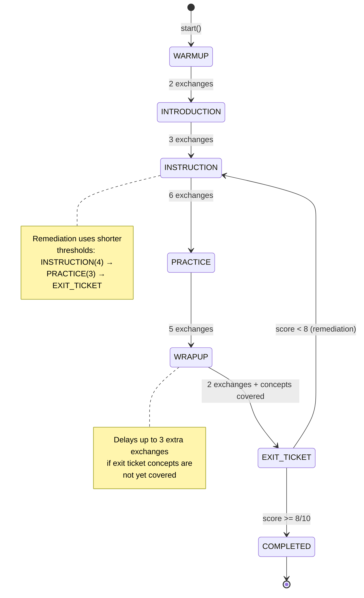
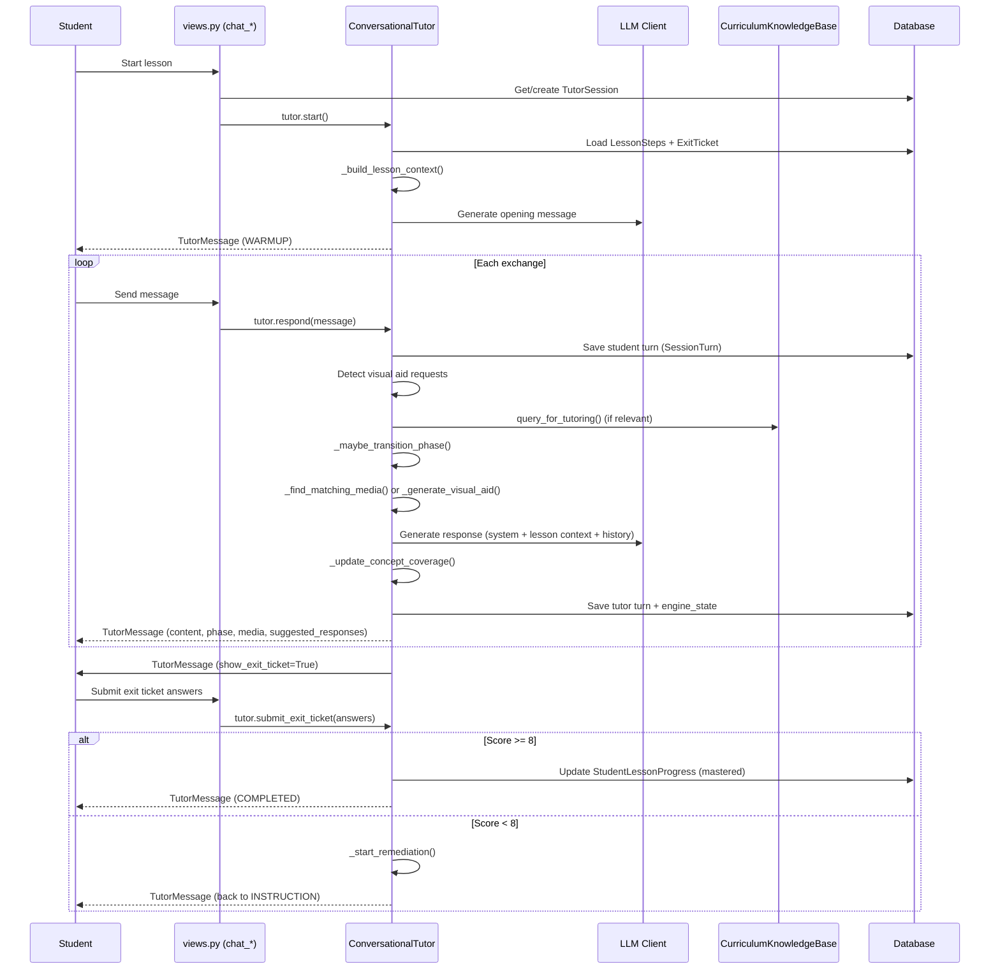
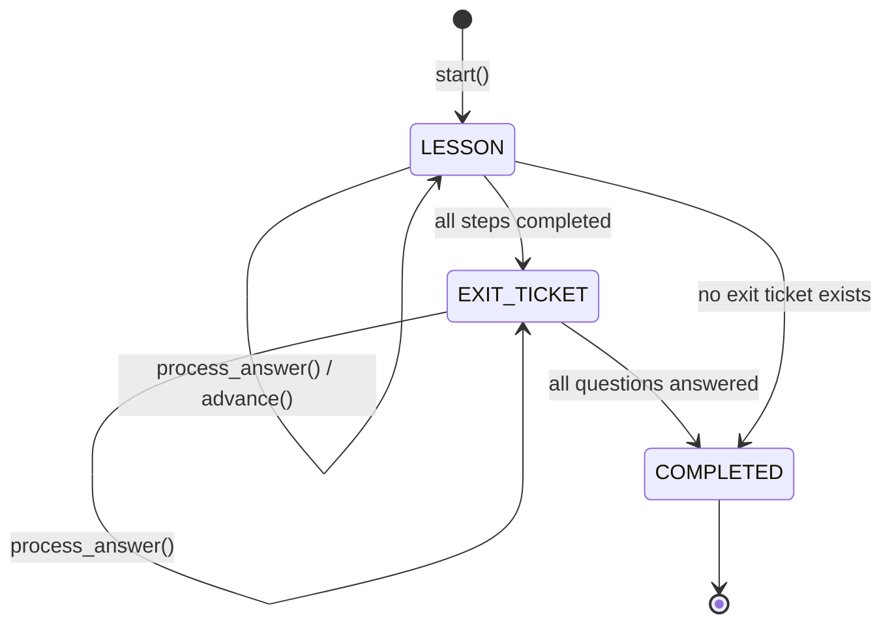
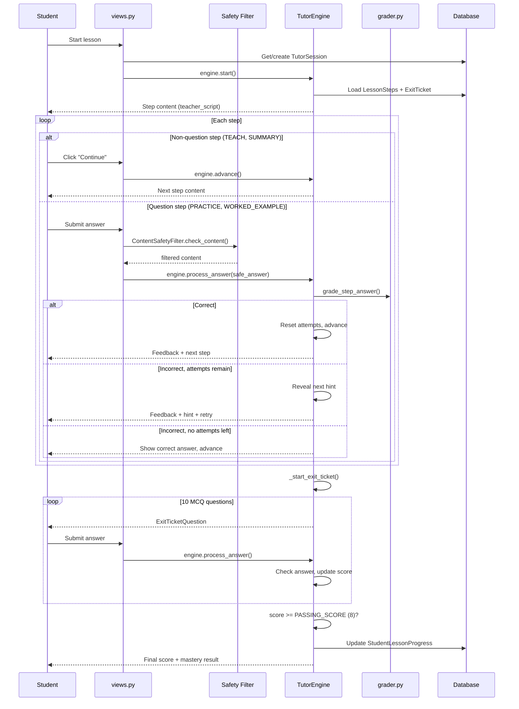
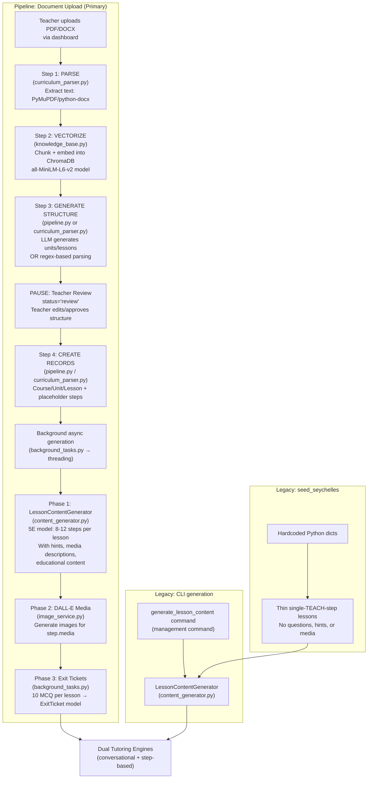
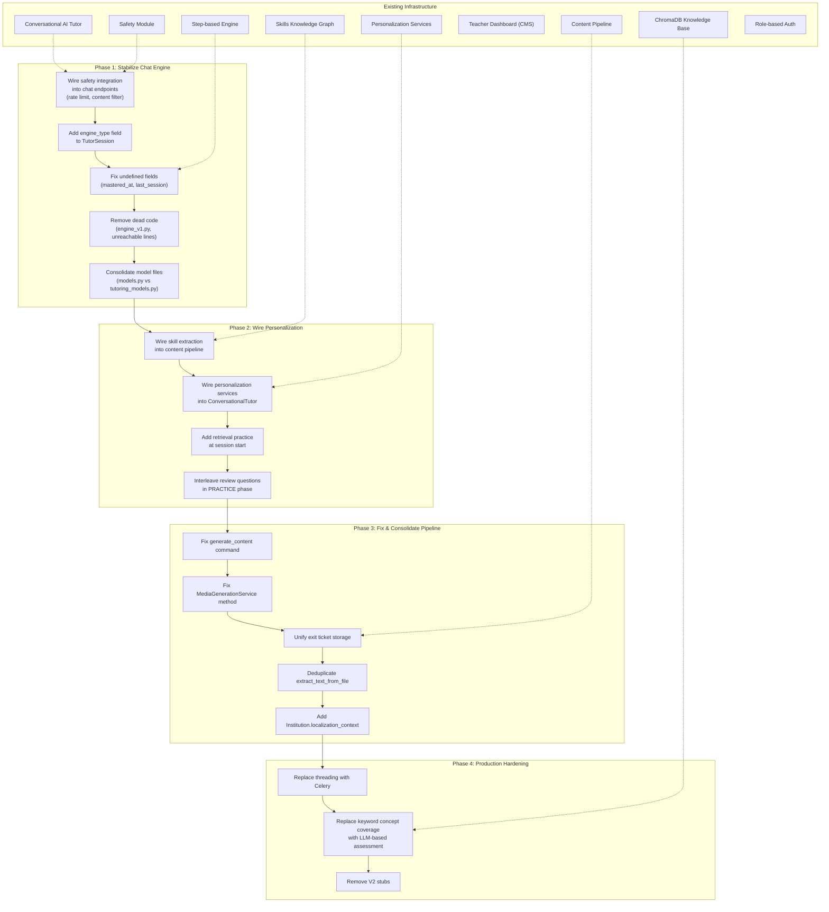

# System Architecture: Dual-Engine Tutoring, Skills Graph, Content Pipeline & Data Model

> A detailed analysis of how the conversational AI tutor and step-based engine work, how the skills knowledge graph and spaced repetition system operate, how curriculum content is generated and stored, how the RAG knowledge base integrates, and how the teacher dashboard manages the editorial workflow.
>
> **Based on codebase at commit `9bee720`** (February 2026)

---

## Part 1: Tutoring Engines

The system now implements a **dual-engine architecture**: a new LLM-driven conversational tutor (primary, default) and the original deterministic step-based engine (legacy, still available). Both engines persist state in `TutorSession.engine_state` (JSONField), but with different schemas — a session started with one engine cannot be resumed by the other.

### 1.1 Conversational AI Tutor — LLM-Driven, Socratic (`apps/tutoring/conversational_tutor.py`, 1,651 lines)

The flagship tutoring engine. It orchestrates an LLM-driven, Socratic conversation that leads students through lessons. Unlike the step-based engine, every tutor response is dynamically generated by a language model. `LessonStep` records serve as guidance (not scripts), and the tutor never gives direct answers — it always scaffolds via questions.

#### Design Philosophy: Exit-Ticket-Driven Instruction

The conversational tutor implements **backward design**: it loads all `ExitTicketQuestion` records at initialization and uses them to drive instruction. The entire lesson is organized around ensuring the student can answer those specific questions. Concept coverage is tracked and the engine delays the exit ticket phase until sufficient coverage is achieved.

#### Conversation Phases



The `ConversationPhase` enum:
- **`WARMUP`** — Greeting, establish rapport (2 exchanges)
- **`INTRODUCTION`** — Preview lesson topic and objectives (3 exchanges)
- **`INSTRUCTION`** — Core teaching, guided by lesson steps (6 exchanges)
- **`PRACTICE`** — Guided practice with feedback (5 exchanges)
- **`WRAPUP`** — Summarize key concepts, check coverage (2 exchanges)
- **`EXIT_TICKET`** — 10-question MCQ assessment
- **`COMPLETED`** — Session finished

#### Public API

| Method | Purpose |
|---|---|
| `start()` | Begin new session or resume if history exists; returns `TutorMessage` |
| `resume()` | Generate "welcome back" message with context of where they left off |
| `respond(student_input)` | Main conversation loop: save turn → detect visual requests → query KB → check phase transitions → select media → call LLM → analyze response → save state |
| `submit_exit_ticket(answers)` | Grade all MCQ answers; pass (>= 8) or start remediation |

#### Conversation Flow



#### TutorMessage Return Type

Every engine method returns a `TutorMessage` dataclass:

| Field | Type | Purpose |
|---|---|---|
| `content` | `str` | Tutor's text response |
| `phase` | `str` | Current conversation phase |
| `media` | `List[Dict]` | Images/diagrams to display |
| `expects_response` | `bool` | Whether to show input field |
| `suggested_responses` | `List[str]` | Quick-reply button labels |
| `is_complete` | `bool` | Session ended flag |
| `show_exit_ticket` | `bool` | Trigger exit ticket modal |
| `exit_ticket_data` | `Optional[Dict]` | Quiz questions or results |
| `skills_covered` | `List[str]` | Tracking metadata |
| `tokens_used` | `int` | LLM token consumption |

#### System Prompt

`TUTOR_SYSTEM_PROMPT` (lines 43–99) defines the tutor persona:
- Local Seychelles context (names, places, currency, cultural references)
- Teaching methodology: scaffold, never lecture, always end with a question
- Visual aid behavior: offer diagrams when concepts are spatial/complex
- Response format: 2–4 sentences max, always end with a question

`SESSION_PHASES` (lines 102–132) describes the 5-phase session structure injected into LLM context.

#### Concept Coverage Tracking

`_update_concept_coverage()` extracts keywords from each exit ticket concept (question text, correct answer, explanation), removes stop words, and checks what fraction appears in the combined student + tutor conversation text. A concept is marked `covered` if coverage ratio > 0.3 or >= 3 keyword matches.

> **Limitation**: This uses naive keyword matching, not semantic understanding. It will have false positives/negatives compared to true comprehension verification.

#### Remediation Flow

When a student fails the exit ticket (score < 8):
1. `remediation_attempt` incremented (no max — can retry indefinitely)
2. `is_remediation = True`, `failed_exit_questions` stored
3. Failed concepts marked `covered = False`
4. Phase reset to INSTRUCTION with shorter thresholds (4 → 3 → EXIT_TICKET, skipping WRAPUP)
5. Encouraging remediation opening message generated

#### Media Integration

- `_find_matching_media(query)` — Searches all lesson step images using keyword overlap, topic term matching, and phrase matching. Returns up to 2 images above relevance threshold (0.4).
- `_generate_visual_aid(request)` — Calls `ImageGenerationService` for on-demand DALL-E generation.

#### Engine State Schema (Conversational)

```json
{
    "phase": "instruction",
    "exchange_count": 12,
    "phase_exchange_count": 3,
    "concepts_covered": ["photosynthesis", "chloroplast"],
    "student_struggles": ["light reactions"],
    "student_strengths": ["plant anatomy"],
    "current_topic_index": 2,
    "practice_correct": 3,
    "practice_total": 5,
    "covered_concept_ids": [1, 3, 5],
    "is_remediation": false,
    "remediation_attempt": 0,
    "failed_exit_questions": []
}
```

#### Dependencies

- `apps.llm.models.ModelConfig` + `apps.llm.client.get_llm_client` — LLM access (lazy-loaded)
- `apps.curriculum.knowledge_base.CurriculumKnowledgeBase` — RAG queries (lazy-loaded)
- `apps.tutoring.image_service.ImageGenerationService` — Visual aid generation

### 1.2 Step-Based Engine — Deterministic, No Runtime AI (`apps/tutoring/engine.py`, 658 lines)

The original tutoring engine. There is **no AI generation during step-based sessions** — all content is pre-generated and stored in the database. The engine walks through `LessonStep` records in order, grades answers deterministically (or via an optional LLM client for free-text), and serves pre-loaded exit ticket questions.

#### Session Phases



The `SessionPhase` enum has three values:
- **`LESSON`** — Walking through `LessonStep` records (any phase: engage, explore, explain, practice, evaluate)
- **`EXIT_TICKET`** — Serving pre-stored `ExitTicketQuestion` MCQs
- **`COMPLETED`** — Session finished, mastery evaluated

#### Engine Public API

| Method | Purpose |
|---|---|
| `start()` | Begin session, present first step |
| `resume()` | Resume from persisted state |
| `process_answer(answer)` | Grade answer, provide feedback, advance or give hint |
| `advance()` | Move to next step (for non-question steps like TEACH, SUMMARY) |

#### Session Flow



#### Grading (`apps/tutoring/grader.py`, 276 lines)

| Answer Type | Strategy | Details |
|---|---|---|
| `multiple_choice` | Exact match | Normalizes case, accepts letter or choice text |
| `true_false` | Variant matching | Accepts "true", "t", "yes", "y", "1", etc. |
| `short_numeric` | Numeric tolerance | Strips `$`, `%`, `,`; uses relative tolerance |
| `free_text` | LLM rubric grading | Calls LLM with question + rubric + answer; returns CORRECT/PARTIAL/INCORRECT |

#### Engine State Schema (Step-Based)

```json
{
    "phase": "lesson",
    "step_index": 3,
    "current_attempt": 1,
    "hints_given": 1,
    "exit_question_index": 0,
    "exit_correct_count": 0,
    "exit_answers": []
}
```

#### Engine Constants

| Constant | Value | Location |
|---|---|---|
| `PASSING_SCORE` | 8 (out of 10) | `engine.py:75` |

#### Engine Version History

`engine_v1.py` (627 lines) is a historical backup of the step-based engine. It is **not imported by any module** and differs primarily in the `advance()` method: v1 auto-presents the next step after a correct answer, while the current engine requires an explicit "Continue" click. This file can be safely removed.

### 1.3 Prompt Assembly (`apps/llm/prompts.py`, 216 lines)

The prompt assembler exists for potential LLM-based tutoring (used by the streaming endpoint and grader, **not** by the conversational tutor which builds its own prompts). It builds a two-layer prompt:

**Layer 1 — System Prompt** (per-session, stable):
- `PromptPack.system_prompt` (persona, locale, identity)
- `PromptPack.teaching_style_prompt` (science-of-learning methodology)
- `PromptPack.safety_prompt` (age-appropriate guardrails)
- `PromptPack.format_rules_prompt` (output style, conversation rules)
- Lesson context (title + learning objective)
- Available media list (`[SHOW_MEDIA:title]` syntax)

**Layer 2 — Step Instruction** (per-turn, varies):
- Step type instruction (TEACH / PRACTICE / QUIZ / etc.)
- `teacher_script` (what to say/explain)
- Question + MCQ choices (if applicable)
- Retry context with progressive hint reveal
- Expected answer + rubric (AI reference only)

---

## Part 2: Skills Knowledge Graph & Adaptive Learning

A complete skills-based adaptive learning layer has been added. It provides atomic skill tracking, spaced repetition via the SM-2 algorithm, prerequisite graphs, and personalization services.

### 2.1 Skills Data Model (`apps/tutoring/skills_models.py`, 690 lines)

```mermaid
erDiagram
    Skill ||--o{ StudentSkillMastery : "tracked_by"
    Skill ||--o{ SkillPracticeLog : "logged_in"
    Skill }o--o{ Skill : "prerequisites/unlocks"
    Skill }o--o{ Lesson : "taught_in (M2M)"
    Skill }o--|| Lesson : "primary_lesson"
    Skill }o--|| Course : "belongs_to"
    LessonPrerequisite }o--|| Lesson : "lesson"
    LessonPrerequisite }o--|| Lesson : "prerequisite"
    StudentSkillMastery }o--|| User : "student"
    StudentSkillMastery }o--|| Skill : "skill"
    SkillPracticeLog }o--|| StudentSkillMastery : "mastery_record"
    SkillPracticeLog }o--|| TutorSession : "session (optional)"
    StudentKnowledgeProfile }o--|| User : "student"
    StudentKnowledgeProfile }o--|| Course : "course"

    Skill {
        string code "e.g., geo_identify_fault_types"
        string name
        text description
        FK course
        FK primary_lesson
        M2M lessons
        string difficulty "foundational|intermediate|advanced"
        float difficulty_score "0.0-1.0"
        float importance "0.0-1.0"
        M2M prerequisites "self, asymmetric"
        string bloom_level "remember|understand|apply|analyze|evaluate|create"
        json tags
    }

    LessonPrerequisite {
        FK lesson
        FK prerequisite
        float strength "1.0=essential, 0.5=helpful"
        bool is_direct
    }

    StudentSkillMastery {
        FK student
        FK skill
        float mastery_level "0.0-1.0"
        string state "not_started|learning|reviewing|mastered"
        datetime next_review_due
        int repetition_count
        float ease_factor "1.3-3.0, default 2.5"
        int interval_days
        int total_attempts
        int correct_attempts
        int current_streak
        int best_streak
    }

    SkillPracticeLog {
        FK student
        FK skill
        FK session "optional"
        FK lesson_step "optional"
        string practice_type "initial|retrieval|interleaved|review|remediation"
        bool was_correct
        int quality "0-5 SM-2"
        int time_taken_seconds
        int hints_used
        float mastery_before
        float mastery_after
    }

    StudentKnowledgeProfile {
        FK student
        FK course
        int total_skills
        int mastered_skills
        float average_mastery
        float average_retention
        int total_xp
        int level
        int current_streak_days
    }
```

#### SM-2 Spaced Repetition Algorithm

`StudentSkillMastery.record_attempt(was_correct, quality)` implements the full SM-2 algorithm:

**On correct answer:**
- Increment streak, update mastery (+= 0.1 * quality/5)
- Update ease factor: `EF' = EF + (0.1 - (5-q) * (0.08 + (5-q) * 0.02))`
- Calculate interval: 1 day → 3 days → `interval * ease_factor` (capped at 180 days)
- Update state: `learning` → `reviewing` → `mastered` (at mastery >= 0.9)

**On incorrect answer:**
- Reset streak and repetition count to 0
- Set interval to 1 day
- Decrease ease factor by 0.2 (minimum 1.3)
- Decrease mastery by 0.15

**Retention estimation** — Ebbinghaus forgetting curve: `R = e^(-t/S)` where `t` = days since last practice, `S` = stability (`interval_days * ease_factor / 2.5`, minimum 0.5).

### 2.2 Skill Extraction (`apps/tutoring/skill_extraction.py`, 431 lines)

An LLM-powered pipeline that analyzes lesson content and populates the skills knowledge graph.

#### `SkillExtractionService`

| Method | Purpose |
|---|---|
| `extract_skills_for_lesson(lesson)` | Extract 2–5 atomic skills per lesson via LLM, create `Skill` records and prerequisite links |
| `extract_skills_for_course(course)` | Process all lessons in order, then detect lesson-level prerequisites |
| `_detect_lesson_prerequisites(course)` | Graph-based: if a skill's prerequisites come from other lessons, create `LessonPrerequisite` |

**Extraction prompt** instructs the LLM to return strict JSON with: `code` (snake_case with subject prefix), `name`, `description`, `difficulty` (0.0–1.0), `bloom_level`, `importance`, `prerequisites` (list of existing skill codes), and `tags`.

#### Module-Level Utilities

- `extract_skills_for_new_lesson(lesson)` — Convenience wrapper
- `extract_skills_for_course(course)` — Convenience wrapper
- `rebuild_skill_graph(course)` — Destructive: deletes all Skills and LessonPrerequisites for the course, then re-extracts

### 2.3 Personalization Services (`apps/tutoring/personalization.py`, 759 lines)

Five service classes providing spaced-repetition-aware personalization. **These are fully implemented but not yet wired into the tutoring views or engines** — they exist as a library layer ready for integration.

#### `RetrievalService`

Selects personalized retrieval practice questions for session starts.

**Priority scoring** (higher = more urgent):
| Condition | Points |
|---|---|
| Overdue for spaced review | 50 + up to 50 bonus (10/day overdue) |
| Prerequisite for current lesson | 40 |
| Low retention (< 70%) | up to 35 |
| Needs consolidation (1–2 repetitions) | 20 |
| Previous difficulty (accuracy < 60%, > 2 attempts) | 15 |
| Skill importance field | up to 10 |

Ensures diversity: max one skill per lesson, max 2 per difficulty level.

#### `InterleavedPracticeService`

Creates mixed sequences of new and review questions (default 20% review ratio). Keeps the first question as new, shuffles the rest.

#### `SkillAssessmentService`

Records practice attempts and updates mastery via SM-2.

**Quality inference** (0–5 scale):
| Scenario | Quality |
|---|---|
| Wrong + 3+ hints | 0 (blackout) |
| Wrong + hints | 1 |
| Wrong, no hints | 2 |
| Correct + 2+ hints | 3 |
| Correct + 1 hint or > 60s | 4 |
| Correct, clean | 5 |

#### `RemediationService`

Identifies weak skills (mastery < 0.6 or accuracy < 0.5) and prerequisite gaps (prerequisite mastery < 0.7). Returns practice steps (up to 2 per skill, max 5 skills) plus supportive messaging.

#### `SessionPersonalizationService`

Orchestrates all services: retrieval questions (3), prerequisite analysis, pace recommendation (`fast` >= 0.85 mastery, `slow` < 0.5), and personalized hints for struggled skills.

Returns a `SessionPersonalization` dataclass with all recommendations.

---

## Part 3: Data Model

### 3.1 Core Models

```mermaid
erDiagram
    Institution ||--o{ Course : "owns"
    Institution ||--o{ Membership : "has"
    Institution ||--o{ StaffInvitation : "sends"
    Institution ||--o{ CurriculumUpload : "tracks"
    Institution ||--o{ TeacherClass : "organizes"
    User ||--o{ Membership : "belongs_to"
    User ||--|| StudentProfile : "has (optional)"
    User ||--o{ TeacherClass : "teaches"
    TeacherClass }o--o{ User : "enrolls students"
    TeacherClass }o--o{ Course : "assigns"
    Course ||--o{ Unit : "contains"
    Unit ||--o{ Lesson : "contains"
    Lesson ||--o{ LessonStep : "contains"
    Lesson ||--|| ExitTicket : "has (optional)"
    ExitTicket ||--o{ ExitTicketQuestion : "contains"
    ExitTicket ||--o{ ExitTicketAttempt : "tracks"
    LessonStep ||--o{ StepMedia : "has"
    MediaAsset ||--o{ StepMedia : "referenced_by"
    User ||--o{ TutorSession : "takes"
    Lesson ||--o{ TutorSession : "taught_in"
    TutorSession ||--o{ SessionTurn : "contains"
    User ||--o{ StudentLessonProgress : "tracks"

    Institution {
        string name
        string slug
        string timezone
        bool is_active
    }

    Membership {
        enum role "staff | student"
        bool is_active
    }

    StaffInvitation {
        string email
        enum role
        string token
        bool is_used
        datetime expires_at
    }

    StudentProfile {
        enum grade_level "S1-S5"
        string school "from SCHOOL_CHOICES"
    }

    TeacherClass {
        string name
        string grade_level
        FK teacher
        M2M students
        M2M courses
        bool is_active
    }

    Lesson {
        string title
        text objective
        int estimated_minutes
        int order_index
        bool is_published
        json metadata "key_concepts, enabling_objectives, teaching_strategies, etc."
    }

    LessonStep {
        enum step_type "teach | worked_example | practice | quiz | summary"
        string phase "engage | explore | explain | elaborate | evaluate"
        text teacher_script
        text question
        enum answer_type "none | multiple_choice | free_text | short_numeric | true_false"
        json choices
        text expected_answer
        text rubric
        text hint_1
        text hint_2
        text hint_3
        int max_attempts
        int order_index
        json media "images, videos, audio with URLs and descriptions"
        json educational_content "vocabulary, worked_example, formulas, key_points, seychelles_context"
        json curriculum_context "teaching_strategies, objectives, assessment_criteria, differentiation"
    }

    ExitTicket {
        int passing_score "default 8"
        int time_limit_minutes "default 15"
        text instructions
    }

    ExitTicketQuestion {
        text question_text
        string option_a
        string option_b
        string option_c
        string option_d
        char correct_answer "A|B|C|D"
        text explanation
        enum difficulty "easy | medium | hard"
        int order_index
        file image "optional"
    }

    TutorSession {
        enum status "active | completed | abandoned"
        bool mastery_achieved
        json engine_state
        int current_step_index
    }

    CurriculumUpload {
        string file_path
        string subject_name
        string grade_level
        enum status "pending | processing | review | media_processing | completed | failed"
        int current_step "1=extract, 2=vectorize, 3=generate, 4=content"
        json parsed_data "stores parsed structure between steps"
        int extracted_text_length
        text processing_log
        text teacher_feedback
        int units_created
        int lessons_created
        int steps_created
    }
```

### 3.2 Model Files

Models are split across two files for the tutoring app:

- **`apps/tutoring/tutoring_models.py`** (282 lines) — `TutorSession`, `SessionTurn`, `StudentLessonProgress`, `ExitTicket`, `ExitTicketQuestion`. Also re-exports all skills models at the bottom for Django migration discovery.
- **`apps/tutoring/skills_models.py`** (690 lines) — `Skill`, `LessonPrerequisite`, `StudentSkillMastery`, `SkillPracticeLog`, `StudentKnowledgeProfile` (see Part 2.1).
- **`apps/tutoring/models.py`** (352 lines) — Legacy model file, still present. Contains duplicate definitions of `TutorSession`, `SessionTurn`, `StudentLessonProgress`, `ExitTicket`, `ExitTicketQuestion`, `ExitTicketAttempt`.

### 3.3 Key Model Relationships

- **`StaffInvitation`** — Invitation-gated staff onboarding. Staff cannot self-register; they must receive a token-based invitation from an admin. Students self-register with school and grade selection.
- **`StudentProfile.SCHOOL_CHOICES`** — Hardcoded list of 11 Seychelles secondary schools.
- **`TeacherClass`** — Groups students into teacher-managed classes with assigned courses.
- **`ExitTicket` / `ExitTicketQuestion`** — Standardized 10-question MCQ assessments per lesson. Used by both engines.
- **`TutorSession.engine_state`** (JSONField) — Schema differs between engines (see Parts 1.1 and 1.2). No engine-type discriminator is stored on the session.
- **`CurriculumUpload`** — Tracks dashboard file uploads with multi-step processing state.
- **`LessonStep.media`** (JSONField) — Structured media: `{images: [{url, alt, caption, type, source, description}], videos: [...], audio: [...]}`.
- **`LessonStep.educational_content`** (JSONField) — Enrichment data: vocabulary, worked examples, formulas, key points, common mistakes, real-world connections, Seychelles context.
- **`LessonStep.curriculum_context`** (JSONField) — RAG-sourced data: teaching strategies, learning objectives, assessment criteria, differentiation guidance.

---

## Part 4: Content Pipeline — Five-Step Architecture

The system has a 5-step pipeline for transforming curriculum documents into tutoring sessions:



### 4.1 Step 1: PARSE — Text Extraction

**Two implementations exist** (code duplication):
- `apps/curriculum/curriculum_parser.py` — `extract_text_from_file()` (primary)
- `apps/curriculum/pipeline.py` — `extract_text_from_file()` (duplicate)

Both support PDF (PyMuPDF), DOCX (python-docx), and TXT/MD.

### 4.2 Step 2: VECTORIZE — ChromaDB Knowledge Base

`apps/curriculum/knowledge_base.py` (`CurriculumKnowledgeBase`, 735 lines) provides semantic search over curriculum documents.

**Architecture:**
- Per-institution data isolation: collection name `curriculum_{institution_id}`
- Stored at `MEDIA_ROOT/vectordb/institution_{id}/`
- Embedding model: `all-MiniLM-L6-v2` (via sentence-transformers, preloaded at startup in `apps/curriculum/apps.py`)
- Storage: ChromaDB `PersistentClient` (auto-persists)
- Graceful degradation: if ChromaDB is not installed, all queries return empty results

**Chunking strategy:**
- Splits text on section boundaries (markdown headers, ALL CAPS headers, numbered sections)
- Maximum chunk size: ~2000 characters (~500 tokens)
- Each chunk tagged with `chunk_type`: `objective`, `teaching_strategy`, `assessment`, `resource`, `content`

**Query interfaces:**
| Method | Use Case | Returns |
|---|---|---|
| `query_for_lesson_generation()` | Step 3: structure generation | Curriculum chunks for unit/lesson creation |
| `query_for_content_generation()` | Step 4: content enrichment | Teaching strategies + related content for step generation |
| `query_for_tutoring()` | Live conversational sessions | Context for runtime tutoring (used by `ConversationalTutor`) |

### 4.3 Step 3: GENERATE STRUCTURE

**Two parallel implementations:**

1. **`pipeline.py` → `generate_lesson_structure()`** — Queries knowledge base, calls LLM for `{units: [{title, lessons: [{title, objective}]}]}`. Used by main pipeline.
2. **`curriculum_parser.py` → `parse_curriculum_with_llm()` / `parse_mathematics_curriculum()` / `parse_generic_curriculum()`** — LLM with regex fallbacks. Dedicated Mathematics parser for Seychelles strand structure. Used by step-by-step API.

### 4.4 Teacher Review

After parsing, the pipeline pauses with `CurriculumUpload.status = 'review'`. The teacher can view, edit, approve, or reject the extracted structure.

### 4.5 Step 4: CREATE RECORDS

Creates Course/Unit/Lesson/LessonStep records. Each lesson gets `is_published=False` and a thin placeholder TEACH step.

### 4.6 Background Content Generation (`apps/dashboard/background_tasks.py`, 555 lines)

Uses Python `threading` for non-blocking generation. Three phases:

| Phase | What | Module |
|---|---|---|
| 1: Tutoring steps | `LessonContentGenerator.generate_for_lesson()` per lesson | `content_generator.py` |
| 2: Media assets | DALL-E image generation for `step.media['images']` | `image_service.py` |
| 3: Exit tickets | 10 MCQ per lesson → `ExitTicket`/`ExitTicketQuestion` models | `background_tasks.py` |

### 4.7 Content Generator (`apps/curriculum/content_generator.py`, 798 lines)

| Aspect | Details |
|---|---|
| Constructor | `__init__(self, institution_id)` |
| Pedagogical model | **5E model**: Engage (1–2 steps), Explore (2–3), Explain (2–3), Practice (3–4), Evaluate (1–2) = 8–12 steps total |
| KB integration | Queries `CurriculumKnowledgeBase.query_for_content_generation()` |
| Step types generated | `teach`, `worked_example`, `practice`, `quiz` |
| Hints | 3-level hint ladder per practice/quiz step |
| Media | Generates `media` JSON per step with image descriptions (URLs filled later by DALL-E) |
| Educational content | Populates `educational_content` JSONField |
| Save strategy | `update_or_create` by `order_index` (does NOT clear existing steps) |

### 4.8 Management Commands

| Command | File | Purpose | Status |
|---|---|---|---|
| `generate_content` | `apps/curriculum/management/commands/generate_content.py` | `--lesson N \| --course N \| --all` | **BUG**: Wrong constructor signature |
| `generate_lesson_content` | `apps/curriculum/management/commands/generate_lesson_content.py` | `--lesson-id N \| --course-id N` | Working |
| `generate_exit_tickets` | `apps/tutoring/management/commands/generate_exit_tickets.py` | `--lesson \| --course \| --all` | Working |
| `seed_seychelles` | `apps/curriculum/management/commands/seed_seychelles.py` | Hardcoded Seychelles seed data | Working |
| `generate_media` | `apps/curriculum/management/commands/generate_media.py` | DALL-E image generation for courses | Working |

---

## Part 5: Authentication, Routing & Views

### 5.1 URL Structure

| URL | Handler | Purpose |
|---|---|---|
| `/` | `accounts.landing_page` | Role selection landing page |
| `/accounts/student/login/` | `accounts.student_login` | Student login |
| `/accounts/student/register/` | `accounts.student_register` | Student self-registration |
| `/accounts/staff/login/` | `accounts.staff_login` | Staff login |
| `/accounts/staff/register/<token>/` | `accounts.staff_register` | Invitation-gated staff registration |
| `/accounts/invite/` | `accounts.invite_staff` | Admin sends staff invitations |
| `/tutor/` | `tutoring` app | Lesson catalog, session endpoints |
| `/dashboard/` | `dashboard` app | Staff dashboard |
| `/admin/` | Django admin | System admin |

### 5.2 Tutoring URL Routes (`apps/tutoring/urls.py`, 42 lines)

Four API generations coexist:

**Chat API (v4, primary — recommended):**
| URL | View | Purpose |
|---|---|---|
| `api/chat/start/<lesson_id>/` | `chat_start_session` | Start conversational session |
| `api/chat/<session_id>/respond/` | `chat_respond` | Send student message |
| `api/chat/<session_id>/exit-ticket/` | `chat_exit_ticket` | Submit exit ticket answers |

**V1 API (original step-based):**
| URL | View | Purpose |
|---|---|---|
| `api/lessons/` | `lesson_list` | JSON list of published lessons |
| `api/session/start/<lesson_id>/` | `start_session` | Create/resume step session |
| `api/session/<session_id>/answer/` | `submit_answer` | Grade answer (with safety checks) |
| `api/session/<session_id>/answer/stream/` | `submit_answer_stream` | SSE streaming |
| `api/session/<session_id>/advance/` | `advance_step` | Advance to next step |
| `api/session/<session_id>/status/` | `session_status` | Session state |

**V2 API (structured engine — non-functional):**
| URL | View | Purpose |
|---|---|---|
| `api/v2/session/start/<lesson_id>/` | `start_structured_session` | Imports non-existent module |
| `api/v2/session/<session_id>/input/` | `structured_session_input` | — |
| `api/v2/session/<session_id>/input/stream/` | `structured_session_input_stream` | — |

**V3 API (step-based with extended media):**
| URL | View | Purpose |
|---|---|---|
| `api/v3/session/start/<lesson_id>/` | `start_session_v3` | Step engine with media enrichment |
| `api/v3/session/<session_id>/input/` | `session_input_v3` | Process answer + build media |
| `api/v3/session/<session_id>/advance/` | `session_advance_v3` | Advance + build media |

**HTML Views:**
| URL | View | Template |
|---|---|---|
| `/tutor/` | `lesson_catalog` | Lesson catalog with progress |
| `/tutor/lesson/<id>/` | `chat_tutor_interface` | **Chat is now default!** |
| `/tutor/chat/lesson/<id>/` | `chat_tutor_interface` | Explicit chat alias |
| `/tutor/v2/lesson/<id>/` | `tutor_interface_v2` | V2 structured (non-functional) |
| `/tutor/v3/lesson/<id>/` | `tutor_interface_v3` | V3 step-based |

### 5.3 Views Layer (`apps/tutoring/views.py`, 1,185 lines)

#### Chat Views (primary, new)

| Endpoint | Method | Purpose |
|---|---|---|
| `chat_tutor_interface` | GET | Renders `tutoring/chat_tutor.html` |
| `chat_start_session` | POST | Create `TutorSession`, call `ConversationalTutor.start()` or `.resume()` |
| `chat_respond` | POST | Call `ConversationalTutor.respond(message)`, handle mid-session completion |
| `chat_exit_ticket` | POST | Call `ConversationalTutor.submit_exit_ticket(answers)` |

> **Note:** Chat views do NOT integrate the `apps.safety` module. No rate limiting or content safety filtering is applied to student messages in the conversational endpoints.

#### V1 Views (original, with safety integration)

| Endpoint | Method | Purpose |
|---|---|---|
| `lesson_list` | GET | JSON list of published lessons |
| `start_session` | POST | Create/resume session via `TutorEngine` |
| `submit_answer` | POST | Safety-filtered answer grading |
| `advance_step` | POST | Advance to next step |
| `session_status` | GET | Session state JSON |
| `submit_answer_stream` | POST | SSE streaming endpoint |

**Safety integration in `submit_answer`:**
1. `RateLimiter.check_rate_limit()` — per-user rate limiting
2. `ContentSafetyFilter.check_content()` — PII detection, profanity, safety flags
3. Blocked content returns a safe response without hitting the engine
4. All safety events logged to `SafetyAuditLog`

### 5.4 Chat UI (`templates/tutoring/chat_tutor.html`, 692 lines)

A single-page HTML/CSS/JS interface for the conversational AI tutor. Features:
- Full-page chat UI with typing indicators and message bubbles
- Markdown rendering via `marked.js` (CDN)
- Media display (images from lesson steps or generated)
- Exit ticket modal with MCQ selection and result highlighting
- Completion modal with mastery status
- CSRF-protected API calls to chat endpoints

### 5.5 Dashboard — Full Editorial CMS (`apps/dashboard/views.py`, 1,699 lines)

24 URL patterns organized into:

#### Overview & Analytics
| View | Purpose |
|---|---|
| `dashboard_home` | Overview metrics: active students, sessions, mastery rates |
| `student_list` | Paginated student list with progress |
| `student_detail` | Individual progress across all courses |
| `reports_overview` | Sessions by day, top students, completion rates |
| `settings_page` | Institution name and timezone |
| `class_list` | Students grouped by grade |

#### Curriculum Management
| View | Purpose |
|---|---|
| `curriculum_list` | All courses with lesson counts |
| `course_detail` | Units/lessons with content/media/exit ticket stats |
| `curriculum_upload` | Upload PDF/DOCX to start pipeline |
| `curriculum_process` | Processing progress and parsed structure review |
| `curriculum_generate` | Trigger `process_curriculum_upload()` |
| `curriculum_approve` | Teacher approves structure, triggers async generation |
| `curriculum_process_api` | Step-by-step processing API |

#### Content Editorial
| View | Purpose |
|---|---|
| `lesson_detail` | View steps, media, exit ticket, completion stats |
| `lesson_regenerate` | Delete and regenerate all content |
| `lesson_generate_content` | Generate content for empty lesson |
| `lesson_publish` | Toggle publish status |
| `step_edit` | Edit step content, question, choices, hints |
| `unit_create` | Create new unit |
| `lesson_create` | Create new lesson |

#### Bulk Operations
| View | Purpose |
|---|---|
| `course_generate_all` | Background generation for entire course |
| `course_generate_media` | Media-only generation |
| `course_publish_all` | Publish lessons with >= 5 steps |
| `content_progress` | Real-time content generation progress |
| `media_progress` | Real-time media generation progress |

---

## Part 6: Known Issues & Gaps

### Issue 1: Missing Safety Integration in Chat Endpoints

The new chat views (`chat_start_session`, `chat_respond`, `chat_exit_ticket`) do **not** include rate limiting or content safety filtering. The v1 `submit_answer` endpoint has full safety integration via `ContentSafetyFilter`, `RateLimiter`, and `SafetyAuditLog`. This gap should be addressed before production use.

### Issue 2: Hardcoded Seychelles References

Localization is hardcoded across multiple files. Deploying to a different country requires code changes.

| File | What |
|---|---|
| `apps/tutoring/conversational_tutor.py` | `TUTOR_SYSTEM_PROMPT` — Seychelles names, places, currency |
| `apps/curriculum/content_generator.py` | `_default_strategies()` and `_generate_steps()` prompts |
| `apps/curriculum/curriculum_parser.py` | `parse_mathematics_curriculum()` |
| `apps/tutoring/image_service.py` | `_enhance_prompt()` — "secondary school students in Seychelles" |
| `apps/tutoring/management/commands/generate_exit_tickets.py` | Exit ticket prompt |
| `apps/accounts/models.py` | `StudentProfile.SCHOOL_CHOICES` — 11 hardcoded school names |
| `apps/curriculum/management/commands/seed_seychelles.py` | Entire file |

### Issue 3: No Engine-Type Discriminator on Sessions

Both engines use `TutorSession.engine_state` but with different JSON schemas. There is no field indicating which engine created a session, meaning a session started with one engine cannot be safely resumed by the other. A `session_type` or `engine_type` field should be added.

### Issue 4: Exit Ticket Storage Inconsistency

| Path | Storage | Format |
|---|---|---|
| `content_generator.py:_save_exit_ticket()` | `Lesson.metadata['exit_ticket']` (JSON) | 3–5 questions, mixed types |
| `background_tasks.py:generate_exit_tickets_for_lessons()` | `ExitTicket` + `ExitTicketQuestion` models | 10 MCQ questions |

Both engines only read from the `ExitTicket`/`ExitTicketQuestion` models. Exit tickets in `Lesson.metadata` are **invisible to both engines**.

### Issue 5: `engine.py` References Undefined Model Fields

`engine.py` sets `progress.mastered_at` and `progress.last_session` on `StudentLessonProgress`, but these fields are not declared in `tutoring_models.py`. These will raise `AttributeError` at runtime when a session completes.

### Issue 6: Unreachable Code in Conversational Tutor

Lines 1317–1322 in `conversational_tutor.py` are dead code inside `_get_concept_coverage_summary()` after a `return` statement.

### Issue 7: `generate_content` Management Command Bug

`apps/curriculum/management/commands/generate_content.py` calls `LessonContentGenerator(llm_client)` with the wrong constructor signature. The constructor expects `institution_id`.

### Issue 8: `MediaGenerationService` References Non-Existent Method

`content_generator.py:639` calls `service.generate_educational_image(prompt, style)` which does not exist on `ImageGenerationService`. The actual method is `get_or_generate_image(prompt, category)`.

### Issue 9: Duplicate Model Definitions

`apps/tutoring/models.py` (352 lines) and `apps/tutoring/tutoring_models.py` (282 lines) both define `TutorSession`, `SessionTurn`, `StudentLessonProgress`, `ExitTicket`, and `ExitTicketQuestion`. This creates confusion about which is the canonical source.

### Issue 10: Personalization Services Not Yet Integrated

`personalization.py` provides fully implemented spaced repetition services (`RetrievalService`, `InterleavedPracticeService`, `SkillAssessmentService`, `RemediationService`, `SessionPersonalizationService`) but **none are called from any view or engine**. They are library-ready code awaiting integration.

### Issue 11: Code Duplication — Text Extraction

`extract_text_from_file()` is duplicated between `curriculum_parser.py` and `pipeline.py`.

### Issue 12: V2 Structured Session Stubs Reference Non-Existent Module

Four views import from `apps.tutoring.structured_engine.StructuredSessionEngine` which does not exist. These endpoints fail with `ImportError`.

### Issue 13: `PromptPack` / `ChildProtection` Unused

The step-based engine serves content directly from `LessonStep.teacher_script` without consulting `PromptPack.teaching_style_prompt`. The `ChildProtection.get_age_appropriate_system_prompt()` is not wired into any prompt assembly or engine.

---

## Part 7: Architecture Evolution Proposals



---

## Appendix: File Inventory

| File | Lines | Purpose |
|---|---|---|
| **Tutoring — Engines** | | |
| `apps/tutoring/conversational_tutor.py` | 1,651 | LLM-driven conversational tutor (WARMUP → … → EXIT_TICKET → COMPLETED) |
| `apps/tutoring/engine.py` | 658 | Step-based tutoring engine (LESSON → EXIT_TICKET → COMPLETED) |
| `apps/tutoring/engine_v1.py` | 627 | Historical backup of step-based engine (unused) |
| `apps/tutoring/grader.py` | 276 | Answer grading (exact match, numeric, T/F, LLM rubric) |
| **Tutoring — Skills & Personalization** | | |
| `apps/tutoring/skills_models.py` | 690 | Skill, LessonPrerequisite, StudentSkillMastery (SM-2), SkillPracticeLog, StudentKnowledgeProfile |
| `apps/tutoring/skill_extraction.py` | 431 | LLM-powered skill extraction and prerequisite detection |
| `apps/tutoring/personalization.py` | 759 | Retrieval, interleaving, assessment, remediation, session personalization services |
| **Tutoring — Web Layer** | | |
| `apps/tutoring/views.py` | 1,185 | All HTTP views: chat (primary), v1, v2, v3, image generation |
| `apps/tutoring/urls.py` | 42 | URL routing (4 API generations + HTML views) |
| `apps/tutoring/tutoring_models.py` | 282 | TutorSession, SessionTurn, StudentLessonProgress, ExitTicket* + skills re-exports |
| `apps/tutoring/models.py` | 352 | Legacy model file (duplicate definitions) |
| `apps/tutoring/image_service.py` | 180 | DALL-E image generation |
| `templates/tutoring/chat_tutor.html` | 692 | Conversational chat UI (HTML/CSS/JS SPA) |
| **Curriculum** | | |
| `apps/curriculum/models.py` | 354 | Course, Unit, Lesson, LessonStep |
| `apps/curriculum/content_generator.py` | 798 | LessonContentGenerator (5E model, KB-integrated) + MediaGenerationService |
| `apps/curriculum/curriculum_parser.py` | 964 | Document parsing (regex + LLM), DB record creation |
| `apps/curriculum/knowledge_base.py` | 735 | ChromaDB RAG layer (vectorize, query for generation/tutoring) |
| `apps/curriculum/pipeline.py` | 874 | 5-step pipeline orchestration |
| `apps/curriculum/apps.py` | 29 | AppConfig with sentence-transformer preloading |
| **Dashboard** | | |
| `apps/dashboard/views.py` | 1,699 | Full editorial CMS (24 URL patterns) |
| `apps/dashboard/models.py` | 119 | CurriculumUpload, TeacherClass |
| `apps/dashboard/tasks.py` | 217 | Thin delegation layer |
| `apps/dashboard/background_tasks.py` | 555 | Threading-based async task runner |
| **LLM** | | |
| `apps/llm/prompts.py` | 216 | Prompt assembly (system + step context) |
| **Accounts** | | |
| `apps/accounts/models.py` | 175 | Institution, Membership, StudentProfile, StaffInvitation |
| `apps/accounts/views.py` | 396 | Role-based auth (student self-register, staff invitation) |
| **Safety** | | |
| `apps/safety/__init__.py` | 543 | ContentSafetyFilter, RateLimiter, ChildProtection |
| `apps/safety/models.py` | 99 | SafetyAuditLog, consent tracking |
| `apps/safety/views.py` | 197 | Privacy dashboard |

---

*Generated February 2026. Based on analysis of the ai-tutor repository at commit `9bee720`.*
