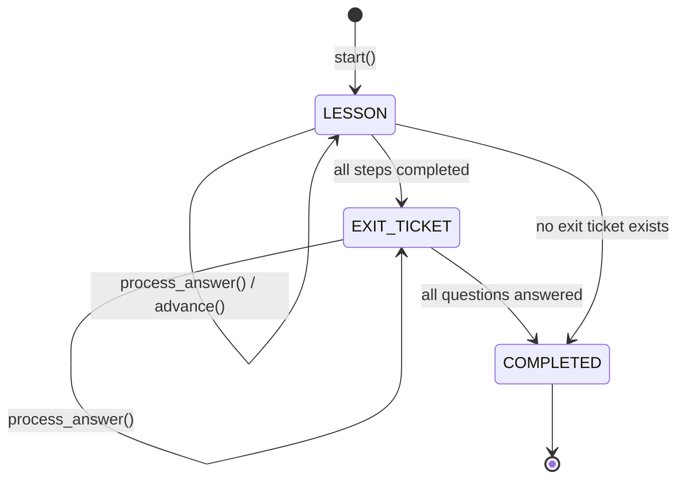
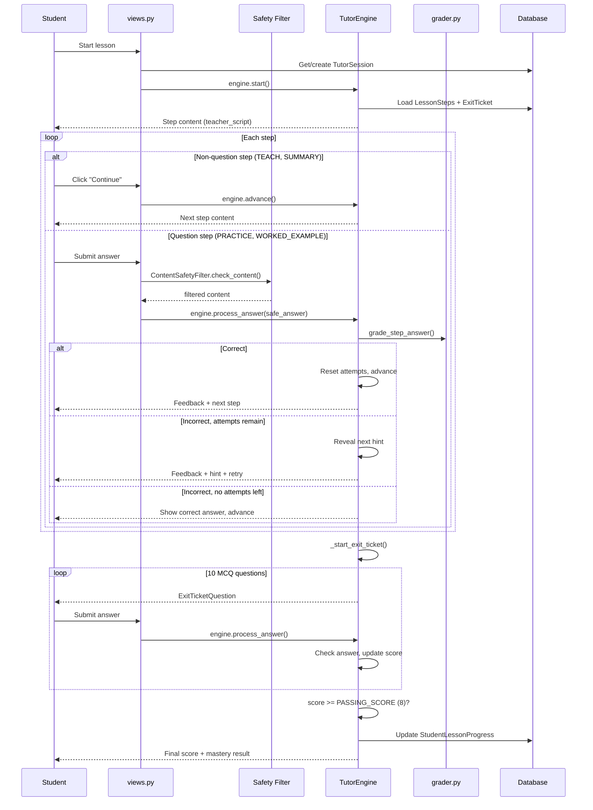
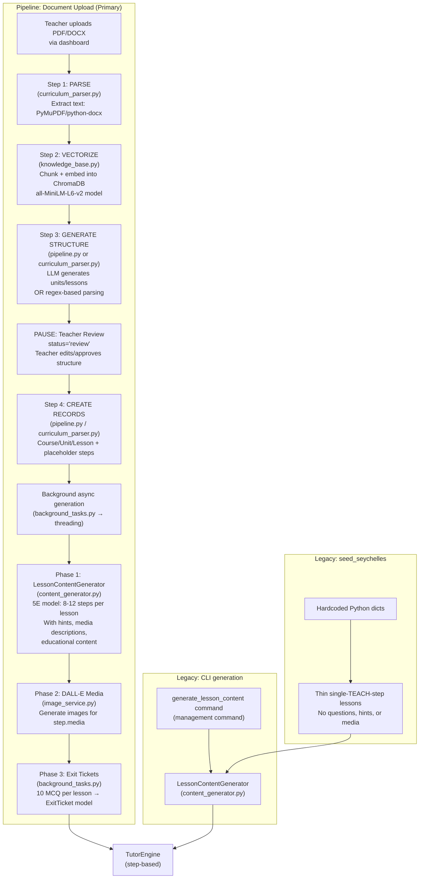
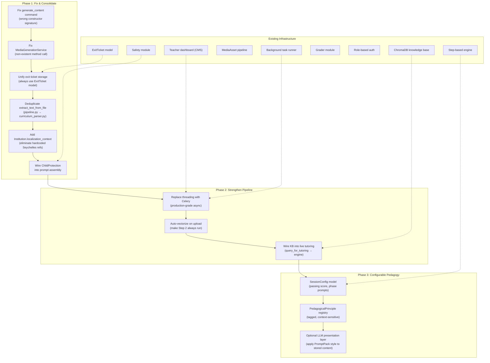

# System Architecture: Tutoring Engine, Content Pipeline & Data Model

> A detailed analysis of how the step-based tutoring engine works, how curriculum content is generated and stored, how the RAG knowledge base integrates, and how the teacher dashboard manages the editorial workflow.
>
> **Based on codebase at commit `1ae99b8`** (February 2026)

---

## Part 1: Current Implementation

### 1.1 Tutoring Engine — Step-Based, No Runtime AI

The system uses a single, deterministic tutoring engine (`apps/tutoring/engine.py`, 627 lines). There is **no AI generation during tutoring sessions** — all content is pre-generated and stored in the database. The engine walks through `LessonStep` records in order, grades answers deterministically (or via an optional LLM client for free-text), and serves pre-loaded exit ticket questions.

> The old conversational engine with its 5-phase state machine (RETRIEVAL → INSTRUCTION → PRACTICE → EXIT_TICKET → COMPLETE) and artifact protocol is preserved in `engine_backup.py` but is not used by any live code path. The current engine maps old phase names to new ones in `_load_state()` for backward compatibility.

#### Session Phases



The `SessionPhase` enum has three values:
- **`LESSON`** — Walking through `LessonStep` records (any phase: engage, explore, explain, practice, evaluate)
- **`EXIT_TICKET`** — Serving pre-stored `ExitTicketQuestion` MCQs
- **`COMPLETED`** — Session finished, mastery evaluated

#### Engine Public API

| Method | Purpose |
|---|---|
| `start()` | Begin session, present first step |
| `resume()` | Resume from persisted state |
| `process_answer(answer)` | Grade answer, provide feedback, advance or give hint |
| `advance()` | Move to next step (for non-question steps like TEACH, SUMMARY) |

#### Session Flow



#### Grading (`apps/tutoring/grader.py`, 276 lines)

A dedicated grading module routes to the appropriate strategy based on `LessonStep.answer_type`:

| Answer Type | Strategy | Details |
|---|---|---|
| `multiple_choice` | Exact match | Normalizes case, accepts letter or choice text |
| `true_false` | Variant matching | Accepts "true", "t", "yes", "y", "1", etc. |
| `short_numeric` | Numeric tolerance | Strips `$`, `%`, `,`; uses relative tolerance |
| `free_text` | LLM rubric grading | Calls LLM with question + rubric + answer; returns CORRECT/PARTIAL/INCORRECT |

The engine itself also has a simpler inline grading path for MCQ (`_grade_step_answer()`), used as the primary path. The `grader.py` module is called for free-text when an `llm_client` is provided.

#### Engine State Persistence

All state is stored in `TutorSession.engine_state` (JSONField):

```json
{
    "phase": "lesson",
    "step_index": 3,
    "current_attempt": 1,
    "hints_given": 1,
    "exit_question_index": 0,
    "exit_correct_count": 0,
    "exit_answers": []
}
```

The engine is stateless between requests — it loads from `engine_state` on init and saves after every action.

#### Engine Constants

| Constant | Value | Location |
|---|---|---|
| `PASSING_SCORE` | 8 (out of 10) | `engine.py:75` |

This is the only hardcoded constant. All other behavior (number of steps, number of exit questions, max attempts per step) comes from the database records themselves.

#### Factory Function

`create_tutor_session(student, lesson, institution)` (line 613) creates a new `TutorSession` with default engine state. This is used by `views.py` when starting sessions.

### 1.2 Prompt Assembly (`apps/llm/prompts.py`, 216 lines)

The prompt assembler exists for potential LLM-based tutoring (currently used only by the streaming endpoint and grader). It builds a two-layer prompt:

**Layer 1 — System Prompt** (per-session, stable):
- `PromptPack.system_prompt` (persona, locale, identity)
- `PromptPack.teaching_style_prompt` (science-of-learning methodology)
- `PromptPack.safety_prompt` (age-appropriate guardrails)
- `PromptPack.format_rules_prompt` (output style, conversation rules)
- Lesson context (title + learning objective)
- Available media list (`[SHOW_MEDIA:title]` syntax)

**Layer 2 — Step Instruction** (per-turn, varies):
- Step type instruction (TEACH / PRACTICE / QUIZ / etc.)
- `teacher_script` (what to say/explain)
- Question + MCQ choices (if applicable)
- Retry context with progressive hint reveal
- Expected answer + rubric (AI reference only)

The `build_tutor_message()` function wraps the step instruction in `[STEP CONTEXT]...[/STEP CONTEXT]` delimiters and injects it into the conversation messages array.

> **Note:** The current step-based engine does NOT use `prompts.py` for session delivery. Content is served directly from `LessonStep.teacher_script`. The prompt assembler is used only by the `submit_answer_stream` endpoint and LLM-based grading.

### 1.3 Data Model

```mermaid
erDiagram
    Institution ||--o{ Course : "owns"
    Institution ||--o{ Membership : "has"
    Institution ||--o{ StaffInvitation : "sends"
    Institution ||--o{ CurriculumUpload : "tracks"
    Institution ||--o{ TeacherClass : "organizes"
    User ||--o{ Membership : "belongs_to"
    User ||--|| StudentProfile : "has (optional)"
    User ||--o{ TeacherClass : "teaches"
    TeacherClass }o--o{ User : "enrolls students"
    TeacherClass }o--o{ Course : "assigns"
    Course ||--o{ Unit : "contains"
    Unit ||--o{ Lesson : "contains"
    Lesson ||--o{ LessonStep : "contains"
    Lesson ||--|| ExitTicket : "has (optional)"
    ExitTicket ||--o{ ExitTicketQuestion : "contains"
    ExitTicket ||--o{ ExitTicketAttempt : "tracks"
    LessonStep ||--o{ StepMedia : "has"
    MediaAsset ||--o{ StepMedia : "referenced_by"
    User ||--o{ TutorSession : "takes"
    Lesson ||--o{ TutorSession : "taught_in"
    TutorSession ||--o{ SessionTurn : "contains"
    User ||--o{ StudentLessonProgress : "tracks"

    Institution {
        string name
        string slug
        string timezone
        bool is_active
    }

    Membership {
        enum role "staff | student"
        bool is_active
    }

    StaffInvitation {
        string email
        enum role
        string token
        bool is_used
        datetime expires_at
    }

    StudentProfile {
        enum grade_level "S1-S5"
        string school "from SCHOOL_CHOICES"
    }

    TeacherClass {
        string name
        string grade_level
        FK teacher
        M2M students
        M2M courses
        bool is_active
    }

    Lesson {
        string title
        text objective
        int estimated_minutes
        int order_index
        bool is_published
        json metadata "key_concepts, enabling_objectives, teaching_strategies, etc."
    }

    LessonStep {
        enum step_type "teach | worked_example | practice | quiz | summary"
        string phase "engage | explore | explain | elaborate | evaluate"
        text teacher_script
        text question
        enum answer_type "none | multiple_choice | free_text | short_numeric | true_false"
        json choices
        text expected_answer
        text rubric
        text hint_1
        text hint_2
        text hint_3
        int max_attempts
        int order_index
        json media "images, videos, audio with URLs and descriptions"
        json educational_content "vocabulary, worked_example, formulas, key_points, seychelles_context"
        json curriculum_context "teaching_strategies, objectives, assessment_criteria, differentiation"
    }

    ExitTicket {
        int passing_score "default 8"
        int time_limit_minutes "default 15"
        text instructions
    }

    ExitTicketQuestion {
        text question_text
        string option_a
        string option_b
        string option_c
        string option_d
        char correct_answer "A|B|C|D"
        text explanation
        enum difficulty "easy | medium | hard"
        int order_index
        file image "optional"
    }

    TutorSession {
        enum status "active | completed | abandoned"
        bool mastery_achieved
        json engine_state
        int current_step_index
    }

    CurriculumUpload {
        string file_path
        string subject_name
        string grade_level
        enum status "pending | processing | review | media_processing | completed | failed"
        int current_step "1=extract, 2=vectorize, 3=generate, 4=content"
        json parsed_data "stores parsed structure between steps"
        int extracted_text_length
        text processing_log
        text teacher_feedback
        int units_created
        int lessons_created
        int steps_created
    }
```

**Key model relationships:**

- **`StaffInvitation`** — Invitation-gated staff onboarding. Staff cannot self-register; they must receive a token-based invitation from an admin. Students self-register with school and grade selection.
- **`StudentProfile.SCHOOL_CHOICES`** — Hardcoded list of 11 Seychelles secondary schools.
- **`TeacherClass`** — Groups students into teacher-managed classes with assigned courses. Supports per-teacher class management.
- **`ExitTicket` / `ExitTicketQuestion`** — Standardized 10-question MCQ assessments per lesson. Questions have individual option fields (not JSON), an optional image, and an explanation. The engine loads these at session start.
- **`TutorSession.engine_state`** (JSONField) — Persists phase, step index, attempt counters, exit ticket score across turns.
- **`CurriculumUpload`** — Tracks dashboard file uploads with multi-step processing state, parsed structure for teacher review, processing log, and link to the created Course. Supports statuses: `pending`, `processing`, `review`, `media_processing`, `completed`, `failed`.
- **`LessonStep.media`** (JSONField) — Structured media: `{images: [{url, alt, caption, type, source, description}], videos: [...], audio: [...]}`. URLs start empty (pending) and are filled during media generation.
- **`LessonStep.educational_content`** (JSONField) — Enrichment data: vocabulary, worked examples, formulas, key points, common mistakes, real-world connections, Seychelles context.
- **`LessonStep.curriculum_context`** (JSONField) — RAG-sourced data: teaching strategies, learning objectives, assessment criteria, differentiation guidance.
- **`LessonStep.phase`** — 5E pedagogical phase marker: engage, explore, explain, elaborate, evaluate.
- **`Lesson.metadata`** (JSONField) — Stores key concepts, enabling objectives, teaching strategies, resources, and assessment methods from curriculum parsing.

### 1.4 Content Pipeline — Five-Step Architecture

The system has a 5-step pipeline for transforming curriculum documents into tutoring sessions, plus two legacy paths:



#### Step 1: PARSE — Text Extraction

**Two implementations exist** (code duplication):
- `apps/curriculum/curriculum_parser.py` — `extract_text_from_file()` (primary)
- `apps/curriculum/pipeline.py` — `extract_text_from_file()` (duplicate)

Both support PDF (PyMuPDF), DOCX (python-docx), and TXT/MD. The `curriculum_parser.py` version also exports table content from DOCX.

#### Step 2: VECTORIZE — ChromaDB Knowledge Base

`apps/curriculum/knowledge_base.py` (`CurriculumKnowledgeBase`, 735 lines) is a **new RAG layer** that provides semantic search over curriculum documents.

**Architecture:**
- Per-institution data isolation: collection name `curriculum_{institution_id}`
- Stored at `MEDIA_ROOT/vectordb/institution_{id}/`
- Embedding model: `all-MiniLM-L6-v2` (via sentence-transformers)
- Storage: ChromaDB `PersistentClient` (auto-persists)
- Graceful degradation: if ChromaDB is not installed, all queries return empty results with no crash

**Chunking strategy:**
- Splits text on section boundaries (markdown headers, ALL CAPS headers, numbered sections)
- Maximum chunk size: ~2000 characters (~500 tokens)
- Each chunk tagged with `chunk_type`: `objective`, `teaching_strategy`, `assessment`, `resource`, `content`

**Query interfaces:**
| Method | Use Case | Returns |
|---|---|---|
| `query_for_lesson_generation()` | Step 3: structure generation | Curriculum chunks for unit/lesson creation |
| `query_for_content_generation()` | Step 4: content enrichment | Teaching strategies + related content for step generation |
| `query_for_tutoring()` | Live sessions (not yet wired) | Context for runtime tutoring |

#### Step 3: GENERATE STRUCTURE — Lesson Structure

**Two parallel implementations:**

1. **`pipeline.py` → `generate_lesson_structure()`** — Queries the knowledge base first, then calls LLM to produce `{units: [{title, lessons: [{title, objective}]}]}`. Used by the main pipeline (`process_curriculum_upload()`).

2. **`curriculum_parser.py` → `parse_curriculum_with_llm()` / `parse_mathematics_curriculum()` / `parse_generic_curriculum()`** — LLM-based parsing with regex fallbacks. Has a dedicated Mathematics parser for Seychelles strand structure (NUMBER, MEASURES, SHAPE AND SPACE, ALGEBRA, HANDLING DATA). Used by the step-by-step processing API (`curriculum_process_api`).

Both produce a `ParsedCurriculum` or JSON structure that is stored in `CurriculumUpload.parsed_data` and presented to the teacher for review.

#### Teacher Review (NEW)

After parsing, the pipeline pauses with `CurriculumUpload.status = 'review'`. The teacher can:
- View the extracted structure (units and lessons)
- Edit unit names, lesson titles, and objectives
- Approve to trigger record creation + background content generation
- Reject or provide feedback

This review step is served by `curriculum_process` (view) and `curriculum_approve` (POST API).

#### Step 4: CREATE RECORDS — Database Population

Both `pipeline.py:complete_curriculum_upload()` and `curriculum_parser.py:create_curriculum_from_structure()` create Course/Unit/Lesson/LessonStep records. Each lesson gets:
- `is_published=False`
- A thin placeholder TEACH step: `"Today we will learn about: {objective}"`
- `metadata` populated with key concepts, teaching strategies, and the upload ID

#### Background Content Generation (`apps/dashboard/background_tasks.py`, 555 lines)

Uses Python `threading` for non-blocking generation. `run_async(func, *args)` wraps any function in a daemon thread with DB connection cleanup.

**`generate_all_content_async(course_id, upload_id, generate_media)`** runs three phases:

| Phase | What | Module |
|---|---|---|
| 1: Tutoring steps | `LessonContentGenerator.generate_for_lesson()` per lesson | `content_generator.py` |
| 2: Media assets | DALL-E image generation for `step.media['images']` | `image_service.py` |
| 3: Exit tickets | 10 MCQ per lesson → `ExitTicket`/`ExitTicketQuestion` models | `background_tasks.py` |

Progress is tracked via `CurriculumUpload.processing_log` and rendered in real-time at `/dashboard/curriculum/content-progress/<id>/` and `/dashboard/curriculum/media-progress/<id>/`.

#### Content Generator (`apps/curriculum/content_generator.py`, 798 lines)

`LessonContentGenerator` is the primary content enrichment class. It replaces the old `generator.py` (deleted).

| Aspect | Details |
|---|---|
| Constructor | `__init__(self, institution_id)` — resolves LLM client from DB `ModelConfig`, initializes `CurriculumKnowledgeBase` |
| Pedagogical model | **5E model**: Engage (1-2 steps), Explore (2-3), Explain (2-3), Practice (3-4), Evaluate (1-2) = 8-12 steps total |
| KB integration | Queries `CurriculumKnowledgeBase.query_for_content_generation()` for teaching strategies and related curriculum chunks |
| Step types generated | `teach`, `worked_example`, `practice`, `quiz` |
| Hints | 3-level hint ladder per practice/quiz step |
| Media | Generates `media` JSON per step with image descriptions (URLs filled later by DALL-E phase) |
| Educational content | Populates `educational_content` JSONField: vocabulary, worked examples, key points, Seychelles context |
| Exit tickets | Saves 3-5 questions to `Lesson.metadata['exit_ticket']` as JSON |
| Save strategy | `update_or_create` by `order_index` (does NOT clear existing steps) |

**Batch helpers:**
- `generate_content_for_course(course_id, force)` — Iterates all units/lessons in a course
- `generate_content_for_unit(unit_id, force)` — All lessons in a unit
- `generate_content_for_lesson(lesson_id, force)` — Single lesson enrichment

**`MediaGenerationService`** (also in `content_generator.py`) — Looks up existing media library assets or delegates to `ImageGenerationService` for DALL-E generation.

#### Image Service (`apps/tutoring/image_service.py`, 180 lines)

`ImageGenerationService` handles DALL-E image generation:
- Constructor: `__init__(lesson=None, institution=None)`
- `get_or_generate_image(prompt, category, **kwargs)` — Always generates fresh with DALL-E (no library fallback)
- `_enhance_prompt()` — Prepends educational context (hardcoded: "secondary school students in Seychelles")
- Generated images saved as `MediaAsset` records with unique filenames (`generated_{hash}.png`)
- Accepts `**kwargs` for backward compatibility (silently ignores `prefer_existing`, `generate_only`)

#### Dashboard Tasks (`apps/dashboard/tasks.py`, 217 lines)

Now a **thin delegation layer** — all inline logic has been extracted to `pipeline.py`, `curriculum_parser.py`, and `content_generator.py`:

| Function | Delegates to |
|---|---|
| `process_curriculum_upload()` | `curriculum.pipeline.process_curriculum_upload` |
| `generate_content_for_course()` | `content_generator.generate_content_for_course` |
| `generate_media_for_course()` | `ImageGenerationService.get_or_generate_image()` |
| `regenerate_lesson_content()` | `content_generator.generate_content_for_lesson` |

Legacy wrappers preserved for backward compatibility: `extract_text_from_file()`, `parse_curriculum_with_ai()`, `create_curriculum_from_structure()`, `generate_exit_ticket_for_lesson()`.

#### Management Commands

| Command | File | Purpose | Status |
|---|---|---|---|
| `generate_content` | `apps/curriculum/management/commands/generate_content.py` (123 lines) | `--lesson N \| --course N \| --all` | **BUG**: Calls `LessonContentGenerator(llm_client)` with wrong constructor signature |
| `generate_lesson_content` | `apps/curriculum/management/commands/generate_lesson_content.py` (144 lines) | `--lesson-id N \| --course-id N` | Working. Supports `--dry-run`, `--force`, `--limit` |
| `generate_exit_tickets` | `apps/tutoring/management/commands/generate_exit_tickets.py` | `--lesson \| --course \| --all` | Working. Bloom's-aligned difficulty distribution |
| `seed_seychelles` | `apps/curriculum/management/commands/seed_seychelles.py` | Hardcoded Seychelles Geography + Mathematics seed data | Working. Produces thin single-step lessons |
| `generate_media` | `apps/curriculum/management/commands/generate_media.py` | DALL-E image generation for courses | Working |

### 1.5 Authentication & Routing

#### URL Structure

| URL | Handler | Purpose |
|---|---|---|
| `/` | `accounts.landing_page` | Role selection landing page |
| `/accounts/student/login/` | `accounts.student_login` | Student login |
| `/accounts/student/register/` | `accounts.student_register` | Student self-registration (with school + grade) |
| `/accounts/staff/login/` | `accounts.staff_login` | Staff login (checks staff membership) |
| `/accounts/staff/register/<token>/` | `accounts.staff_register` | Invitation-gated staff registration |
| `/accounts/invite/` | `accounts.invite_staff` | Admin sends staff invitations |
| `/tutor/` | `tutoring` app | Lesson catalog, session endpoints |
| `/dashboard/` | `dashboard` app | Staff dashboard (metrics, curriculum, students) |
| `/admin/` | Django admin | System admin |

#### Auth Flow

- **Students**: Self-register → auto-assigned to first active institution → redirected to lesson catalog
- **Staff**: Must receive invitation token → register via token link → assigned to invitation's institution with invitation's role → redirected to dashboard
- **Role-based redirect**: `redirect_by_role()` sends staff to dashboard, students to catalog

### 1.6 Views Layer — Tutoring (`apps/tutoring/views.py`, 828 lines)

| Endpoint | Method | Purpose |
|---|---|---|
| `lesson_list` | GET | JSON list of published lessons for institution |
| `lesson_catalog` | GET | HTML catalog with progress tracking per subject |
| `start_session` | POST | Create/resume session, return first step |
| `submit_answer` | POST | Grade answer via step-based engine with safety checks |
| `advance_step` | POST | Advance to next non-question step |
| `session_status` | GET | Current session state |
| `tutor_interface` | GET | HTML tutoring page |
| `submit_answer_stream` | POST | SSE streaming endpoint (uses step-based engine, not LLM) |
| `generate_image` | POST | DALL-E image generation on demand |

**Safety integration in `submit_answer`:**
1. `RateLimiter.check_rate_limit()` — per-user rate limiting
2. `ContentSafetyFilter.check_content()` — PII detection, profanity, safety flags
3. Blocked content returns a safe response without hitting the engine
4. All safety events logged to `SafetyAuditLog`

**Structured session endpoints** (`tutor_interface_v2`, `start_structured_session`, `structured_session_input`, `structured_session_input_stream`) import from `apps.tutoring.structured_engine.StructuredSessionEngine` which does not exist in the codebase — these are non-functional stubs.

### 1.7 Dashboard — Full Editorial CMS (`apps/dashboard/views.py`, 1,699 lines)

The dashboard has evolved into a full content management system with 24 URL patterns:

#### Overview & Analytics

| View | Purpose |
|---|---|
| `dashboard_home` | Overview metrics: active students, sessions, mastery rates, activity chart |
| `student_list` | Paginated student list with progress summary |
| `student_detail` | Individual student's progress across all courses |
| `reports_overview` | Sessions by day, top students, lesson completion rates |
| `settings_page` | Edit institution name and timezone |
| `class_list` | Students grouped by grade |

#### Curriculum Management

| View | Purpose |
|---|---|
| `curriculum_list` | All courses with lesson counts (published vs total) |
| `course_detail` | Units and lessons with per-lesson content stats, media stats, exit ticket status |
| `curriculum_upload` | Upload PDF/DOCX to start curriculum processing pipeline |
| `curriculum_process` | Show processing progress/results, display parsed structure for review |
| `curriculum_generate` | API to trigger `process_curriculum_upload()` |
| `curriculum_approve` | Teacher reviews/edits parsed structure, approves, triggers async content generation |
| `curriculum_process_api` | Step-by-step processing API (extract → parse → create_lessons → save) |

#### Content Editorial

| View | Purpose |
|---|---|
| `lesson_detail` | View lesson steps, media, exit ticket, student completion stats |
| `lesson_regenerate` | Delete existing steps + exit ticket, regenerate everything |
| `lesson_generate_content` | Generate content for a lesson that has none |
| `lesson_publish` | Toggle lesson publish status |
| `step_edit` | Edit a lesson step: phase, type, content, question, choices, hints |
| `unit_create` | Create a new unit in a course |
| `lesson_create` | Create a new lesson in a unit |

#### Bulk Operations

| View | Purpose |
|---|---|
| `course_generate_all` | Trigger background generation for entire course (steps + media + exit tickets) |
| `course_generate_media` | Trigger background media-only generation with `force_regenerate` option |
| `course_publish_all` | Publish all lessons that have content (steps >= 5) |
| `content_progress` | Real-time content generation progress (polls `CurriculumUpload.processing_log`) |
| `media_progress` | Real-time media generation progress |

---

## Part 2: Known Issues & Gaps

### Issue 1: Hardcoded Seychelles References

Localization is hardcoded in multiple files across the codebase. Deploying to a different country requires code changes, not data changes.

| File | What | Location |
|---|---|---|
| `apps/curriculum/content_generator.py` | `_default_strategies()` — "Seychelles context", "SCR currency", "local measurements" | lines 203-226 |
| `apps/curriculum/content_generator.py` | `_generate_steps()` prompt — "Seychelles secondary school", "SCR currency, local places" | lines 245, 367 |
| `apps/curriculum/curriculum_parser.py` | `parse_mathematics_curriculum()` — "Seychelles secondary schools", "Seychelles context" | lines 222-237 |
| `apps/tutoring/image_service.py` | `_enhance_prompt()` — "secondary school students in Seychelles" | line 119 |
| `apps/tutoring/management/commands/generate_exit_tickets.py` | Exit ticket prompt — "Seychelles secondary school students" | ~line 32 |
| `apps/accounts/models.py` | `StudentProfile.SCHOOL_CHOICES` — 11 hardcoded Seychelles school names | lines 84-98 |
| `apps/curriculum/management/commands/seed_seychelles.py` | Entire file — Seychelles-specific seed data | throughout |

**Proposal:** Add an `Institution.localization_context` TextField (or JSONField) carrying place names, currency, industries, school names, and cultural references. Inject this into all generation prompts dynamically. The `SCHOOL_CHOICES` on `StudentProfile` should also come from the institution or be configurable.

### Issue 2: Exit Ticket Storage Inconsistency

Two different paths store exit tickets differently:

| Path | Storage | Format |
|---|---|---|
| `content_generator.py:_save_exit_ticket()` | `Lesson.metadata['exit_ticket']` (JSON) | 3-5 questions, mixed types (MCQ + T/F + numeric) |
| `background_tasks.py:generate_exit_tickets_for_lessons()` | `ExitTicket` + `ExitTicketQuestion` models | 10 MCQ questions |
| `dashboard/views.py:generate_exit_ticket_for_lesson()` | `ExitTicket` + `ExitTicketQuestion` models | 10 MCQ questions |

The engine only reads from the `ExitTicket`/`ExitTicketQuestion` models. Exit tickets stored in `Lesson.metadata` by `content_generator.py` are **invisible to the engine**.

**Proposal:** `content_generator.py:_save_exit_ticket()` should save to the `ExitTicket`/`ExitTicketQuestion` models instead of `Lesson.metadata`. Or remove exit ticket generation from `content_generator.py` entirely and rely on the background task Phase 3.

### Issue 3: `generate_content` Management Command Bug

`apps/curriculum/management/commands/generate_content.py` (line 58) calls `LessonContentGenerator(llm_client)` with the old constructor signature. The new constructor expects `institution_id`, not an `llm_client`. This command will fail at runtime with a `TypeError`.

**Fix:** Change to `LessonContentGenerator(institution_id=institution_id)` matching the working `generate_lesson_content` command.

### Issue 4: `MediaGenerationService` References Non-Existent Method

`content_generator.py:639` calls `service.generate_educational_image(prompt, style)` which does not exist on `ImageGenerationService`. The actual method is `get_or_generate_image(prompt, category)`.

### Issue 5: Code Duplication — Text Extraction

`extract_text_from_file()` is duplicated between `curriculum_parser.py` and `pipeline.py` with identical implementations.

### Issue 6: `PromptPack` Teaching Style Is Unused in Step-Based Mode

The step-based engine serves content directly from `LessonStep.teacher_script` without consulting `PromptPack.teaching_style_prompt`. An admin editing the teaching methodology in `PromptPack` has **no effect** on step-based sessions.

### Issue 7: `ChildProtection` Module Exists but Is Not Wired into Prompt Assembly

`apps/safety/__init__.py` defines `ChildProtection.get_age_appropriate_system_prompt()` which returns a child-safety prompt addendum. Neither `prompts.py` nor the engine calls it.

### Issue 8: Structured Session Stubs Reference Non-Existent Module

Four views (`tutor_interface_v2`, `start_structured_session`, `structured_session_input`, `structured_session_input_stream`) import from `apps.tutoring.structured_engine.StructuredSessionEngine` which does not exist. These endpoints will fail with `ImportError`.

---

## Part 3: Architecture Evolution Proposals



---

## Appendix: File Inventory

| File | Lines | Purpose |
|---|---|---|
| **Tutoring** | | |
| `apps/tutoring/engine.py` | 627 | Step-based tutoring engine (LESSON → EXIT_TICKET → COMPLETED) |
| `apps/tutoring/grader.py` | 276 | Answer grading (exact match, numeric, T/F, LLM rubric) |
| `apps/tutoring/models.py` | 352 | TutorSession, SessionTurn, StudentLessonProgress, ExitTicket* |
| `apps/tutoring/views.py` | 828 | Tutoring endpoints + safety integration + streaming |
| `apps/tutoring/image_service.py` | 180 | DALL-E image generation |
| **Curriculum** | | |
| `apps/curriculum/models.py` | 354 | Course, Unit, Lesson, LessonStep (with media/educational/curriculum JSON fields) |
| `apps/curriculum/content_generator.py` | 798 | LessonContentGenerator (5E model, KB-integrated) + MediaGenerationService |
| `apps/curriculum/curriculum_parser.py` | 964 | Document parsing (regex + LLM), DB record creation, upload processing |
| `apps/curriculum/knowledge_base.py` | 735 | ChromaDB RAG layer (vectorize, query for generation/tutoring) |
| `apps/curriculum/pipeline.py` | 874 | 5-step pipeline orchestration (parse → vectorize → generate → review → create) |
| **Dashboard** | | |
| `apps/dashboard/views.py` | 1,699 | Full editorial CMS (24 URL patterns) |
| `apps/dashboard/models.py` | 119 | CurriculumUpload, TeacherClass |
| `apps/dashboard/tasks.py` | 217 | Thin delegation layer to pipeline/generator |
| `apps/dashboard/background_tasks.py` | 555 | Threading-based async task runner (content + media + exit tickets) |
| **LLM** | | |
| `apps/llm/prompts.py` | 216 | Prompt assembly (system + step context) |
| **Accounts** | | |
| `apps/accounts/models.py` | 175 | Institution, Membership, StudentProfile, StaffInvitation |
| `apps/accounts/views.py` | 396 | Role-based auth (student self-register, staff invitation) |
| **Safety** | | |
| `apps/safety/__init__.py` | 543 | ContentSafetyFilter, RateLimiter, ChildProtection |
| `apps/safety/models.py` | 99 | SafetyAuditLog, consent tracking |
| `apps/safety/views.py` | 197 | Privacy dashboard |

---

*Generated February 2026. Based on analysis of the ai-tutor repository at commit `1ae99b8`.*
