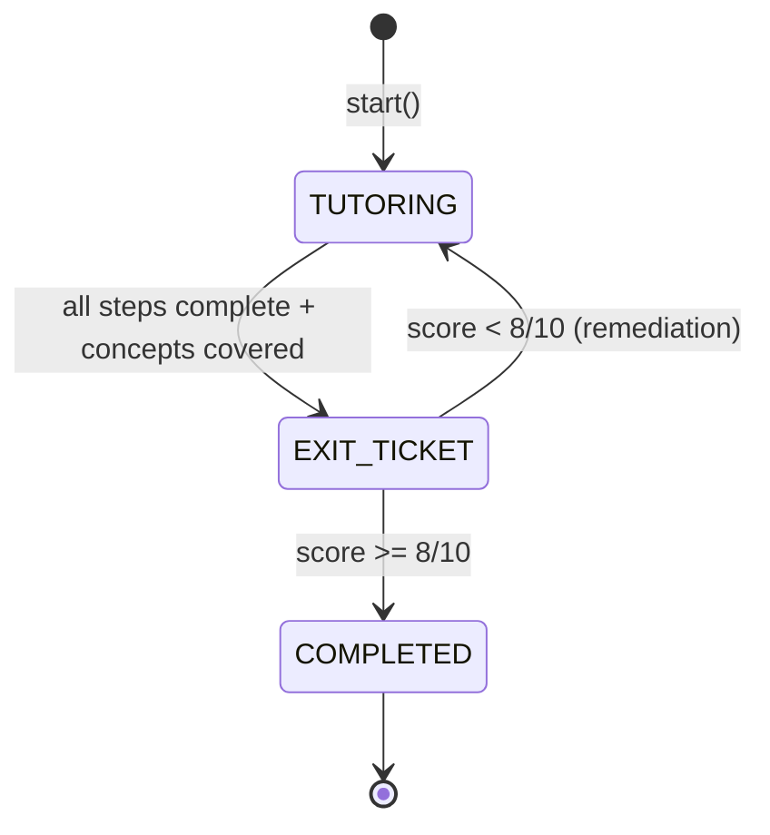

# System Architecture: AI Tutoring Engine, Skills Graph, Content Pipeline & Data Model

> A detailed analysis of how the conversational AI tutor and step-based engine work, how the skills knowledge graph and spaced repetition system operate, how curriculum content is generated and stored, how the RAG knowledge base integrates, and how the teacher dashboard manages the editorial workflow.
>
> **Based on codebase at commit `74c0ea5`** (March 2026)

---

## Table of Contents

- [Part 1 — Conversational AI Tutor](#part-1--conversational-ai-tutor)
- [Part 2 — Skills Knowledge Graph & Spaced Repetition](#part-2--skills-knowledge-graph--spaced-repetition)
- [Part 3 — Curriculum Content Pipeline](#part-3--curriculum-content-pipeline)
- [Part 4 — RAG Knowledge Base](#part-4--rag-knowledge-base)
- [Part 5 — LLM Client Layer](#part-5--llm-client-layer)
- [Part 6 — Teacher Dashboard & Editorial Workflow](#part-6--teacher-dashboard--editorial-workflow)
- [Part 7 — Safety & Content Moderation](#part-7--safety--content-moderation)
- [Part 8 — Data Model](#part-8--data-model)
- [Part 9 — Frontend & Deployment](#part-9--frontend--deployment)

---

## Part 1 — Conversational AI Tutor

**Primary source:** `apps/tutoring/conversational_tutor.py` (3,332 lines)

The `ConversationalTutor` class is the platform's flagship tutoring engine. It orchestrates an LLM-driven, Socratic conversation that leads students through structured lessons. Every tutor response is dynamically generated by a language model. `LessonStep` records serve as pedagogical guidance (not rigid scripts), and the tutor scaffolds understanding through questions rather than giving direct answers.

### 1.1 Design Philosophy: Exit-Ticket-Driven Instruction

The tutor implements **backward design**: it loads all `ExitTicketQuestion` records at initialization and uses them to drive instruction. The entire lesson is organized around ensuring the student can answer those specific questions. Concept coverage is tracked and the engine delays the exit-ticket phase until sufficient coverage is achieved.

### 1.2 Session State Machine

The engine manages three internal states via `SessionState`:



All state is persisted in `TutorSession.engine_state` (JSONField), enabling robust resume across page reloads and reconnections. Persisted state includes: current topic index, exchange counts, concept coverage status, student struggles/strengths, remediation flags, selected exit-ticket question IDs, and turn media mappings.

### 1.3 System Prompt Architecture

The system prompt template (`TUTOR_SYSTEM_PROMPT_TEMPLATE`) embeds 15 core instructional principles drawn from the science of learning:

| # | Principle | Behavioral Rule |
|---|-----------|-----------------|
| 1 | Active Learning | Keep explanations to ~50 words; student does 60% of talking |
| 2 | Direct Instruction | Teach explicitly BEFORE posing discovery questions |
| 3 | Deliberate Practice | Target the edge of ability; vary difficulty |
| 4 | Mastery Learning | Don't advance until independent problem-solving is demonstrated |
| 5 | Cognitive Load | One idea at a time; worked examples with labeled steps |
| 6 | Automaticity | Flag and remediate basic skill gaps |
| 7 | Layering | Connect new content to prior knowledge |
| 8 | Non-Interference | Distinguish and address confused concepts separately |
| 9 | Testing Effect | Nudge on 1st wrong attempt, hint on 2nd |
| 10 | Spaced Repetition | Use warmup retrieval questions from earlier lessons |
| 11 | Interleaving | Mix review with new practice |
| 12 | Targeted Remediation | Diagnose root cause of struggles |
| 13 | Gamification | Celebrate streaks; normalize mistakes |
| 14 | Expertise Reversal | Fade scaffolding as mastery grows |
| 15 | Follow Script | Deliver exact lesson content and questions faithfully |

The prompt is further augmented with: personality injection (if the student selected one), lesson context (steps grouped by concept tag), student profile data (skill mastery, XP, streaks, pace recommendation), and curriculum knowledge base context.

### 1.4 Response Generation Pipeline

```
Student Input
  |
  v
Save Turn --> Update Exchange Counts --> Detect Visual Request
  |
  v
Get Knowledge Base Context (RAG query)
  |
  v
Generate LLM Response --> Parse Media Signals (|||MEDIA:N|||)
  |
  v
Auto-attach Media (fallback) --> Analyze Student Response
  |
  v
Step Evaluation (correct? complete?) --> Concept Coverage Check
  |
  v
Track Skills (SM-2 update) --> Advance Topic or Retry
  |
  v
Save Turn --> Return TutorMessage
```

Each `TutorMessage` carries: content (markdown), phase, media items, exit-ticket data (when applicable), and step progress (current/total).

### 1.5 Concept-Boundary Gating

Steps are grouped by `concept_tag` into logical blocks. When the next step belongs to a different concept, the engine blocks advancement until:

- The student answers the current concept's practice question correctly, **OR**
- A safety valve triggers (4+ boundary attempts)

This prevents jumping between concepts before the student has demonstrated understanding of the current one.

### 1.6 Step Advancement Logic

Multiple safety valves merge to determine when to advance:

| Rule | Threshold |
|------|-----------|
| Hard cap | 8 exchanges per step max |
| Min exchanges | teach/example: 2, practice: 1 |
| Practice fast-path | correct answer → advance immediately |
| Practice attempt cap | `max_attempts + 2` → force advance |
| LLM step evaluator | merged answer correctness + step completion |

Step evaluation uses the Instructor client to get a `StepEvaluationResult` (answer_correct + step_complete + reasoning). Falls back to keyword matching if the Instructor client is unavailable.

### 1.7 Concept Coverage Tracking

Coverage of exit-ticket concepts is tracked via a dual approach:

1. **Keyword-based (fast, default):** Extracts keywords from each exit question's text + answer + explanation. Marks a concept as covered if >30% of keywords appear in conversation or 3+ keywords match.
2. **LLM-based (accurate):** Every ~2 exchanges, asks the Instructor client which concepts were "meaningfully covered" (taught/discussed, not merely mentioned). Returns a `ConceptCoverageResult` with covered concept indices.

Falls back from LLM to keywords on failure. Coverage persists across resume.

### 1.8 Media System

The engine builds a numbered media catalog from lesson steps. The LLM signals media insertion via tail-line markers:

- `|||MEDIA:N|||` — insert pre-existing media item N from the catalog
- `|||GENERATE:category:description|||` — generate a new image on-the-fly

Signals are stripped before saving to the database. Fallback: if the LLM references visuals (e.g., "look at the diagram") without a signal, the engine auto-attaches the current step's media. Media items survive resume via the `turn_media` map in engine state.

### 1.9 Worked Examples

Worked examples follow a structured format to minimize cognitive load:

```
Problem Statement
  Step 1: [Action] — [Why this step]
  Step 2: [Action] — [Why this step]
  ...
  Final Answer
```

Each step has a labeled subgoal. After presenting the worked example, the tutor asks a comprehension check on a random step, then gives a similar problem for guided practice.

### 1.10 Interleaved Practice

The engine fetches review questions from earlier lessons via `InterleavedPracticeService` and weaves approximately 1 review question for every 4 new-topic questions. Review questions are introduced with framing like "Quick question from an earlier topic..." and are cached to avoid redundant service calls.

### 1.11 Retrieval Practice

Warmup retrieval questions are assembled by `SessionPersonalizationService` at session start. These target concepts from prior lessons that are approaching their spaced-repetition review date, providing natural retrieval practice.

### 1.12 Exit Ticket Flow

```
10 questions selected from 30+ question bank (1 per concept tag + random fill)
  |
  v
Student submits answers (MCQ, A-D)
  |
  v
Grade: case-insensitive match against correct_answer
  |
  v
Score >= 8/10 --> Complete Session (award XP + streak + achievements)
Score < 8/10  --> Start Remediation
```

Question selection is persisted so resume always gets the same set.

### 1.13 Remediation

Triggered automatically when a student fails the exit ticket:

1. `RemediationService` identifies weak skills and prerequisite gaps
2. Failed-question concepts are marked as NOT covered
3. Session resets to TUTORING with a remediation flag
4. The LLM re-teaches missed concepts using different angles/examples
5. Safety valve: 15 exchanges max before re-quiz
6. Student re-attempts the exit ticket

### 1.14 Gamification

On session completion:

- **XP awards:** 50 for pass + 25 for perfect + 100 for mastery
- **Streak tracking:** Incremented each active day, capped at longest streak
- **Achievement checking:** Triggers include first_lesson, lessons_completed, streak_days, xp_threshold, level_reached, perfect_score, exit_ticket_pass

All persisted in `StudentKnowledgeProfile`. Achievements are defined in the `Achievement` model and checked via `achievements.check_and_award()`.

### 1.15 Audio Support

**Source:** `apps/tutoring/audio_service.py` (301 lines)

| Feature | Backends | Details |
|---------|----------|---------|
| TTS | Piper (local, offline) or ElevenLabs (cloud, MP3) | ElevenLabs supports word-level timestamps for highlighting |
| STT | faster-whisper (local, CPU, INT8) or ElevenLabs (cloud) | Thread-safe singleton model loading |

The chat UI supports a toggle for audio mode. TTS responses can include word-level timing data for synchronized highlighting in the frontend.

### 1.16 API Endpoints

**Source:** `apps/tutoring/views.py` (1,091 lines), `apps/tutoring/urls.py`

| Endpoint | Method | Purpose |
|----------|--------|---------|
| `/tutor/api/chat/start/<lesson_id>/` | POST | Start or resume a session |
| `/tutor/api/chat/<session_id>/respond/` | POST | Send a student message |
| `/tutor/api/chat/<session_id>/exit-ticket/` | POST | Submit exit ticket answers |
| `/tutor/api/chat/<session_id>/review/` | POST | Start review of a completed session |
| `/tutor/api/chat/<session_id>/transcribe/` | POST | Speech-to-text |
| `/tutor/api/speak/` | POST | Text-to-speech |
| `/tutor/api/generate-image/` | POST | On-demand image generation |
| `/tutor/api/personality/` | POST | Set tutor personality |
| `/tutor/api/gamification/` | GET | XP, level, achievements, personalities |
| `/tutor/api/leaderboard/` | GET | Top 50 students by XP (anonymized) |
| `/tutor/` | GET | Lesson catalog with progress |
| `/tutor/lesson/<lesson_id>/` | GET | Chat tutor interface |

Key view behaviors:

- **`chat_start_session`**: Resolves institution, checks prerequisites (R7 — only gates NEW sessions), resumes active or completed (review mode) sessions, creates new session with `StudentLessonProgress`.
- **`chat_respond`**: Rate-limits, runs content safety check on input + output, calls `tutor.respond()`.
- **`leaderboard`**: Per-institution, top 50 by aggregated XP, anonymized names ("First L.").

---

## Part 2 — Skills Knowledge Graph & Spaced Repetition

**Primary source:** `apps/tutoring/skills_models.py` (746 lines)

### 2.1 Skill Model

The `Skill` model represents an atomic unit of knowledge (e.g., "identify_fault_types", "solve_quadratic_equations"):

- **Linked to lessons:** Primary lesson (where taught) + all lessons that teach/practice it (M2M)
- **Difficulty:** foundational, intermediate, advanced
- **Bloom's level:** remember → understand → apply → analyze → evaluate → create
- **Prerequisites:** Self-referential M2M — forms a directed acyclic knowledge graph
- **Tags:** For categorization and filtering

`get_prerequisite_chain()` recursively fetches all transitive dependencies.

### 2.2 Student Skill Mastery (SM-2 Spaced Repetition)

`StudentSkillMastery` tracks per-student, per-skill mastery using the **SM-2 algorithm**:

**Mastery levels:** NOT_STARTED → LEARNING → REVIEWING → MASTERED

**SM-2 fields:**
- `ease_factor` — adjusts interval growth rate (starts at 2.5)
- `interval_days` — days until next review
- `repetition_count` — successful repetitions in a row

**Key methods:**

| Method | Purpose |
|--------|---------|
| `record_attempt(correct, quality)` | Updates SM-2 state: ease factor, interval, mastery level |
| `calculate_retention()` | Exponential decay model estimating current retention probability |
| `is_due_for_review()` | True if overdue based on interval |
| `get_review_priority()` | Composite score: overdue weight + prerequisite importance + retention decay + repetition count |

**Performance tracking:** total_attempts, correct_attempts, current_streak, best_streak, first_learned, last_correct, last_incorrect.

### 2.3 Lesson Prerequisites

`LessonPrerequisite` defines explicit lesson-level dependencies (separate from skill-level prerequisites):

- **Strength:** 1.0 (essential) to 0.5 (helpful)
- **is_direct:** Immediate vs. transitive prerequisite
- Used by the tutor to gate new sessions (R7): students cannot start a lesson until essential prerequisites are mastered

### 2.4 Skill Practice Log

`SkillPracticeLog` records every practice attempt with full context:

- **Practice type:** initial, retrieval, interleaved, review, remediation
- **Result:** was_correct, quality (0-5), time_taken, hints_used
- **Mastery snapshots:** before/after mastery level and ease factor
- **Links:** session, lesson_step, skill, mastery record

### 2.5 Student Knowledge Profile

`StudentKnowledgeProfile` aggregates per-student, per-course knowledge state:

- **Stats:** total_skills, mastered_skills, learning_skills
- **Engagement:** practice_time_minutes, total_sessions, current_streak, longest_streak
- **XP & level:** total_xp, level
- `recalculate()` rolls up from `StudentSkillMastery` records
- `add_xp(amount)` adds XP and checks for level-up

### 2.6 Achievements

`Achievement` defines earnable badges with trigger types:

| Trigger | Example |
|---------|---------|
| FIRST_LESSON | Complete your first lesson |
| LESSONS_COMPLETED | Complete N lessons |
| STREAK_DAYS | N consecutive active days |
| XP_THRESHOLD | Reach N XP |
| LEVEL_REACHED | Reach level N |
| PERFECT_SCORE | All exit ticket questions correct |
| EXIT_TICKET_PASS | Pass an exit ticket |

`StudentAchievement` records when earned, with an `is_seen` flag for notification display.

### 2.7 Integration with the Tutor

The tutor integrates skills at multiple points:

- **R2 (Skill Assessment):** Skill mastery loaded into the student profile block in the system prompt
- **R3 (Personalization):** `SessionPersonalizationService` adjusts pace based on skill history
- **R5 (Remediation):** `RemediationService` identifies weak skills and prerequisite gaps on exit ticket failure
- **R6 (Interleaving):** `InterleavedPracticeService` selects review questions weighted by spaced repetition priority
- **R11 (Student Profile):** Full skill mastery state included in LLM context
- **R14 (Worked Examples):** Triggered for skills at the practice boundary

---

## Part 3 — Curriculum Content Pipeline

The content pipeline transforms raw curriculum documents into fully structured, AI-generated tutoring content through a 5-step process.

### 3.1 Pipeline Overview

```
STEP 1: PARSE          Extract text from PDF/DOCX/image
          |
STEP 2: VECTORIZE      Chunk and index into ChromaDB
          |
STEP 3: GENERATE       LLM generates lesson structure (4-8 units, 8-20 lessons each)
          |
      [TEACHER REVIEW]  Teacher reviews/edits proposed structure
          |
STEP 4: CREATE         Persist Course/Unit/Lesson records in database
          |
STEP 5: CONTENT        Generate tutoring steps, exit tickets, media, skills
```

### 3.2 Step 1 — Text Extraction

**Source:** `apps/curriculum/curriculum_parser.py` (1,422 lines)

Supports multiple document formats:

| Format | Method | Fallback |
|--------|--------|----------|
| PDF | PyMuPDF text extraction | Claude Vision API (for scanned PDFs with <100 chars extracted) |
| DOCX | python-docx (paragraphs + tables) | — |
| TXT/MD | Direct read | — |
| Images | Claude Vision API | — |

**Figure extraction** runs in parallel: pages with meaningful images (>100x100px or >10 drawing operations) are batch-processed through the LLM Vision API. Each extracted figure gets: page number, figure type, description, and educational context.

**Curriculum parsing** detects the subject from content keywords, then uses either a specialized parser (for mathematics) or an LLM-based parser (for other subjects) to extract units, learning objectives, teaching strategies, and assessment methods.

### 3.3 Step 2 — Vectorization

**Source:** `apps/curriculum/knowledge_base.py` (1,432 lines) — see [Part 4](#part-4--rag-knowledge-base) for full details.

Text is chunked (~500 tokens / ~2,000 chars each), classified by type (objective, teaching_strategy, assessment, resource, content), tagged with rich metadata, and indexed into ChromaDB.

### 3.4 Step 3 — Lesson Structure Generation

**Source:** `apps/curriculum/pipeline.py` (1,031 lines)

Uses the Instructor library (Pydantic-validated LLM output) to generate a structured curriculum:

```python
class LessonStructureResult(BaseModel):
    units: List[UnitSchema]  # 4-8 units, each with 8-20 lessons
```

Each lesson includes: title, objective, and key_concepts. The knowledge base is queried for grounding context. Falls back to raw LLM + multi-level JSON repair if Instructor is unavailable.

**JSON repair strategy** (4-level fallback):
1. Clean markdown fences, find JSON boundaries
2. Repair truncated JSON via bracket-stack analysis
3. Fix trailing commas and quote escaping
4. `ast.literal_eval` as last resort

### 3.5 Step 4 — Record Creation

After teacher approval (with optional edits), the pipeline creates:
- `Course` record linked to institution
- `Unit` records with order indices and grade levels
- `Lesson` records with objectives and key concepts in metadata

### 3.6 Step 5 — Content Generation

**Source:** `apps/curriculum/content_generator.py` (700 lines)

`LessonContentGenerator` produces 12-18 concept-grouped tutoring steps per lesson following the **5E pedagogical model**:

| Phase | Step Types | Purpose |
|-------|-----------|---------|
| Engage | teach | Hook student interest, activate prior knowledge |
| Explore | teach, practice | Guided discovery of new concepts |
| Explain | teach, worked_example | Direct instruction, vocabulary, formulas |
| Practice | practice, quiz | Deliberate practice with feedback |
| Evaluate | quiz | Assessment of understanding |

Each step includes:
- `concept_tag` — groups related steps for mastery tracking
- `teacher_script` — what the tutor should say
- `question`, `expected_answer`, `choices`, `hints` (hint_1 through hint_3)
- `media` — image descriptions for generation
- `educational_content` — vocabulary, worked examples, common mistakes, local context

**Content generation also produces** (via `background_tasks.py`):
- **Exit tickets:** 35 MCQs per lesson (10 selected per session), grounded on real exam questions from the knowledge base
- **Media:** Images generated via DALL-E or retrieved from the media library, with 3-layer safety pipeline
- **Skills:** Extracted via `SkillExtractionService`, linked to lessons, with prerequisite detection

### 3.7 Batch Processing

Content generation runs in parallel via `ThreadPoolExecutor` (max 2 workers):

```python
generate_all_content_async(course_id, upload_id)
    for each lesson (parallel):
        generate_complete_lesson()
            1. Generate steps (LessonContentGenerator)
            2. Generate media (ImageGenerationService)
            3. Generate exit tickets (35 MCQ bank)
            4. Extract skills (SkillExtractionService)
    then: detect course-level prerequisites
```

Cancellation is supported: the upload's `is_cancelled` flag is checked between phases.

### 3.8 Content Status Tracking

Each lesson tracks its generation status:

| Status | Meaning |
|--------|---------|
| `empty` | No content generated yet |
| `generating` | Pipeline in progress |
| `ready` | Content complete and available |
| `failed` | Generation encountered an error |

---

## Part 4 — RAG Knowledge Base

**Primary source:** `apps/curriculum/knowledge_base.py` (1,432 lines)

### 4.1 Architecture

The `CurriculumKnowledgeBase` implements a two-tier RAG system using ChromaDB for vector storage and semantic search. Each institution gets an isolated vector database, with a global knowledge base (institution_id=0) as a shared fallback for resources like OpenStax textbooks.

```
Query arrives
    |
    v
Institution KB (boosted relevance)
    |
    v
Results < 3? --> Global KB fallback
    |
    v
Merge, sort by distance, return top N
```

### 4.2 Embedding Strategy

Two backends supported (configured via `EMBEDDING_BACKEND` env var):

| Backend | Model | Details |
|---------|-------|---------|
| `local` (default) | `all-MiniLM-L6-v2` via SentenceTransformer | No API key needed; singleton instance shared across all KB instances |
| `openai` | `text-embedding-3-small` | Higher quality; requires API key |

The embedding function is a class-level singleton — loaded once, reused across all `CurriculumKnowledgeBase` instances to minimize memory footprint.

### 4.3 Chunking Strategy

**Standard curriculum chunking** (`_chunk_curriculum_text`):
1. Detect section boundaries via regex (markdown headers, bold text, ALL CAPS, numbered sections)
2. Classify chunk type heuristically: objective, teaching_strategy, assessment, resource, content
3. Split into ~2,000 character chunks (~500 tokens), preserving section boundaries
4. Attach metadata: subject, grade_level, section, chunk_type, source_file, upload_id, institution_id

**Question bank chunking** (`_chunk_question_bank_text`) — specialized for exam papers:
1. Extract metadata from filename and content: year, paper number, marking scheme flag
2. Detect question boundaries (`Q1.`, `Question 1:`, numbered patterns)
3. Classify as MCQ (if A/B/C/D options detected) or structured
4. Tag with: question_number, question_type, has_answers, year, paper_number

### 4.4 Indexing

Chunks are upserted into ChromaDB collections (one per institution). Each chunk gets:
- **ID:** MD5 hash of content (deduplication on re-index)
- **Document:** The text to embed
- **Metadata:** All classification and source data

### 4.5 Query Methods

Five purpose-specific query methods, each building optimized queries:

| Method | Used By | Query Strategy |
|--------|---------|---------------|
| `query_for_lesson_generation()` | Pipeline Step 3 | Subject + grade + "objectives lessons content" |
| `query_for_content_generation()` | Pipeline Step 5 | Lesson title + objective + "teaching strategies methods" |
| `query_for_tutoring()` | Live tutoring | Lesson title + objective + current topic + student message (200 chars) |
| `query_for_exit_ticket_generation()` | Exit ticket generation | Filtered to chunk_type IN (exam_question, marking_scheme, assessment) |
| `query_for_figure_descriptions()` | Content generation | Filtered to chunk_type='figure_description' |

### 4.6 Two-Tier Retrieval

`query_with_global_fallback()` implements the core retrieval logic:

1. Query institution-specific collection first
2. Apply `institution_boost` (0.7 multiplier on distance) — prefer local content
3. If results < `FALLBACK_THRESHOLD` (3), query global collection (subject filter only, relaxed constraints)
4. Merge results, sort by adjusted distance, return top N

This ensures new institutions with sparse content still get useful results while institutions with rich content pay zero overhead for the fallback.

### 4.7 Result Processing

`_process_query_results()` transforms raw ChromaDB output into structured `QueryResult` objects:
- Extracts teaching strategies from `teaching_strategy` chunks (bullet-point parsing)
- Extracts learning objectives from `objective` chunks (regex: "students will...", "learner will...")
- Deduplicates (max 10 strategies, 15 objectives)
- Builds a context summary from sections and chunk types

Fallback teaching strategies are provided per subject when the KB returns no strategies (e.g., Mathematics gets "step-by-step problem solving", Geography gets "maps and local context").

### 4.8 Teaching Material Indexing

Teaching materials (textbooks, worksheets, question banks) uploaded via the dashboard are indexed separately via `index_teaching_material()`. They follow the same chunking pipeline but are tagged with `source_type='teaching_material'` and their material type. Materials are auto-linked to matching courses by subject name.

---

## Part 5 — LLM Client Layer

**Primary sources:** `apps/llm/client.py` (476 lines), `apps/llm/models.py` (218 lines), `apps/llm/prompts.py` (289 lines), `apps/llm/json_utils.py` (203 lines)

### 5.1 Multi-Provider Abstraction

The LLM client uses a factory pattern with a unified interface:

```
ModelConfig (Django model, per-purpose)
    |
    v
get_llm_client(config) [Factory]
    |-- AnthropicClient   (Claude models, streaming + retry)
    |-- OpenAIClient      (GPT models)
    |-- GeminiClient      (Gemini models, Google Search grounding)
    |-- OllamaClient      (local models, no API key)
    |-- MockLLMClient     (testing)
```

All clients implement `generate(messages, system_prompt, max_tokens) -> LLMResponse` and `generate_stream(messages, system_prompt) -> Generator[str]`.

### 5.2 Anthropic Client

The primary production client with:
- **Streaming by default** — avoids 10-minute API timeout by streaming immediately
- **Retry with exponential backoff** — 4 retries with delays of 15s, 30s, 60s, 120s for 429/529 errors
- **Token management** — clamps `max_tokens` to known model limits (Haiku/Sonnet: 64K, Opus: 32K)

### 5.3 ModelConfig

Each `ModelConfig` record specifies:
- **Provider:** Anthropic, OpenAI, Google, Azure OpenAI, Local Ollama
- **Purpose:** tutoring, generation, exit_tickets, skill_extraction, image_generation
- **Model name, temperature, max_tokens**
- **API key:** Fernet-encrypted in DB (derived from Django `SECRET_KEY`) with environment variable fallback

`ModelConfig.get_for(purpose)` fetches the active config for a given purpose, falling back to any active config if the specific purpose isn't configured.

### 5.4 PromptPack

`PromptPack` provides institution-customizable prompt composition:

```
system_prompt
  + teaching_style_prompt
  + safety_prompt
  + format_rules_prompt
  = Full System Prompt
```

Extended prompt fields provide full overrides for specific use cases: `tutor_system_prompt`, `content_generation_prompt`, `exit_ticket_prompt`, `grading_prompt`, `image_generation_prompt`.

Supports placeholder substitution: `{institution_name}`, `{locale_context}`, `{grade_level}`, `{safety_prompt}`, etc.

### 5.5 Prompt Assembly

`prompts.py` handles layered prompt composition:

- `assemble_system_prompt()` — builds the full system prompt with lesson context and media catalog
- `build_step_instruction()` — generates per-step instructions (teacher script, question, grading rubric, retry context with progressive hint revelation)
- `build_tutor_message()` — injects step context into the conversation message history as `[STEP CONTEXT]` markers
- `get_prompt_or_default()` — resolves prompts from PromptPack with fallback defaults; auto-appends JSON-required directives when needed

### 5.6 JSON Recovery

`json_utils.py` provides robust JSON parsing from LLM output:

1. **Direct parse** — `json.loads()` as-is
2. **Truncation repair** — bracket-stack analysis to close unclosed braces/brackets, fix odd quote counts
3. **Trailing comma fix** — regex removes commas before `}` or `]`
4. **Array extraction** — find outermost `[...]` for expected arrays
5. **`ast.literal_eval`** — last resort

Returns parsed dict/list or None if all strategies fail.

---

## Part 6 — Teacher Dashboard & Editorial Workflow

**Primary sources:** `apps/dashboard/views.py` (2,728 lines), `apps/dashboard/models.py` (210 lines), `apps/dashboard/background_tasks.py` (1,049 lines), `apps/dashboard/material_tasks.py` (120 lines)

### 6.1 Multi-Tenancy & Access Control

**Source:** `apps/accounts/models.py` (268 lines), `apps/accounts/views.py` (533 lines)

The platform uses institution-based multi-tenancy:

- **Institution** — core entity; each school is an Institution. A global institution (slug='global') serves as a platform-wide fallback.
- **Membership** — links users to institutions with roles: STAFF or STUDENT. Unique constraint: one role per user per institution.
- **PlatformConfig** — singleton (pk=1) for platform-wide branding (logo, colors, name) and dynamic config (schools, grades as JSON).
- **StaffInvitation** — pre-approval workflow: admins invite staff via email with a unique token; staff cannot self-register without invitation.

Every dashboard query passes through `get_staff_context()` which resolves the current institution:
- **Regular staff:** sees only their assigned school(s)
- **Superadmin (is_staff=True):** can switch between schools or see an aggregated view
- Session-based school selection persists across requests

### 6.2 Authentication Flows

| User Type | Flow |
|-----------|------|
| Student | Self-registration → auto-creates Membership(role='student') |
| Staff (invited) | Admin sends token email → `staff_register(token)` → active Membership |
| Staff (self-register) | `staff_self_register()` → inactive user, pending admin approval |
| Superadmin | Created via settings page with `is_staff=True` |

### 6.3 Curriculum Upload Workflow

The editorial workflow follows a 7-step process:

```
1. Teacher uploads PDF/DOCX
   |  Creates CurriculumUpload(status=pending)
   |  Optionally attaches TeachingMaterialUpload files
   v
2. Teaching materials auto-indexed (async)
   |  Chunks & indexes into ChromaDB
   v
3. Teacher triggers generation
   |  process_curriculum_upload() runs:
   |    Extract text → Parse structure → Return parsed_data
   v
4. Status → 'review'
   |  Teacher reviews/edits proposed units & lessons
   v
5. Teacher approves (curriculum_approve)
   |  Creates Course/Unit/Lesson records in DB
   |  Links attached teaching materials to course
   v
6. Content generation (optional, async)
   |  ThreadPoolExecutor(workers=2) processes lessons in parallel:
   |    Steps → Media → Exit tickets → Skills → Prerequisites
   v
7. Status → 'completed'
   |  Teachers can review/edit individual lessons
   |  Publish when ready
```

### 6.4 CurriculumUpload Model

Tracks the full lifecycle:

| Status | Meaning |
|--------|---------|
| `pending` | Uploaded, awaiting processing |
| `processing` | Pipeline running |
| `review` | Structure generated, awaiting teacher approval |
| `media_processing` | Content generation in progress |
| `completed` | All content generated and available |
| `failed` | Error during processing |

Fields include: `parsed_data` (JSONField with extracted structure), `processing_log` (timestamped messages), `teacher_feedback`, `is_cancelled`, and result counts (units_created, lessons_created, steps_created).

### 6.5 Teaching Material Processing

**Source:** `apps/dashboard/material_tasks.py` (120 lines)

Teaching materials (textbooks, reference books, worksheets, question banks) are processed asynchronously:

1. Extract text from file
2. Chunk and index into ChromaDB via `CurriculumKnowledgeBase.index_teaching_material()`
3. Auto-link to matching course by subject name
4. Record: extracted_text_length, chunks_created, figures_extracted

### 6.6 Content Generation Background Tasks

**Source:** `apps/dashboard/background_tasks.py` (1,049 lines)

Uses `ThreadPoolExecutor` (max 2-3 workers) for parallel content generation — no Celery dependency.

**`generate_complete_lesson()`** — atomic pipeline per lesson:

1. **Steps:** `LessonContentGenerator.generate_for_lesson()`
2. **Media:** `ImageGenerationService.get_or_generate_image()` per image description
3. **Exit tickets:** 35 MCQs grounded on KB exam questions
4. **Skills:** `SkillExtractionService.extract_skills_for_lesson()`

Thread safety: `connection.close()` before thread work; cancellation checked between phases; thread-safe logging to upload record.

### 6.7 Dashboard Views

The dashboard provides comprehensive management:

| Feature | View | Key Details |
|---------|------|-------------|
| **Home** | `dashboard_home` | Total/active students, sessions, mastery rates, 14-day activity chart, at-risk students |
| **Students** | `student_list`, `student_detail` | Paginated grid (20/page), sessions, progress by course |
| **Curriculum** | `curriculum_list`, `course_detail` | Courses grouped by grade; per-lesson stats (students, steps, media, content status, exit ticket) |
| **Lesson editor** | `lesson_detail` | Review steps, media, exit ticket; regenerate content; manage prerequisites |
| **Classes** | `class_list`, `promote_students` | Grade-based grouping; bulk grade promotion (S5→graduate deactivates) |
| **Reports** | `reports_overview` | Sessions/day, top students, completion rates; date-range filtering |
| **Materials** | `material_process`, `course_upload_material` | Upload and index supplementary materials |
| **Safety** | `flagged_sessions`, `resolve_flag` | Review flagged sessions with full transcript |
| **Settings** | `settings_page` | Institution, account, theme, schools, users, grades, AI model config, personalities, system prompts |

### 6.8 Lesson-Level Operations

Teachers can perform fine-grained operations on individual lessons:

- **`lesson_regenerate`** — full content rebuild: deletes steps + exit ticket, re-runs pipeline
- **`lesson_generate_content`** — just steps + media (not exit tickets)
- **`lesson_prerequisite_edit`** — add/remove prerequisites (AJAX)
- **`exit_question_edit`** — edit individual exit ticket questions or delete them (AJAX)

### 6.9 Platform Configuration (Settings)

Superadmins configure the platform through the settings page:

- **General:** Institution name, timezone
- **Theme:** Logo, primary/secondary/accent colors, platform name
- **Schools:** Add, activate/deactivate institutions
- **Users:** Toggle active/admin status, delete users
- **Grades:** JSON-based grade configuration
- **AI Models:** Provider/model selection per purpose (tutoring, generation, image_generation, exit_tickets, skill_extraction)
- **Personalities:** Add/toggle/delete tutor personalities
- **System Prompts:** Full override of tutor, generation, exit ticket, grading, image, and safety prompts

---

## Part 7 — Safety & Content Moderation

**Primary sources:** `apps/safety/models.py` (100 lines), `apps/safety/image_safety_pipeline.py` (341 lines)

### 7.1 Multi-Layer Safety

Safety is enforced at multiple levels:

| Layer | Scope | Mechanism |
|-------|-------|-----------|
| Input filtering | Every student message | `ContentSafetyFilter` checks input before processing |
| Output filtering | Every tutor response | `ContentSafetyFilter` checks AI output before delivery |
| Rate limiting | Per-student | `RateLimiter.check_rate_limit()` in views |
| Session flagging | Session-level | `is_flagged`, `flag_reason`, `flagged_at`, `reviewed_by` |
| Turn flagging | Per-turn | Individual turn flagging for granular analysis |
| Image safety | Image generation | 3-layer pipeline (see below) |
| Age-appropriate | System prompt | `grade_level` included in prompt context |
| Safety middleware | All requests | `apps.safety.SafetyMiddleware` in Django middleware stack |

### 7.2 Image Safety Pipeline

`ImageSafetyPipeline` implements a 3-layer verification for on-the-fly image generation:

```
Layer 0: Regex pre-filter (fast pattern matching on prompt)
    |
    v  (blocked? → audit log + return None)
Layer 1: LLM prompt validation
    |  "You are a school safety officer reviewing image-generation
    |   prompts for a K-12 educational tutoring app..."
    |  Returns: PromptSafetyResult (is_safe, reason, sanitized_prompt)
    v  (unsafe? → audit log + return None)
Layer 2: Generate image (using sanitized prompt)
    |
    v
Layer 3: Post-generation verification
    |  3a: Gemini Vision describes the generated image
    |  3b: LLM verifies description is age-appropriate
    |  Returns: ImageVerificationResult (is_appropriate, concern, confidence)
    v  (inappropriate? → audit log + delete asset + return None)
Success → audit log + return media dict
```

Layer 1 fails open (safe=True on LLM error) to avoid blocking. Layer 3 fails safe (rejects on error).

### 7.3 Audit Logging

`SafetyAuditLog` records all safety events with:
- Event types: CONTENT_FLAGGED, RATE_LIMITED, AGE_CHECK, DATA_EXPORT, DATA_DELETE, LOGIN_ATTEMPT, CONSENT_GIVEN/WITHDRAWN, DATA_CLEANUP
- Fields: user_hash (privacy-aware), session_id, details (JSONField), IP address, user agent, severity (info/warning/critical)
- Database indexes on (event_type, timestamp), (user_hash, timestamp), (severity, timestamp)

### 7.4 Consent Management

`ConsentRecord` tracks GDPR-compliant consent:
- Types: DATA_PROCESSING, AI_TUTORING, ANALYTICS, PARENTAL
- Tracks: given/withdrawn timestamps, parent email/name (for parental consent), IP address
- Unique constraint: one record per (user, consent_type)

---

## Part 8 — Data Model

### 8.1 Complete Entity Relationship

```
Institution
 |-- PlatformConfig (singleton)
 |-- Membership (User + role)
 |-- StaffInvitation
 |-- CurriculumUpload
 |-- TeachingMaterialUpload
 |-- TeacherClass
 |-- Course
 |    |-- Unit (order_index)
 |    |    |-- Lesson (order_index)
 |    |    |    |-- LessonStep (order_index, concept_tag, phase, step_type)
 |    |    |    |    |-- media (JSONField: images, videos, audio)
 |    |    |    |    |-- educational_content (JSONField: vocabulary, worked_example, common_mistakes)
 |    |    |    |    |-- curriculum_context (JSONField: teaching_strategies, prerequisites)
 |    |    |    |-- ExitTicket
 |    |    |    |    |-- ExitTicketQuestion (30+ bank, concept_tag, difficulty)
 |    |    |    |-- LessonPrerequisite
 |    |    |    |-- StudentLessonProgress (mastery_level, scores, streaks)
 |    |    |    +-- Skill (M2M, prerequisites graph)
 |    |    |         |-- StudentSkillMastery (SM-2 state)
 |    |    |         |-- SkillPracticeLogs
 |    +----+
 |
 |-- TutorSession
 |    |-- SessionTurn (role, content, timestamps, tokens)
 |    |-- ExitTicketAttempt (score, passed, detailed answers)
 |    |-- engine_state (JSONField: full session state)
 |
 |-- StudentProfile (grade_level, school, tutor_personality)
 |-- StudentKnowledgeProfile (XP, level, streaks, per-course)
 |    |-- StudentAchievement
 |
 |-- ModelConfig (provider, model, purpose, encrypted API key)
 |-- PromptPack (layered prompts, institution-specific)
 |
 |-- MediaAsset (reusable media files)
 |-- SafetyAuditLog
 |-- ConsentRecord
 |-- Achievement (badge definitions)
 |-- TutorPersonality
```

### 8.2 Key Model Details

**Lesson** — core content unit:
- `content_status`: empty → generating → ready / failed
- `mastery_rule`: streak_3, streak_5, pass_quiz, complete_all
- `metadata` (JSONField): key_concepts, from_curriculum_upload

**LessonStep** — individual tutoring step:
- `step_type`: teach, worked_example, practice, quiz, summary
- `phase`: engage, explore, explain, practice, evaluate (5E model)
- `concept_tag`: groups related steps for concept-boundary gating
- Rich JSON fields for media, educational content, and curriculum context

**TutorSession** — active or completed tutoring session:
- Status: ACTIVE, COMPLETED, ABANDONED
- `engine_state` (JSONField): complete session state for resume
- Safety: is_flagged, flag_reason, flagged_at, reviewed_by/at
- Links: student, lesson, institution, prompt_pack, model_config

**ExitTicketQuestion** — assessment item:
- 4-option MCQ with correct answer, explanation
- Difficulty: easy (recall), medium (apply), hard (analyze)
- `concept_tag` for grouping and coverage tracking
- Optional image field for figure-based questions

---

## Part 9 — Frontend & Deployment

### 9.1 Frontend Architecture

The frontend is server-rendered Django templates with vanilla JavaScript — no frontend framework.

**Template hierarchy:**

```
templates/
 |-- base.html                    Root layout (header, theming, Google Fonts)
 |-- accounts/                    Authentication (login, register, invitations)
 |-- tutoring/
 |    |-- catalog.html            Lesson catalog with progress
 |    |-- chat_tutor.html         Main tutoring UI (850+ lines HTML + JS)
 |-- dashboard/
 |    |-- base.html               Dashboard layout (sidebar + main content)
 |    |-- home.html               Overview with stats/charts
 |    |-- students/, classes/, curriculum/, materials/, reports/
 |    |-- settings.html
 |    |-- flagged_sessions.html
 |-- safety/                      Privacy policy, terms
```

**Chat interface** (`chat_tutor.html`):
- Center-aligned chat messages (768px max-width, Claude-like layout)
- Tutor messages: white bubbles with avatars; student messages: dark bubbles
- **Artifact panel:** Right sidebar (420px, expandable to 70vw) for media display with thumbnail strip
- **Exit quiz modal** and **completion modal** with XP/badge display
- **Audio mode:** Toggle for TTS/STT with word-level highlighting
- Auto-expanding textarea with send + mic buttons
- Markdown rendering via `marked.js` (CDN)
- Media signal stripping before display (`|||MEDIA:|||`, `[SHOW_MEDIA:]`)

**Communication:** HTTP POST with JSON responses (no WebSocket). The ASGI config is minimal — standard Django ASGI wrapper.

**Styling:** Custom CSS with CSS variables for theming (primary, secondary, accent colors). No external framework. Responsive design with media queries. Animations: fadeIn, bounce (typing indicator), xpPulse, pulse-red (mic recording).

**Theming:** `institution_theme` context processor injects branding into every template (colors with auto-generated dark/light variants, logo URL, institution name).

### 9.2 Django Configuration

**Source:** `config/settings.py`

| Setting | Value |
|---------|-------|
| Installed apps | accounts, curriculum, media_library, tutoring, llm, safety, dashboard |
| Middleware | SecurityMiddleware, WhiteNoise, Session, CSRF, Auth, Messages, Clickjacking, SafetyMiddleware |
| Database | SQLite (dev) / PostgreSQL via `DATABASE_URL` (prod) |
| Static files | WhiteNoise with compressed manifest |
| Embeddings | `EMBEDDING_BACKEND`: 'local' (SentenceTransformer) or 'openai' |
| TTS | `TTS_BACKEND`: 'piper' (local) or 'elevenlabs' (cloud) |
| STT | `STT_BACKEND`: 'whisper' (local) or 'elevenlabs' (cloud) |

### 9.3 URL Structure

```
/                           Landing page
/accounts/                  Authentication routes
/tutor/                     Lesson catalog
/tutor/lesson/<id>/         Chat tutor interface
/tutor/api/chat/...         Tutoring API endpoints
/dashboard/                 Teacher dashboard
/dashboard/curriculum/...   Curriculum management
/dashboard/students/...     Student management
/health/                    Liveness probe
/admin/                     Django admin
```

### 9.4 Docker Build

Multi-stage Dockerfile:

**Builder stage:**
- Python 3.12-slim base
- Installs PyTorch (CPU-only) + all dependencies
- **Pre-caches AI models at build time:**
  - faster-whisper (tiny, INT8)
  - Piper TTS (ONNX model from HuggingFace)
  - SentenceTransformer embedding model

**Runtime stage:**
- Copies: pip packages, HuggingFace cache, Piper models, application code
- Runs `collectstatic`
- **Startup:** migrate → seed_gamification → backfill_progress → classify_unit_grades → copy vectordb to /tmp → gunicorn (4 workers, 4 threads, 120s timeout)

### 9.5 CI/CD

**Source:** `.github/workflows/deploy.yml`

On push to `main`:
1. Build Docker image with git SHA + latest tags
2. Push to Azure Container Registry (ACR)
3. Set Container App to single-revision mode
4. Update Container App image

### 9.6 Infrastructure (Pulumi)

**Source:** `infra/__main__.py`

Azure resources provisioned via Pulumi IaC:

| Resource | Configuration |
|----------|---------------|
| Container Registry | Basic SKU, admin enabled |
| Container Apps Environment | D4 workload profile (1-2 replicas) |
| Container App | 4 CPU, 8 GiB RAM, managed identity |
| PostgreSQL Flexible Server | v16, Standard_B1ms, 32 GiB storage |
| Storage Account | Standard LRS, 5 GiB file share (mounted at /media) |
| Log Analytics | 30-day retention |

Secrets injected: DATABASE_URL, SECRET_KEY, ANTHROPIC_API_KEY, OPENAI_API_KEY, GOOGLE_API_KEY, ELEVENLABS_API_KEY.

VectorDB is copied to `/tmp/vectordb` on startup to avoid Azure File Share SMB latency.

---

## Appendix: Requirements Traceability

| Req | Feature | Primary Location |
|-----|---------|-----------------|
| R1 | Adaptive conversation | `conversational_tutor.py`: respond() pipeline |
| R2 | Skill-based tracking | `skills_models.py`: StudentSkillMastery, SkillAssessmentService |
| R3 | Personalized pace | SessionPersonalizationService, `_build_student_profile_block()` |
| R4 | Retrieval practice | `_build_retrieval_block()`, warmup questions |
| R5 | Targeted remediation | RemediationService, `_start_remediation()` |
| R6 | Interleaved practice | InterleavedPracticeService, `_build_interleaved_practice_block()` |
| R7 | Prerequisite gating | `check_lesson_prerequisites()` in views |
| R8 | Rate limiting | `RateLimiter.check_rate_limit()` in views |
| R9 | Multi-format prompts | `TUTOR_SYSTEM_PROMPT_TEMPLATE` + personality injection |
| R10 | Lesson content fidelity | `_get_current_guidance()`, follow step directives |
| R11 | Student profile context | `_build_student_profile_block()`, skill mastery + gamification |
| R12 | Exit concept coverage | `_keyword_concept_coverage_check()`, `_llm_concept_coverage_check()` |
| R13 | Gamification | `_complete_session_with_results()`, `check_and_award()` |
| R14 | Worked examples | `_build_worked_example_block()`, labeled subgoals |

## Appendix: File Inventory

| File | Lines | Purpose |
|------|-------|---------|
| `apps/tutoring/conversational_tutor.py` | 3,332 | Core tutoring engine |
| `apps/tutoring/views.py` | 1,091 | Tutoring API endpoints |
| `apps/tutoring/models.py` | 386 | Session, turn, progress, exit ticket models |
| `apps/tutoring/skills_models.py` | 746 | Skill graph, SM-2, practice logs, achievements |
| `apps/tutoring/audio_service.py` | 301 | TTS/STT backends |
| `apps/tutoring/achievements.py` | 103 | Achievement checking and awarding |
| `apps/curriculum/knowledge_base.py` | 1,432 | RAG system: chunking, indexing, retrieval |
| `apps/curriculum/pipeline.py` | 1,031 | 5-step content pipeline orchestration |
| `apps/curriculum/content_generator.py` | 700 | LLM-based step generation |
| `apps/curriculum/curriculum_parser.py` | 1,422 | Document extraction and parsing |
| `apps/curriculum/models.py` | 380 | Course, Unit, Lesson, LessonStep models |
| `apps/curriculum/signals.py` | 204 | Cleanup handlers |
| `apps/curriculum/utils.py` | 116 | Grade-level utilities |
| `apps/dashboard/views.py` | 2,728 | Teacher dashboard views |
| `apps/dashboard/models.py` | 210 | Upload tracking models |
| `apps/dashboard/background_tasks.py` | 1,049 | Async content generation |
| `apps/dashboard/material_tasks.py` | 120 | Teaching material processing |
| `apps/llm/client.py` | 476 | Multi-provider LLM abstraction |
| `apps/llm/models.py` | 218 | ModelConfig, PromptPack |
| `apps/llm/prompts.py` | 289 | Prompt assembly |
| `apps/llm/json_utils.py` | 203 | JSON recovery from LLM output |
| `apps/accounts/models.py` | 268 | Institution, Membership, PlatformConfig |
| `apps/accounts/views.py` | 533 | Authentication flows |
| `apps/safety/models.py` | 100 | SafetyAuditLog, ConsentRecord |
| `apps/safety/image_safety_pipeline.py` | 341 | 3-layer image safety |
| `apps/media_library/models.py` | 58 | MediaAsset storage |
